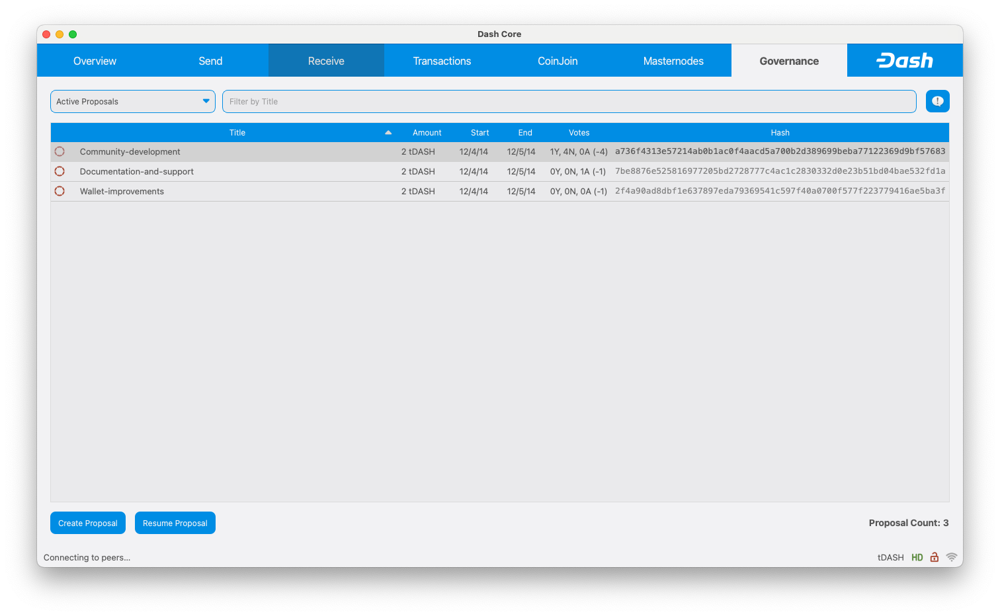
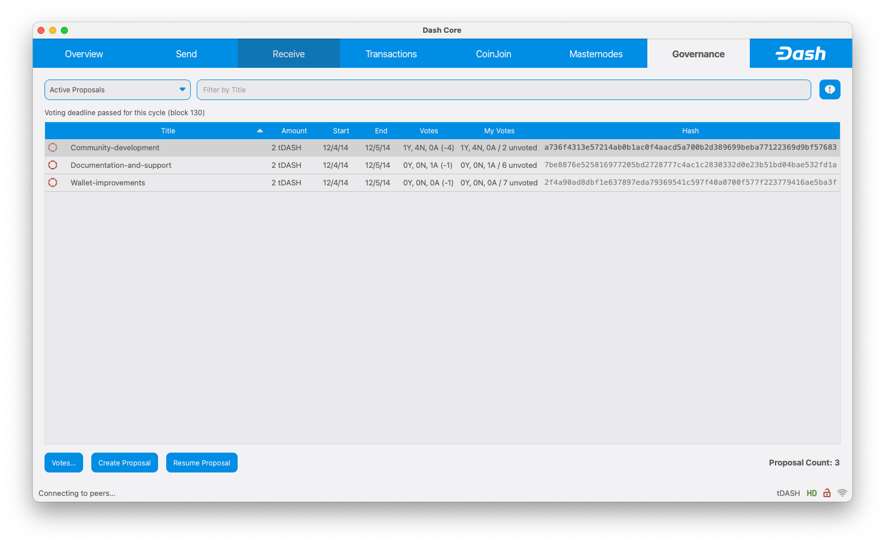
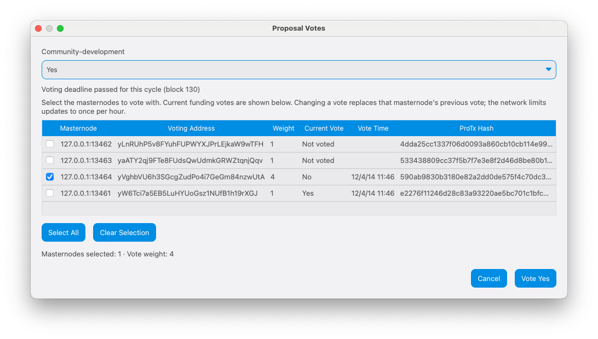
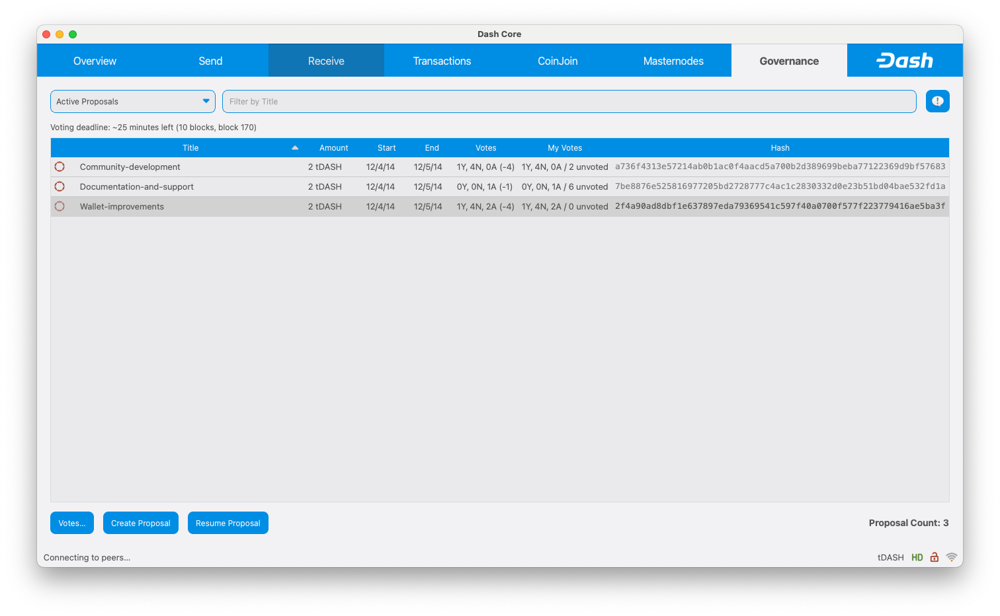

# Dash Core PR #7694 — governance voting

Before: `f5979f7c56da7bee6ce9bb0b7b21fd2c3d745b61`. After: `ffb3242f64a115ba2c812f6a36a7652f321a2b41`.

These are synthetic **regtest** fixtures, not mainnet or public-testnet votes. Both overview captures use copies of the same wallet and chain at height 139, three regular masternodes, one Evo node, and identical proposal IDs. Mock time intentionally remains in December 2014. Both binaries were built independently from the named revisions. The separate QA executables include an external Qt interaction driver; the installed application contains no driver. Screenshots are native OS window captures, opened and visually inspected at original resolution.

| Surface | Before — exact base | After — full PR head |
| --- | --- | --- |
| Governance overview, same fixture and selection |  |  |

The overview adds My Votes and an explicit deadline-passed label at block 139. The wallet controls all four fixture masternodes, so its weighted votes match the network totals in this example. Tooltips and the Votes dialog identify the contributing masternodes.

## Masternode selection

The Evo node is checked: one selected masternode contributes weight four. Its current vote is No; the proposed new outcome is Yes. This capture is taken before submission, and Cancel preserves the vote. ProTx hashes are elided to fit the dialog; full IDs are in [manifest.json](manifest.json).

## Live deadline and accepted votes

This later state is at height 160, with ten blocks to the next deadline at 170. The third proposal reflects the executed QA votes (1 Yes, 4 No, 2 Abstain; no unvoted weight). This is a subsequent scenario, not the like-for-like overview comparison.

## Verification

- Complete local build and packaged application signature verification.
- Full Qt test suite passed; one existing platform-specific test skipped. New tests cover selection, select all/clear, empty lists, outcome choice, weighted current votes and cutoff boundaries.
- 34 governance and argument unit tests passed; include, include-guard, Qt translation, circular-dependency and whitespace checks passed.
- GUI interactions plus RPC assertions verified cancellation, single-node voting, untouched unselected nodes, rate-limit rejection, partial success, Evo vote weight and replacement, summary refresh, filtering, My Proposals, unlock cancellation, signing and relocking, no-key/no-wallet states, cutoff/rollover/reorg handling, and live deadline updates in an open dialog.
- All final images were opened and inspected. File hashes and exact identifiers appear in [manifest.json](manifest.json).
