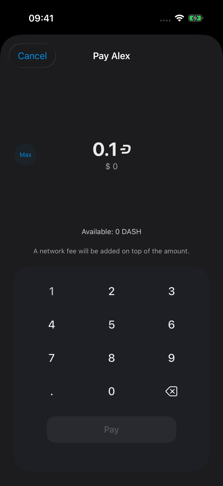
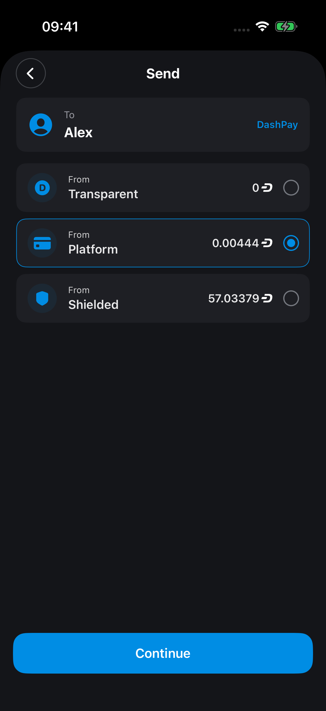
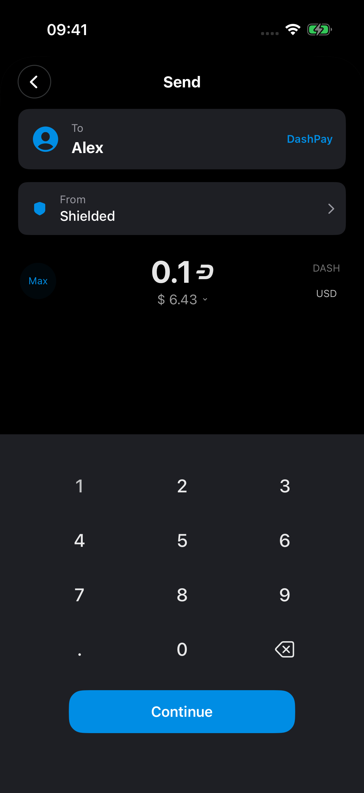
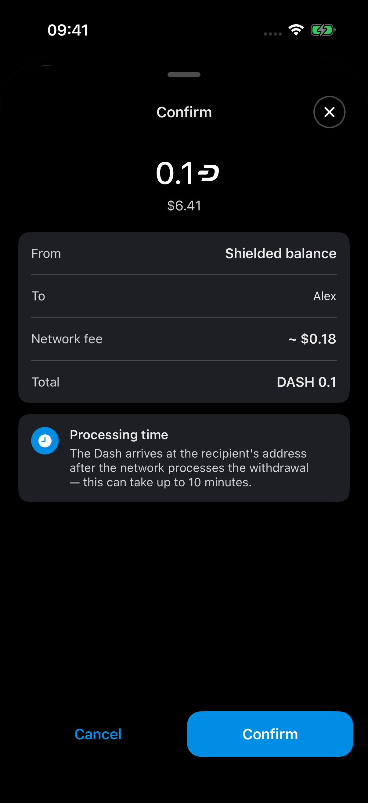
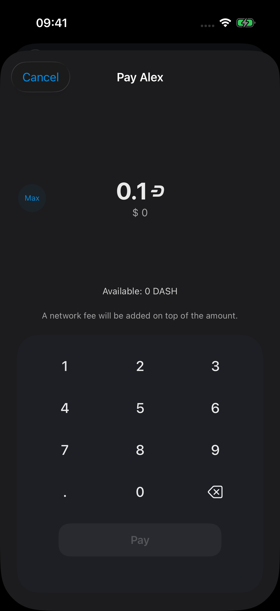

# DashPay payments from any address balance — PR 1117

Source PR: https://github.com/dashpay/dashwallet-ios/pull/1117

## Exact revisions

| Component | Revision |
|---|---|
| Before: upstream develop without this feature | `9e5c39a3480d4a9f0d706257c86ed72a2d935251` |
| After: full iOS PR head | `c37b82ef00591d0ee68d65779d845af8233ee153` |
| SDK used by both builds | `0298af619167992fa23810d064dc333be72d80bf` — [platform#4614](https://github.com/dashpay/platform/pull/4614) |

Each iOS revision was built independently with the same final SDK release simulator FFI framework. The SDK commit was verified in both linked binaries. Clean source builds also passed install and launch-liveness checks separately from the instrumented screenshot builds. Capture-only patches are included here and excluded from the product commits.

## Fixture and scope

Both simulators were cloned from the same shutdown PR1100 wallet fixture (`2BA73F81-DD2A-4971-BA50-6D2C50FFCA4A`). They are iPhone 16 Pro, iOS 26.5, dark appearance, en-US; status bar 09:41 and battery 100%, 1206×2622 screenshots (402×874 points at 3× scale).

- Before simulator: `E0061D99-11A7-4E9C-9BD7-7F92E5D03690`.
- After simulator: `69FE0C97-6BB5-4DA4-8005-F54A804F0BCA`.
- Bundle: `org.dashfoundation.dash`, scheme `dashpay`, architecture arm64.
- Synthetic contact: Alex (`alex.dash`), contact identity 32 bytes of `0x22`, established relationship, no avatar or alias.
- Transparent balance: 0 DASH from the empty Core wallet. Display-only Platform balance: 0.00444 DASH (444,000,000 credits). Display-only Shielded balance: 57.03379 DASH (5,703,379,000,000 credits).
- Capture patches present the production contact-payment views and reapply the synthetic balance publishers every 0.5 seconds so background synchronization cannot reset display data. They do not fabricate wallet notes, live identity state, SDK success, or contact payment history.
- Entered amount: 0.1 DASH in the old Transparent sheet and the Shielded amount/confirmation views. Fiat display remains the respective production view's behavior, rather than fixture-controlled rates; it is not part of the comparison claim.

**These are UI screenshots with synthetic contact/balance data, not evidence of a broadcast or recipient delivery.** No Confirm payment action was submitted. Accessible test wallet fixtures had no established DashPay contacts. Success/unknown-result/history states are covered by code review and journal tests, not live screenshots. The journal tracks device-local withdrawal submission and has no Core payout txid or final receipt reconciliation.

## Comparison

| Before — exact base | After — full PR head |
|---|---|
|  |  |

With the same zero Transparent balance, the old contact payment sheet disables Pay; the new contact flow offers all three sources and preserves Alex as recipient.

| Shielded amount entry | Shielded confirmation |
|---|---|
|  |  |

The real navigation flow retains Alex, displays the network fee estimate, and explains the withdrawal processing delay. No payout address is reserved while browsing these screens.

Transparent compatibility: selecting Transparent still presents the existing amount sheet, including Available: 0 DASH and disabled Pay.

## Validation and provenance

All final images were opened and inspected at original resolution. Full-resolution files are linked in the comparison above. `SHA256SUMS` identifies the published artifacts. `evidence-plan.md` describes the capture matrix; `before-fixture.patch` and `after-fixture.patch` describe all capture-only source changes; `review.md` records review limits; `rebase-range-diff.txt` verifies preservation across the concurrent upstream clipboard fix.

- Eight Foundation journal XCTest tests pass. Full app test target has pre-existing breakage documented in repository CLAUDE.md.
- SDK prerequisite: 61 DashPay payment tests, clippy, formatting, release simulator FFI, and Swift example app build passed.
- Accessibility audit: no new blocking findings.
- Rebase review: all four signed commits preserved; only the clipboard guard was adapted to upstream lifecycle gating.
- Capture scaffolding removed and the clean app binaries restored after screenshots. Original user simulators were not erased or modified.
