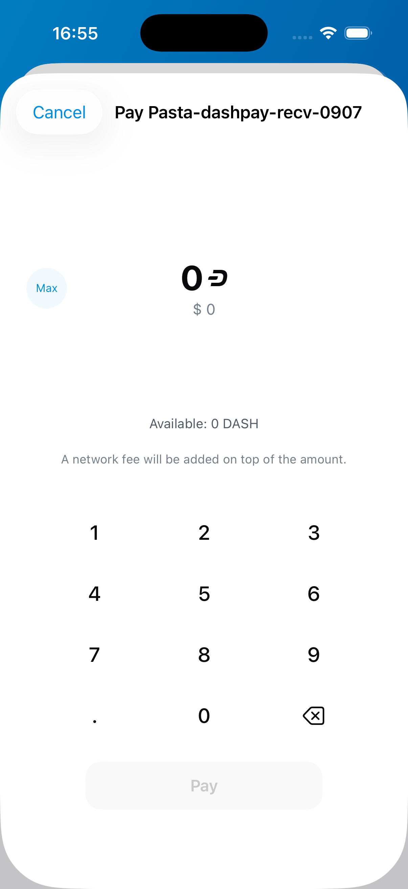
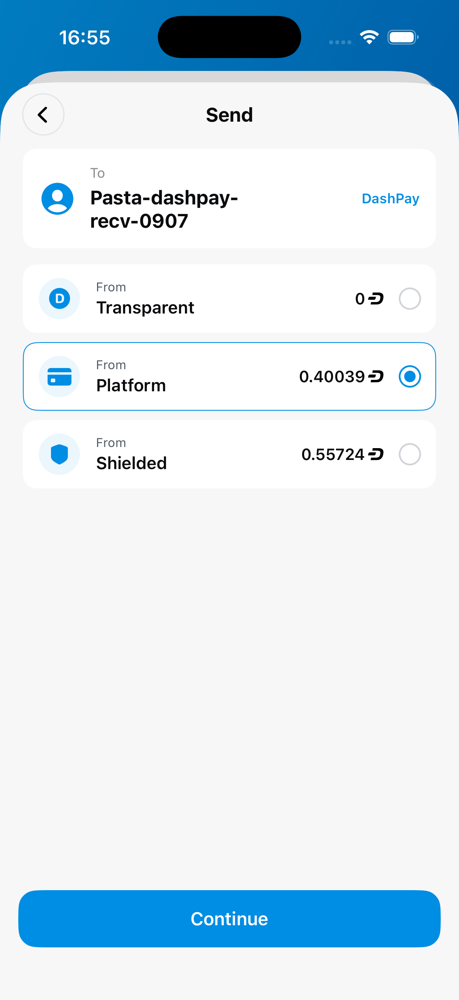
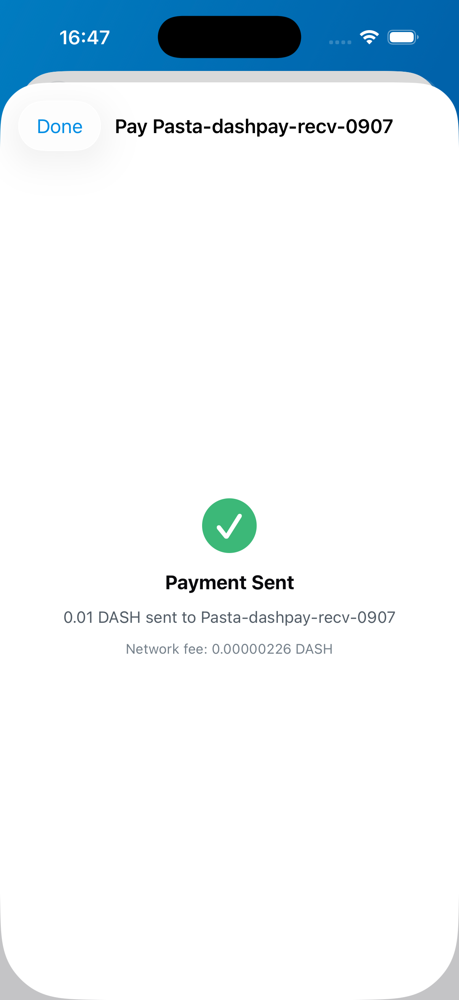
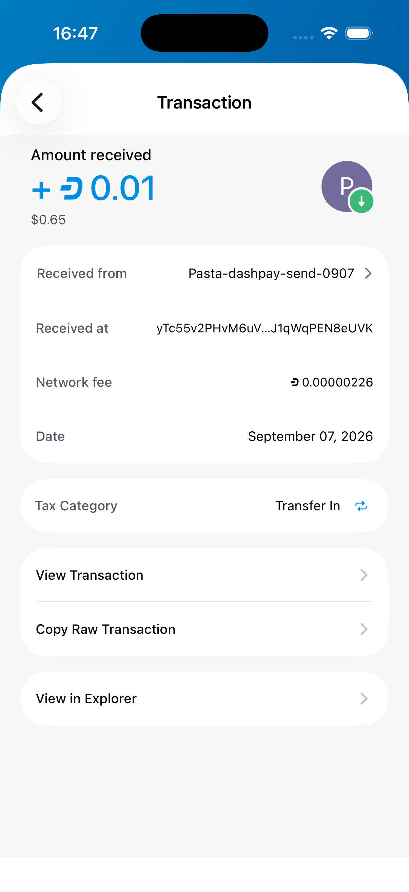
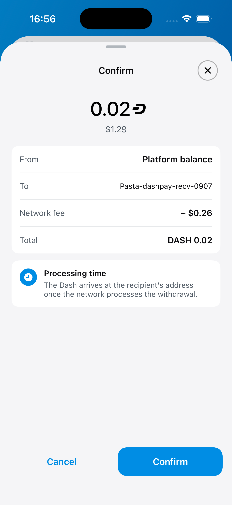
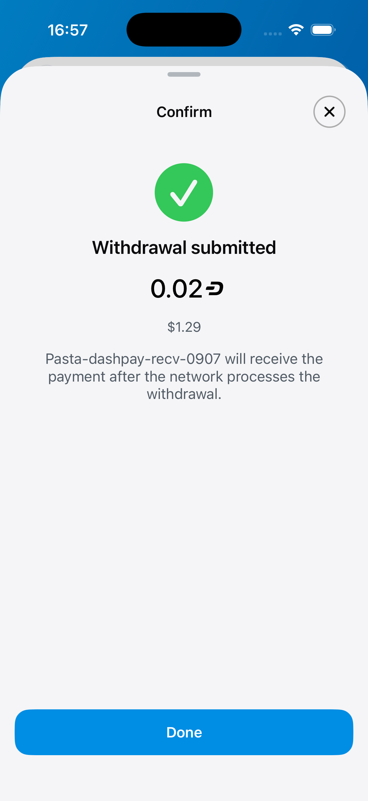
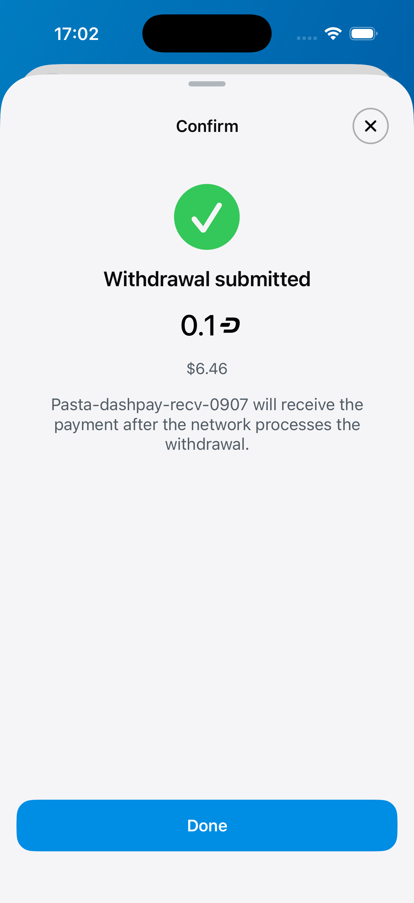

# DashPay contact payments — real testnet evidence

This replaces the earlier synthetic Alex screenshots, which did not validate a live contact payment. Images outside `live/` are retired and must not be used as validation evidence.

Base: `9e5c39a3480d4a9f0d706257c86ed72a2d935251`  
Head: `fc66451c570d2259aab27cfd7dcb8577972ac7ac`  
Platform SDK: `0298af619167992fa23810d064dc333be72d80bf`

Both clean app builds ran on iPhone 16 Pro / iOS 26.5 simulators. No capture patches, synthetic balances, or mock contacts. Original PNGs are 1206×2622. Build hashes are in [provenance](live/build-provenance.json); artifact hashes are in [sha256.json](live/sha256.json).

Real registered sender: **Pasta-dashpay-send-0907** (`B46PA5VXKaxiT7yJycyuUi2PbbuqDkYNzixhWMeTyVDp`). Recipient: **Pasta-dashpay-recv-0907** (`Ayq14RP1ABgem2ArDmeoufFpr8Q2UWYSZoVWHrthwQ2y`). Contact request and acceptance completed through the app.

## Before and after

The same real sender wallet/contact state was cloned before the comparison. Transparent balance was zero, Platform 0.40039441 DASH, Shielded 0.55724057 DASH. The base clone and head use that state; subsequent live payments below occurred later.

| Before — exact base | After — full PR head |
|---|---|
|  |  |

## Real payments

- Transparent: 0.01 DASH sent and independently received by the contact. Core tx `e1774419d079544d44d0f0a175de40637ffd15de0e06458d6ef0c45e2299c3a7`. Recipient UI resolves the sender username.
- Platform: 0.02 DASH withdrawal submitted with zero Transparent funds. Payout `c2a22f3948fe70b80ecda3e5a2b68100d053fa2230dae05c4119a6cbe6d82b94` pays DIP-15 index1 address `yXxvQ8eQ4CvmpdaDydwfULNL8vtU5S1DFb`.
- Shielded: user submitted 0.1 DASH to the same contact. Payout `8acbd5f727b094615072c2244d9743b8c6a2159dc24412375e950e63d8dcc57f` pays DIP-15 index2 address `yf7cYU7z5sTmtSLiEzqiQDXkH8EQEPsNG9`.

**Limitation:** Both withdrawal payouts reached Core, but the recipient wallet did not record them. Its pinned transaction router excludes DashPay accounts from AssetUnlock discovery. A prerequisite fix is in progress. Submission screenshots do not prove recipient receipt; withdrawal end-to-end validation remains incomplete.

| Transparent sent | Transparent received |
|---|---|
|  |  |

| Platform confirmation | Platform submission | Shielded submission (user-operated) |
|---|---|---|
|  |  |  |
