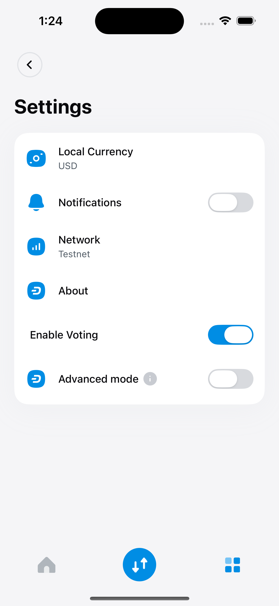
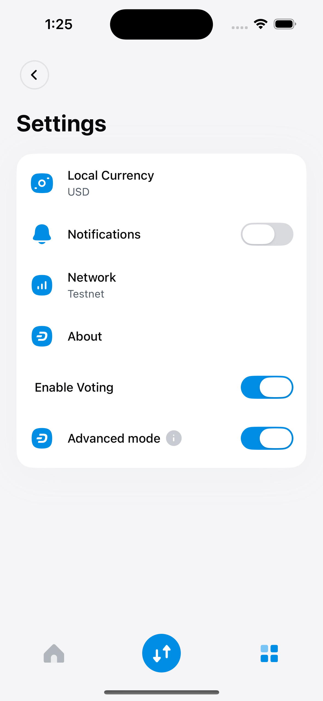
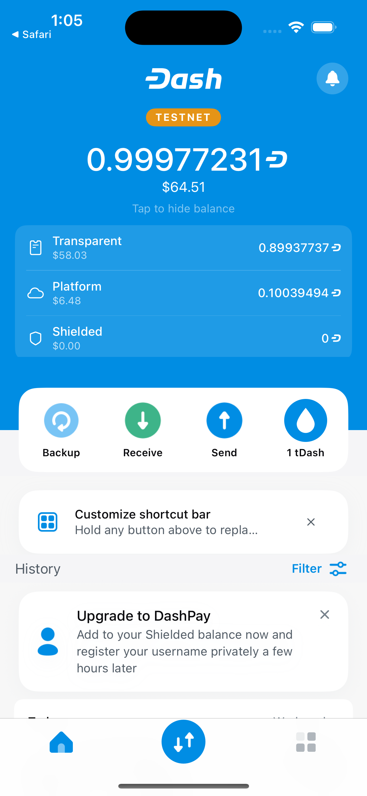
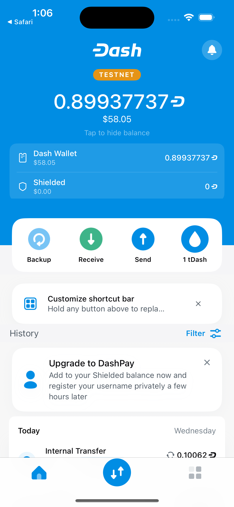
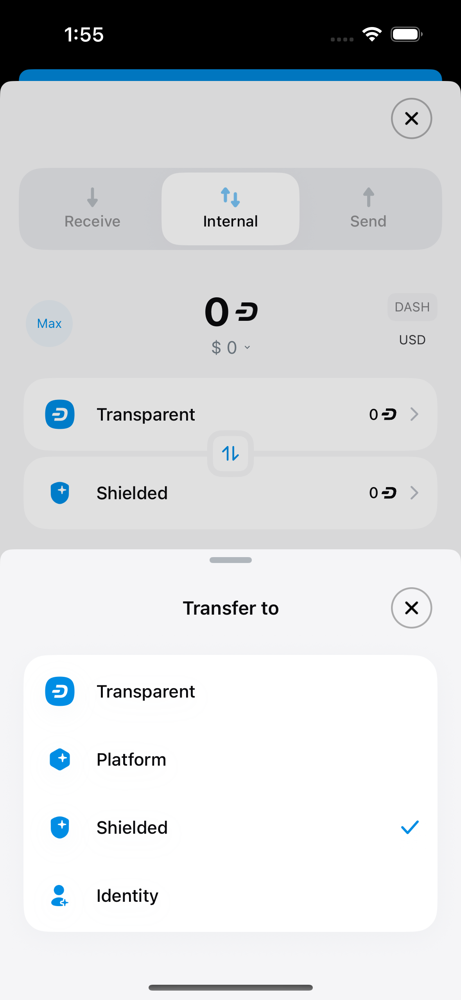
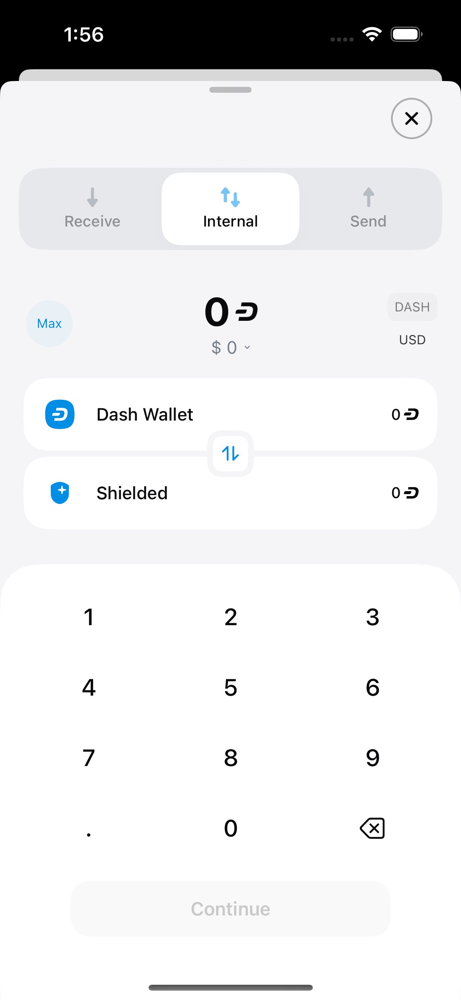
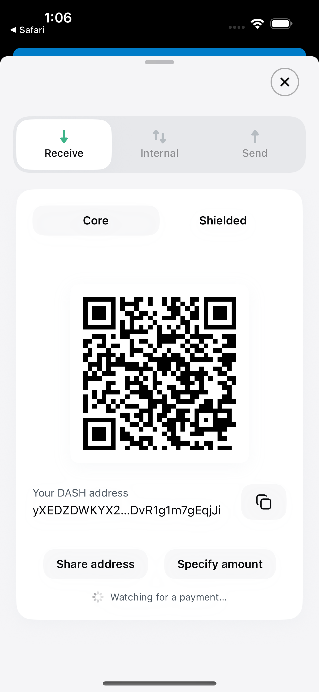
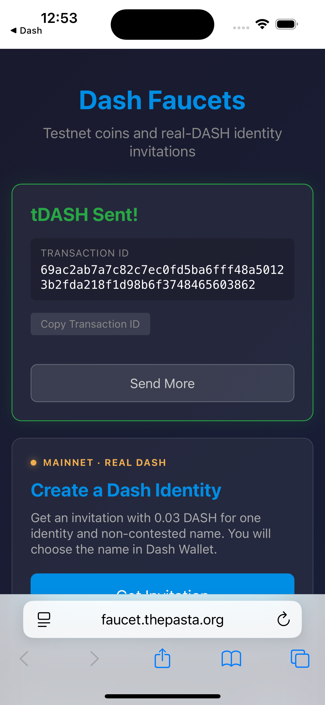
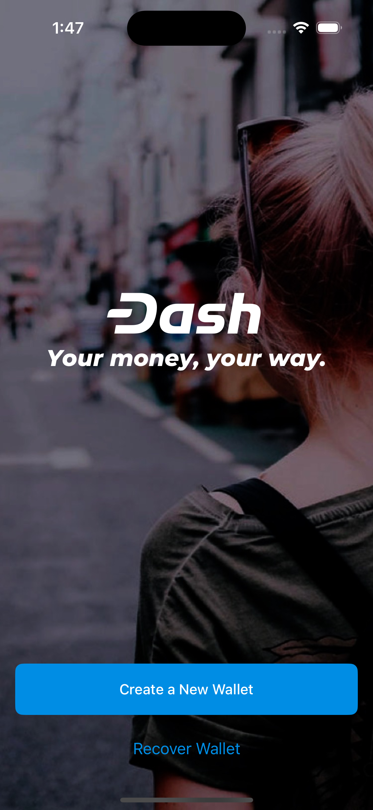

# Advanced mode: implementation and testnet QA

Tested 2026-09-09. The new policy passed automated regression checks and real testnet wallet flows. Re-import required the existing Platform sync **Clear** control before the SDK rediscovered the balance; that qualification is detailed below. This is feature-flow QA, not a claim that every wallet feature or production service was tested.

## Implementation

Signed commit `2bfee9e3cfeba384799449de54c5495dc25f7223` on branch `fix/auto-enable-platform-advanced-mode`, based on `5f4cefc1dff9eb38e2e68b6b8a290a2557ff77ff`. Signature verified (`G`); product worktree clean. Pushed to `PastaPastaPasta/dashwallet-ios:fix/auto-enable-platform-advanced-mode`; [PR #1123](https://github.com/dashpay/dashwallet-ios/pull/1123) targets `dashpay/dashwallet-ios:develop`.

A positive raw Platform credit balance enables the app-wide Advanced mode once per wallet ID/network. Cached startup balances and live persisted balance refreshes both apply the policy. First funding records the marker even when Advanced mode is already on. Later manual disable survives balance changes and relaunch. Zero or unavailable balances leave the check pending. Successful wallet removal clears that wallet's history; full wipe clears all history. Settings observes automatic changes.

The commit also fixes a pre-existing SendViewModel compiler error by safely binding the preferred/first valid source. This small prerequisite was necessary to build the current upstream app.

## Verification matrix

| Flow | Outcome | Evidence |
|---|---|---|
| Fresh wallet, missing preference, no Platform funds | PASS: remains off and unhandled | Regression executable; initial simulator onboarding |
| First funding while already on | PASS: records A/testnet marker | [state-first-funding.txt](state-first-funding.txt) |
| Upgrade with absent setting/history and real cached funds | PASS: automatically on at startup | [state-upgrade-auto-on.txt](state-upgrade-auto-on.txt) |
| Positive balance, manual disable | PASS: setting off; Platform hidden on Home/Receive; Internal limited to Dash Wallet/Shielded | Screenshots below |
| Relaunch with positive balance after manual disable | PASS, tested for A and re-imported B | [state-relaunch-off.txt](state-relaunch-off.txt), [state-final-relaunch-off.txt](state-final-relaunch-off.txt) |
| First live payment to another unhandled wallet, Settings open | PASS: B receives 0.01 tDASH; open Settings changes off → on | [state-before-live-incoming.txt](state-before-live-incoming.txt), [state-live-auto-on.txt](state-live-auto-on.txt); Settings pair below |
| More incoming funds after manual disable | PASS: another 0.002 tDASH arrives; stays off | [state-second-payment-off.txt](state-second-payment-off.txt) |
| Spend then receive again | PASS: B sends 0.011 tDASH back to A; after disabling, receives another 0.001 tDASH and stays off | [state-refunded-off.txt](state-refunded-off.txt) (before refresh), later synced balance and observed UI sequence |
| Exact zero → funded again after handling | PASS in regression executable; not reproduced at exact zero on-chain | Max Platform send leaves a fee reserve |
| Mainnet → Testnet round trip | PASS: manual off preserved; no mainnet marker created | [state-mainnet-off.txt](state-mainnet-off.txt), [state-return-testnet-off.txt](state-return-testnet-off.txt) |
| Per-network first funding | PASS in regression executable | No mainnet funds used |
| Per-wallet removal | PASS: removing B removes B marker/data, preserves A marker/data | [state-wallet-b-removed.txt](state-wallet-b-removed.txt) |
| Re-import funded B | QUALIFIED PASS: marker can be recorded again; SDK balance discovery required manual Clear/resync | [state-reimport-after-clear-auto-on.txt](state-reimport-after-clear-auto-on.txt) |
| Full wipe | PASS through app's Debug Reset All Wallets action: onboarding, mode off, history absent | [state-full-wipe.json](state-full-wipe.json), wipe screenshot |
| One raw credit, missing context, duplicate notifications, already-on handling | PASS in regression executable | [regression.log](regression.log) |
| Failed balance load/deletion | Reviewed: no enablement without a positive balance; cleanup after successful deletion | [review.md](review.md); no forced SDK failure injection |

The automatic setting is a UI preference. This change does not restrict transaction capabilities. Home, Receive, menu entries, and Internal Transfer retain their existing mode-dependent presentation. External Send continues to select sources by recipient type; actual Platform sends were exercised while Advanced mode was on.

## Real funding and transfers

One faucet payout, **1 tDASH**, to wallet A testnet Core address `ygWprUB3NpmbCRhP5SjrwzAZ4cBC8Uttvc` from `https://faucet.thepasta.org/`. The ordinary Safari verification challenge was completed in the dedicated simulator. No additional successful faucet payout was requested.

Faucet transaction:
`69ac2ab7a7c82c7ec0fd5ba6fff48a50123b2fda218f1d98b6f3748465603862`

Confirmed in the app's synced Core transaction data at block **1550555**. Core-to-Platform asset-lock transaction:
`8525a80c047090e40ed2f48e82da810c22cd65d57efe14d252821c8e96df9e81`

Confirmed at block **1550558**. See [core-chain-verification.json](core-chain-verification.json). Independent Insight HTTP verification returned 503; no independent InstantSend verification claim is made.

A's Platform address: `tdash1kq50yzuamskulmlfnyym3j5f2cp2r4mc0cxpreqx`.
B's Platform address: `tdash1kpfxtw8sw6t8w37226ck69mdxm5dwqq2hu2m2tx0`.

A received 0.1 tDASH via Internal Transfer from Core, plus an actual Platform remainder of 0.0003949432 tDASH. Real Platform sends then moved A → B: 0.01 and 0.002; B → A: 0.011; A → B: 0.001 tDASH. Every send showed Sent and corresponding synchronized balances. The app's incoming Platform ledger is observational and does not expose a transaction hash; none is invented here.

Wallet IDs:

- A/testnet: `2ec3cef372b3f70fbd373e53892ed2aa13100ebdd07354b5f530e839596f9dcf`
- B/testnet: `3e2d49a1a1997b473d81e7e45176ec7282cd8d1ee1e66c4269fb23aa80ee79da`

Final B Platform balance: **196611380 raw credits / 0.0019661138 tDASH**, with Advanced mode manually off. Both wallets remain on the primary QA simulator. All wallet balances came from actual testnet activity; no fabricated balance rows were used.

Preference snapshot note: [state-live-auto-on.txt](state-live-auto-on.txt) caught the on-disk UserDefaults file before its new boolean was flushed; the live Settings screenshot shows the actual in-memory toggle on. [state-refunded-off.txt](state-refunded-off.txt) was taken after send success but before the recipient refreshed, so it shows the prior balance. Subsequent sync showed 196611380 credits. Raw snapshot files are preserved unchanged.

## Build and quality checks

- Local arm64 iOS Simulator build: PASS; build log retained locally.
- Actual DWGlobalOptions and CocoaPod DSDynamicOptions compiled in the Foundation regression executable: **16 checks passed**; unrelated keychain/environment symbols stubbed. Re-run with `scripts/advanced_mode_regression/run.sh`.
- SwiftLint: **56 findings in touched Swift files on both base and head; zero new**; [lint-comparison.txt](lint-comparison.txt).
- Accessibility audit: **no new blocking findings**; 26 advisory findings relative to the repository's baseline remain; audit log retained locally.
- Xcode test action attempted: scheme `dashpay` is **not configured for test action**; test-action log retained locally. No passing XCTest-suite claim.
- Four-pass code review: APPROVED, no blocking findings; simplification review retained the small implementation; [review.md](review.md).
- `git diff --check`: clean.

## Build provenance and limits

Primary simulator: **Advanced Mode QA**, `2F20F61F-B932-449E-AE0E-C88247F1B408`; iPhone 16 / iOS 18.6. Sender: **Advanced Mode QA Sender**, `99BB8D99-D488-46E4-9564-E61D47115865`. Bundle identifier `org.dashfoundation.dash`. Primary left booted with the app foregrounded, funded B active, Advanced mode off. Sender left on onboarding after its test wipe. No pre-existing user simulator was erased.

Build uses Xcode **16.4 / Swift 6.1**, concrete primary UDID, normal simulator signing, `ARCHS=arm64`, and `SWIFT_ENABLE_EXPLICIT_MODULES=NO`. Build/launch used the run-ios-simulator skill's script, an isolated QA workspace, isolated DerivedData, and local service resources.

DashUIKit source revision `83cf65a84834f6a7a1f0a82446ea1258ea86f37d` was unchanged except a QA-only tools-version manifest adjustment **6.3 → 6.1**, outside the product worktree. Runtime service plists are local QA stubs; Firebase's required storage-bucket field was supplied to allow startup. Explore/Firebase and other third-party production services were not validated.

Local Swift SDK sources were copied from a Platform checkout whose HEAD was `658aec5ea95ab748f78db7f8701735e3fd12c233`; prebuilt simulator FFI came from a checkout at `b02eb22bcd1857454a535f24b3879331a08141ff`. These donor HEADs alone do not establish binary build provenance; [provenance-hashes.json](provenance-hashes.json) records the actual SDK source files, FFI bundle files, manifest and app executable used. Production toolchain/release-device validation remains outside this simulator run.

The upgrade fixture was constructed by shutting down the primary simulator and deleting **only** `DW_GLOB_advancedModeEnabled` and `DW_PLATFORM_ADVANCED_MODE_HISTORY`, retaining the real funded database/keychain. The startup test ran online; code inspection verifies the cached-balance call, but no offline timing benchmark was performed.

The sender clone initially retained a source-container path. Before live two-simulator tests, the identical app was reinstalled on the clone; simctl and process open-file checks then confirmed distinct app containers and databases. Only verified independent-container live tests are reported above.

Re-import caveat: after removal/import, B's correct address was derived but its balance remained zero through repeated recent-block syncs. The existing Platform Sync Status **Clear** action forced a full resync, recovered its 196611380 credits, and triggered auto-enable. The sync implementation was not changed here. This behavior was not isolated against a runnable exact-base binary, so it is recorded as a separate observed SDK/restore limitation, not asserted to be a proven pre-existing defect.

## Inspected visual evidence

All images below are unmodified captures of the implemented revision, opened and inspected at original resolution (1179 × 2556). These are comparisons of states/flows on the **same feature revision**, not base-versus-head screenshots. Exact-base build failed at the SendViewModel prerequisite compiler error; there is no valid exact-base visual comparison.

| Claim | First state | Second state |
|---|---|---|
| Funded A shows/hides Platform | [Advanced on](home-funded-on.png) | [Manually off](home-funded-off.png) |
| Live incoming payment updates open Settings | [Before payment: off](live-before-settings-off.png) | [After payment: on](live-after-settings-on.png) |
| Internal transfer choices | [Advanced destinations](internal-on-destinations.png) | [Simple fixed pair](internal-off-destinations.png) |

The Home pair uses the same funded wallet; fiat rates vary slightly between captures. The Settings pair spans B's real first incoming payment. Internal images show B with unchanged funds: opening the destination selector while on exposes Platform/Identity; while off, tapping the fixed destination does not open that selector.

Additional captures: [Receive while off](receive-funded-off.png), [faucet payout](faucet-safari-confirmed.png), [full wipe returns to onboarding](full-wipe-onboarding.png).

Artifacts are hosted separately from product commits in `PastaPastaPasta/dash-ui-artifacts/dashwallet-ios/pr-1123/`. [artifact-hashes.json](artifact-hashes.json) records SHA-256 hashes of this published subset. [provenance-hashes.json](provenance-hashes.json) records actual SDK source and binary hashes with machine-specific paths removed. Full build/audit logs remain local. Recovery material, private PIN, runtime preference backups and raw simulator databases are excluded.

## Screenshot gallery

Each image links to the unmodified full-resolution file. All app images show product head `2bfee9e3cfeba384799449de54c5495dc25f7223`.

| Settings before B's first live payment: off | Settings after B's first live payment: on |
|---|---|
|  |  |

| Funded A, Advanced mode on | Same funded A, manually off |
|---|---|
|  |  |

| Internal transfer, Advanced mode on | Internal transfer, Advanced mode off |
|---|---|
|  |  |

| Receive with Advanced mode off | Confirmed faucet payout | Full wipe returns to onboarding |
|---|---|---|
|  |  |  |
