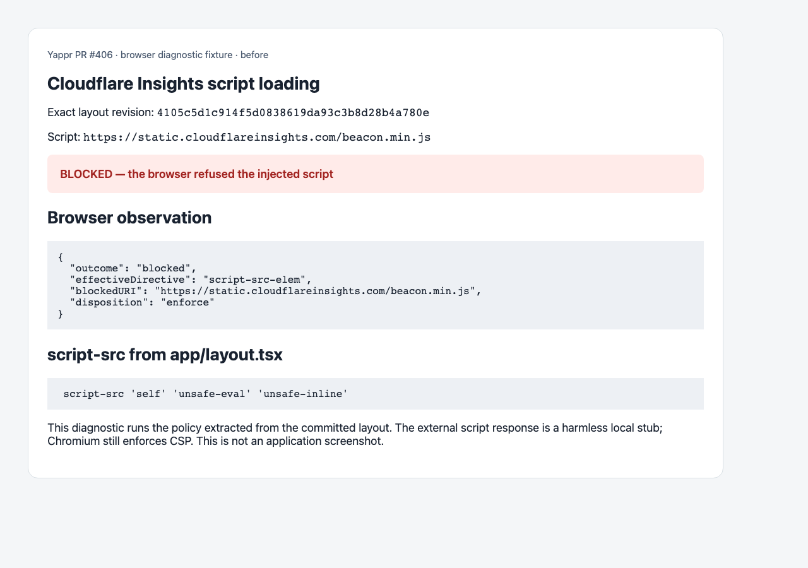
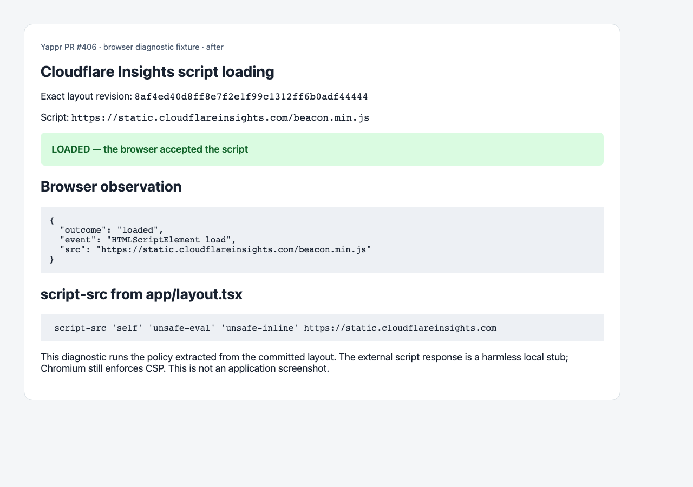

# PR #406: verified visual evidence

Before: `4105c5d1c914f5d0838619da93c3b8d28b4a780e`

After: `8af4ed40d8ff8e7f2e1f99c1312ff6b0adf44444`

Chromium policy diagnostic; external script response stubbed, no application UI change.

The capture script executes the real behavior and asserts its observed result before capture. These images replace the earlier PR screenshots, which were insufficient evidence (loading skeletons for CSP and hand-rendered HTML for embed). The old images must not be used as proof.

Both final images were opened and inspected at original resolution. `results.json` records observations; `hashes.json` records SHA-256 before upload. No credentials are present.

| Before | After |
|---|---|
|  |  |
