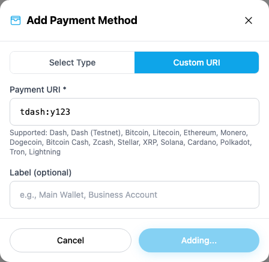
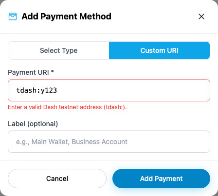
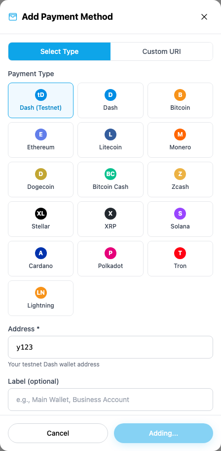
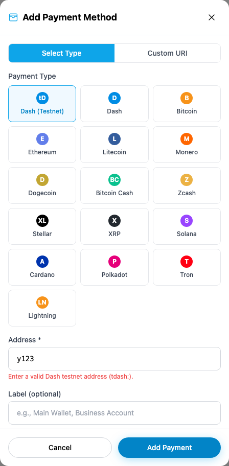
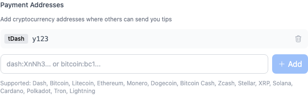
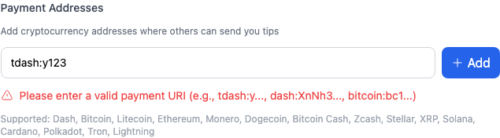

# Yappr PR 410 — Dash payment validation

PR: https://github.com/PastaPastaPasta/yappr/pull/410

Before is exact staging `4105c5d1c914f5d0838619da93c3b8d28b4a780e`. After is full PR head `57d2395ae22566f79b355baaf5fad13dcf347c34`.

**Evidence correction:** This comparison supersedes the earlier `0557c49` artifact comparison, whose before capture used master `f42ce65f` instead of this PR's staging base. Those earlier images are not authoritative for this PR.

These are browser screenshots of the actual `PaymentMethodModal` and `PaymentUriInput` product components from those revisions, imported unchanged by the identical capture-only fixtures in `fixture/`. The fixtures replace persistence callbacks with visibly labeled observers. The store observer records an invocation and keeps its promise pending so the submitted input remains visible; it never submits a blockchain write. The profile fixture uses the normal local state setter. This comparison proves that malformed input reached the component's save/change callback before and is rejected by the real component afterward. It does not claim an on-chain save.

Both revisions were independently built using `npm run build:devnet`, with separate worktrees and static exports. Their `.next/BUILD_ID` values were `4105c5d1` and `57d2395a`. Product source files were unmodified at each revision; only the two disclosed fixture routes were untracked during capture. Those fixtures were removed afterward and the capture servers stopped. The clean product source was also built separately before capture.

Shared state: Chromium, 1440 × 1100 viewport, 1× scale, light theme, en-US, America/Chicago, fresh signed-out browser contexts, no stored data. The test waits for a fixture hydration marker, enters the same malformed value `y123` or `tdash:y123`, submits, and asserts callback count 1 before versus 0 after plus visible error. The overview captures include the observer and application context; focused captures are direct locator screenshots of the real component, not reconstructed UI. The background sidebar is unrelated public devnet content and is outside the claimed change.

## Store — custom URI

| Before — exact staging base | After — full PR head |
| --- | --- |
|  |  |

[Full before with observer](comparison/before/custom-modal.png) · [Full after with observer](comparison/after/custom-modal.png)

## Store — selected payment type

| Before — exact staging base | After — full PR head |
| --- | --- |
|  |  |

[Full before with observer](comparison/before/type-modal.png) · [Full after with observer](comparison/after/type-modal.png)

## Profile payment addresses

| Before — exact staging base | After — full PR head |
| --- | --- |
|  |  |

[Full before with observer](comparison/before/profile.png) · [Full after with observer](comparison/after/profile.png)

## Validation

- `npm run test`: 162 tests passed, including 17 Dash/payment URI cases now part of normal CI Vitest discovery.
- `npm run lint` and `npm run build:devnet`: passed with a fresh `npm ci` install.
- `capture.cjs`: all six before/after component cases and five compatibility assertions passed. Valid mainnet and testnet destinations reach `onSave`; a wrong-network address does not. Valid URI query parameters arrive unchanged at store and profile callbacks.
- Utility tests cover malformed/checksum/length failures, mainnet/testnet P2PKH and P2SH, optional query parameters, and unchanged non-Dash payload handling. Profile-to-store import filtering uses this same validated destination helper; no live profile import was performed for these screenshots.
- Independent code review approved the final head without blocking findings.

All 12 final screenshots (six overviews and six focused captures) were inspected at original resolution. `SHA256SUMS` records the final file hashes for post-publication verification. No image pixels were mocked or edited. The fixture and test source are included so the comparison can be repeated.
