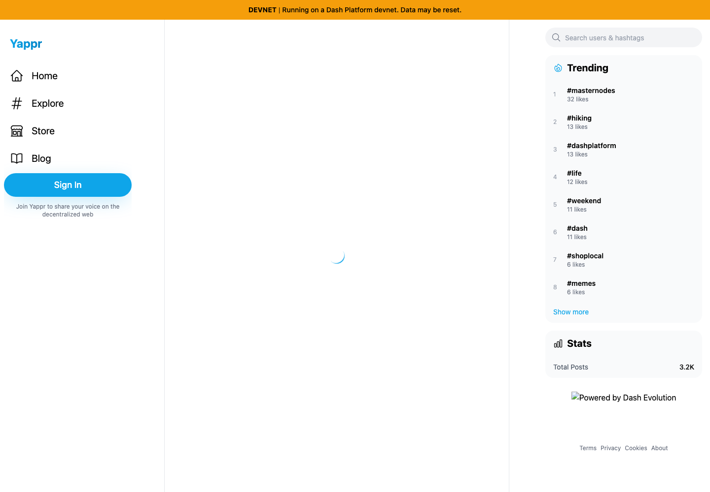
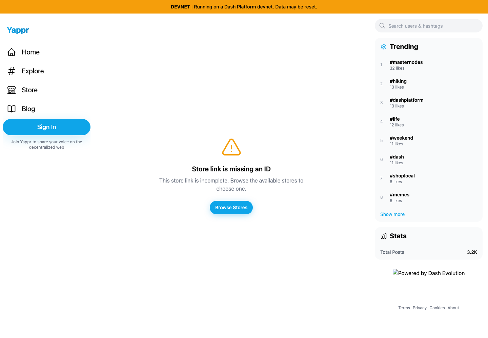
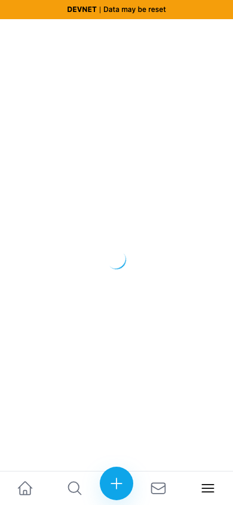
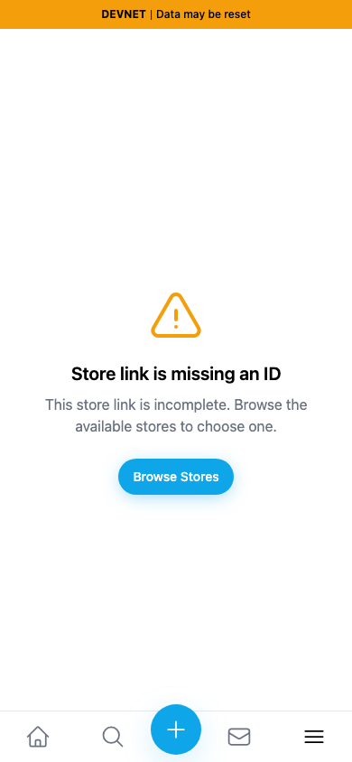

# Yappr PR 411 — incomplete store link

PR: https://github.com/PastaPastaPasta/yappr/pull/411

## Provenance and evidence matrix

| Surface | Before — exact staging base | After — full PR head | Shared fixture | Visible delta |
| --- | --- | --- | --- | --- |
| Desktop `/devnet/store/view/` | `4105c5d1c914f5d0838619da93c3b8d28b4a780e` | `6cc35c1a671d03773acd5922d3812e9f228cfd35` | Signed out, empty browser storage, no store ID, light theme, en-US, America/Chicago, 1440 × 1000 at 1× | Loading spinner becomes an incomplete-link explanation and Browse Stores action. |
| Mobile `/devnet/store/view/` | Same exact base | Same full head | Same state, 390 × 844 at 1× | Recovery content fits above the mobile navigation. |

Both revisions were built independently with `npm run build:devnet` in separate clean worktrees. The base export was served on localhost:4178 and head on localhost:4177 using the repository's `scripts/serve-static.mjs --base /devnet`. The head was rebuilt after committing; `.next/BUILD_ID` matches the corresponding source commit prefix. No UI was mocked or hand-rendered. Each capture used a fresh Playwright browser context and waited five seconds after the devnet banner appeared. Public sidebar data came from devnet and is identical in this pair. The existing failed “Powered by Dash Evolution” sidebar image appears in both desktop images and is outside this fix.

The image pair demonstrates the visible missing-ID recovery state; source review confirms the baseline loading effect cannot complete without an ID. Browser regression tests cover both an omitted `id` and `?id=`, and clicking Browse Stores successfully renders the store directory. There are no authenticated writes in these tests or captures.

## Desktop

| Before — exact base | After — full PR head |
| --- | --- |
|  |  |

## Mobile

| Before — exact base | After — full PR head |
| --- | --- |
|  |  |

All four final PNGs were opened and inspected at original resolution before publication. The capture script and captured page text are included alongside this index. SHA-256 hashes are recorded in `SHA256SUMS` for post-upload byte verification.

Local validation: production devnet build, full ESLint run, and both focused Playwright smoke cases passed.
