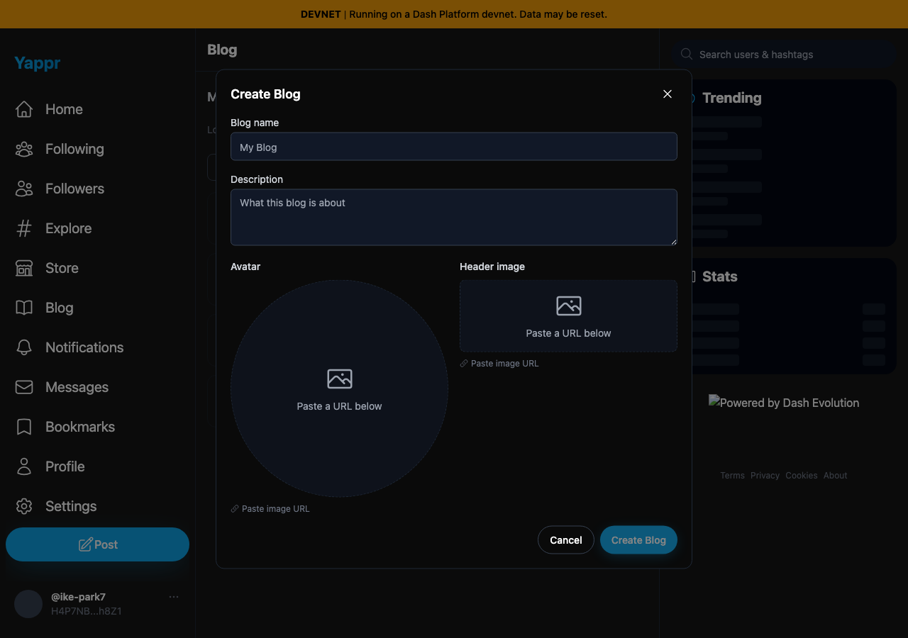
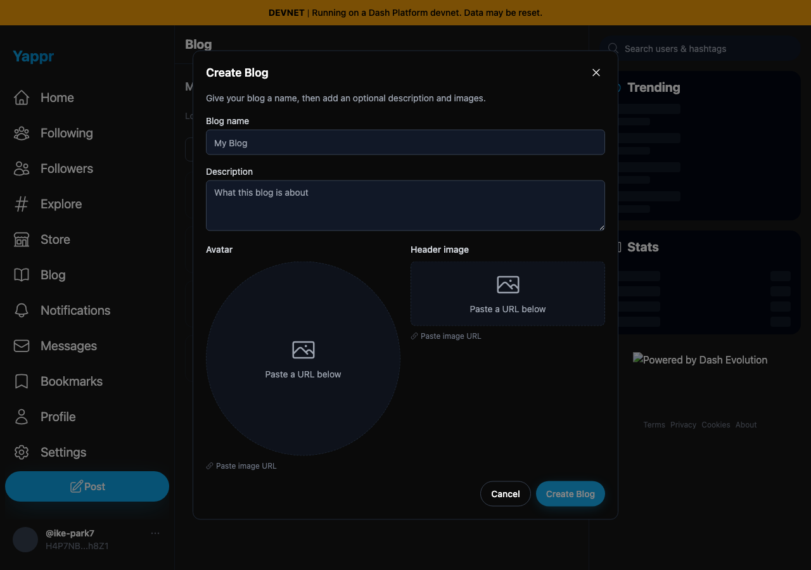
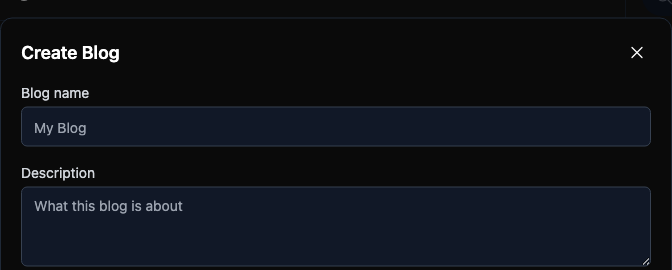
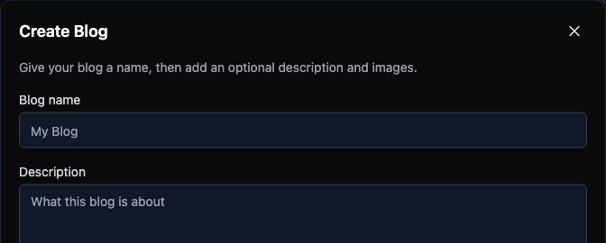

# Yappr PR #412 — Create Blog dialog description

[Product PR](https://github.com/PastaPastaPasta/yappr/pull/412)

| Surface | Before — exact staging base | After — full PR head | Shared fixture | Visible delta |
| --- | --- | --- | --- | --- |
| `/devnet/blog/` → Create Blog | `4105c5d1c914f5d0838619da93c3b8d28b4a780e` | `10f00a7af3aa1906ff13b500d59eb41d742e7da7` | Same seeded devnet identity, empty form, restored session | New introductory guidance explains the required name and optional description/images |

| Before — exact base | After — full PR head |
| --- | --- |
|  |  |

Focused view of the same screenshots, cropped at the identical viewport rectangle `(304, 80, 672, 270)` without resizing or annotations:

Before — no introductory description:

After — visible instructions associated with the dialog:

Both focused images were also opened and inspected at original resolution.

Both images were captured from independent `npm run build:devnet` production exports of the actual application, served locally using the repository's static server. Both builds passed lint/type checking and static export. No capture-only product route, copied markup, or DOM replacement was used.

The seeded fixture is devnet persona 8, handle `ike-park7`, identity `H4P7NB1JNJ3B9LRpPixi3sUs7qhN5w9xs9YbQSBFh8Z1`. Its existing session was restored in isolated browser contexts using its registered key in memory. Nothing was submitted to Platform. Locale `en-US`, timezone `America/Chicago`, dark theme, Chromium, and 1280×900 viewport were identical. Each dialog was opened from My Blogs with an empty form. The surrounding panels are still loading in both images; no claim depends on them.

Screenshots demonstrate the added visible instructions. The accessibility change itself is verified by Playwright `toHaveAccessibleDescription`: before the computed description is empty and `aria-describedby` points to a nonexistent element; after it resolves to the visible instructions. In both revisions Cancel dismisses the dialog. The machine-readable observations are in [assertions.json](assertions.json). A permanent regression spec is included in the product PR's `e2e/write/blog-dialog.spec.ts` (uses the existing seeded bot fixture).

Both final screenshots were opened and inspected at original resolution before publication. They show the intended dialog, the instructions are legible, and no private keys or unrelated desktop content appear.

## SHA-256

- `69cb4dd8b38dd12655cd33616a7094ee10ec4973743e88bbce4b9c96356ec73f` — `comparison/before/create-blog.png`
- `45ad597d462e7507c380f7fd4a4097bdafadefb5145558c8fe568b9c7b6db56b` — `comparison/after/create-blog.png`
- `a6c93ac1956d49d0686bfc406a505cd1bb5de12006849d7732c96698dabd6ad7` — `assertions.json`
- `18297df0b1fcbadacd735067938310fd02b7ced7d66ade8a41f705f697a3e7e1` — `comparison/before/description-focus.png`
- `f689898e54eeb61ef67d544aaa0a4f150b61110415f15d106ae44e97f93ddfc4` — `comparison/after/description-focus.png`
