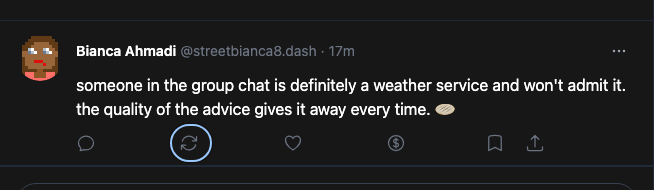
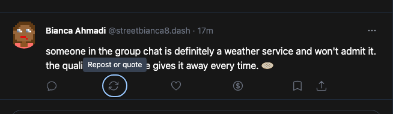
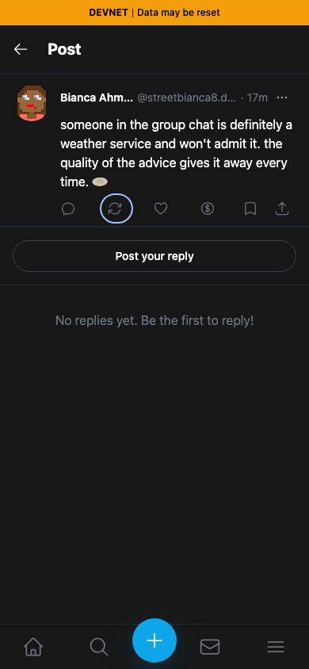
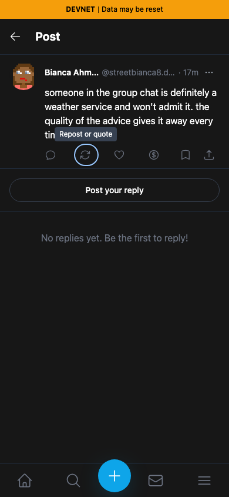

# Yappr PR #413 — accessible post action controls

[Product PR](https://github.com/PastaPastaPasta/yappr/pull/413)

| Surface | Before — exact staging base | After — full PR head | Shared fixture | Visible delta |
| --- | --- | --- | --- | --- |
| Post action row, desktop and mobile, keyboard focus on repost/quote | `4105c5d1c914f5d0838619da93c3b8d28b4a780e` | `0aba68a8aeb2c5d96631da051f65dd5c62804caf` | Same public devnet post, same persona, all zero counts, not bookmarked | Focused icon gains a visible “Repost or quote” tooltip |

Before — focused button has no tooltip:

After — focused button explains its action:

These focused images are identical rectangle crops `(276, 80, 654, 190)` of the full desktop screenshots, with no resizing or annotations.

| Before — mobile | After — mobile |
| --- | --- |
|  |  |

[Full desktop before](comparison/before/post-desktop.png) · [Full desktop after](comparison/after/post-desktop.png)

## Provenance and verification

Both revisions were independently built with `npm run build:devnet` and served by the repository's static server. These are actual app routes and components; no test-only route, copied markup, or replacement DOM was used.

- Route: `/devnet/post/?id=8Pu2yqcvPTnhtikJ2cWRnC2eukzLFHSJkrVEimGUjf47`.
- Public post: `8Pu2yqcvPTnhtikJ2cWRnC2eukzLFHSJkrVEimGUjf47`, authored by seeded Bianca Ahmadi (`9LQjbxV6BiArha9QiiLAp1ziN2i497SR1giWvxZD4b2R`). Both captures waited for the profile to resolve.
- Restored viewer: seeded persona 8, `ike-park7`, identity `H4P7NB1JNJ3B9LRpPixi3sUs7qhN5w9xs9YbQSBFh8Z1`; its existing registered key was loaded only in memory.
- Shared settings: Chromium, dark theme, `en-US`, `America/Chicago`, desktop 1280×900 and mobile 390×844.
- Repost/quote received keyboard focus on both revisions. The menu was also opened with Enter and dismissed with Escape on both. Nothing was submitted to Platform.

The screenshots prove the visible focus tooltip. The screen-reader names and state are nonvisual and were verified with Playwright accessible-name assertions and [recorded ARIA snapshots](assertions.json): the six action buttons are unnamed before, and named Reply, Repost/Quote, Like, Tip, Bookmark, and Share after; Bookmark gains `aria-pressed=false` for this unselected fixture. Like already exposed its pressed state on staging. The product tests cover names/counts, the focus tooltip, existing Like toggling, the unselected Bookmark state, and the Quote-only label on a reply.

Every final full screenshot and crop was opened and inspected at original resolution. The post, relative timestamp, counts, profile, theme, and selected focus match across each pair. No keys, private content, or unrelated desktop windows are visible.

## SHA-256

- `056b49776faa560b4d8f6a84f1f62920b356467267ea128c4e996a537684b4c5` — `assertions.json`
- `0c7a3b1b30d6bbdcbcc8760ac8dd827560601e7ba5e98789cc652eb06bdf9eec` — `comparison/after/action-focus.png`
- `381f86925e56f90413d0ba79248b2a845590580a44b8883adab4b7c923675c31` — `comparison/after/post-desktop.png`
- `6cda9b1207decdf9a9485ed25b02c223522606736779e3c268d480a6bee2ea1b` — `comparison/after/post-mobile.png`
- `d16b2cbec12cd38c09bee82b27789c43eb22f05607aa6e71a3cedc9f6221ebe8` — `comparison/before/action-focus.png`
- `b027196fdb3051d3e4cf06226cdd8824cc63d56ba8166f125e1e35cfbfe97950` — `comparison/before/post-desktop.png`
- `4cca44e47a6ededb90c1b4748c59fbbc49b1f82f7d7b47ea2366bb1fcbc96eb3` — `comparison/before/post-mobile.png`
