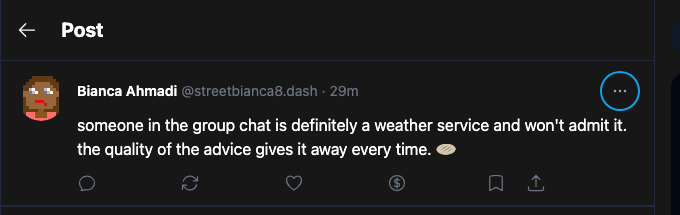
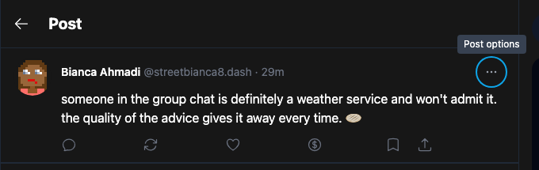
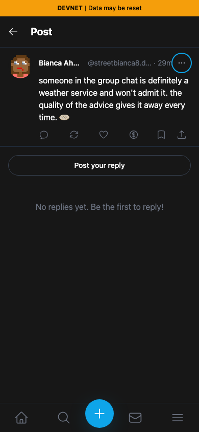
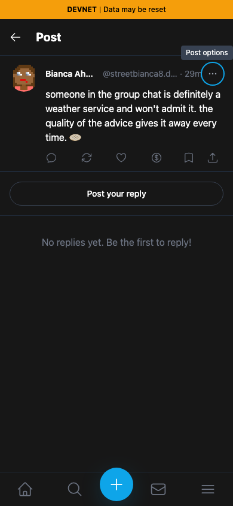

# Yappr PR #414 — accessible post options menu

[Product PR](https://github.com/PastaPastaPasta/yappr/pull/414)

| Surface | Before — exact staging base | After — full PR head | Shared fixture | Visible delta |
| --- | --- | --- | --- | --- |
| Post header, keyboard focus on overflow menu | `4105c5d1c914f5d0838619da93c3b8d28b4a780e` | `1d5daf5b233baed9a334810914345a32d9996d4a` | Same public devnet post and restored viewer | Focused ellipsis button gains a readable “Post options” tooltip |

Before — focused menu trigger is unnamed and shows no tooltip:

After — focused menu trigger announces and displays Post options:

The focused images are identical rectangle crops `(275, 40, 680, 215)` of the full desktop screenshots, without resizing or annotations.

| Before — mobile | After — mobile |
| --- | --- |
|  |  |

[Full desktop before](comparison/before/post-desktop.png) · [Full desktop after](comparison/after/post-desktop.png)

## Provenance and verification

Both revisions were independently built with `npm run build:devnet` and served by the repository's static server. The captures use the real app route and component. No capture-only route, copied markup, or replacement DOM was introduced.

- Route: `/devnet/post/?id=8Pu2yqcvPTnhtikJ2cWRnC2eukzLFHSJkrVEimGUjf47`.
- Public post: `8Pu2yqcvPTnhtikJ2cWRnC2eukzLFHSJkrVEimGUjf47`, by seeded Bianca Ahmadi (`9LQjbxV6BiArha9QiiLAp1ziN2i497SR1giWvxZD4b2R`). Both captures waited for profile resolution.
- Restored viewer: seeded persona 8, `ike-park7`, identity `H4P7NB1JNJ3B9LRpPixi3sUs7qhN5w9xs9YbQSBFh8Z1`; the existing registered key was loaded only in memory.
- Shared settings: Chromium, dark theme, `en-US`, `America/Chicago`, desktop 1280×900 and mobile 390×844.

The screenshots show the focus tooltip. The nonvisual accessible-name change is separately verified in [assertions.json](assertions.json): the before ARIA snapshot is an unnamed button; after it is `button "Post options"`. On both exact revisions Enter opens the existing menu, `aria-expanded` changes to true, Escape dismisses it, expanded returns to false, and focus returns to the trigger. No menu item was selected and no Platform write was submitted. Permanent product tests also check “Reply options” on replies.

Every final full screenshot and crop was opened and inspected at original resolution. The new tooltip is fully legible above the sticky header on both viewports. The post, profile, relative timestamp, counts, theme, and focus are matched across the pair. No private keys, private content, or unrelated desktop windows appear.

## SHA-256

- `fe3b53b3eff0c63d38c9a8a80e041701d01eb552ca54f8ab24d01fd0bff49d74` — `assertions.json`
- `38715ab31cbcacfe285e93485d2bd1d5845c0cbedb8c8d4f3c0ed752f13738f9` — `comparison/after/options-focus.png`
- `922342ba54112005959a9be6a034697062ccfc2f402cafa1b3f4d6e8052c3144` — `comparison/after/post-desktop.png`
- `beb7eb875f4ccbb40f475f7576af2b589399a187a470ad34a4c60859efec533a` — `comparison/after/post-mobile.png`
- `69e709d867a62373267ad773da5865be4f65e7e29bafafc0c1fd69d108bff172` — `comparison/before/options-focus.png`
- `34fcb487b6291818a08f1f5e5794b85f48c2891d3042391cabd4ba619dd8d27d` — `comparison/before/post-desktop.png`
- `a4bfcf52b62aaed0d32bd73e896c497b89c93bdfa96810a26cbcedfa187d1047` — `comparison/before/post-mobile.png`
