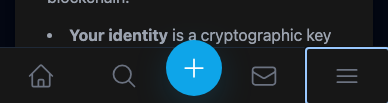
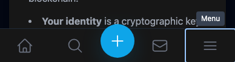
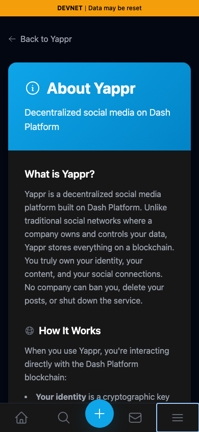
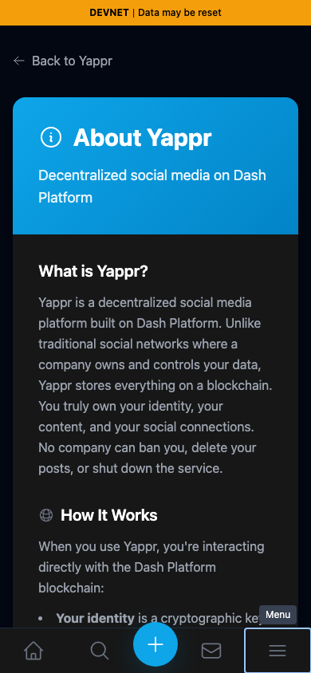

# Yappr PR #416 — accessible mobile navigation

[Product PR](https://github.com/PastaPastaPasta/yappr/pull/416)

| Surface | Before — exact staging base | After — full PR head | Shared fixture | Visible delta |
| --- | --- | --- | --- | --- |
| Mobile bottom navigation with Menu focused | `4105c5d1c914f5d0838619da93c3b8d28b4a780e` | `2baa1660d0b3cf65cf1d426a7fabcb8197471822` | Signed out, `/devnet/about/`, dark theme, 390×844 | Focused menu icon gains a readable Menu tooltip |

| Before — exact base | After — full PR head |
| --- | --- |
|  |  |

The focused views are identical `(1, 740, 388, 103)` crops of the full screenshots, without resizing or annotations.

| Before — full mobile viewport | After — full mobile viewport |
| --- | --- |
|  |  |

## Provenance and verification

Each revision was independently built with `npm run build:devnet` and served by the repository's static server. The captures show the actual app, with no capture-only route, copied markup, or replacement DOM. Both use isolated browser contexts, Chromium, dark theme, `en-US`, `America/Chicago`, and 390×844. The comparison is signed out and has no account or dynamic post fixture.

The screenshot demonstrates the new focus tooltip. The accessibility claims are verified separately by Playwright computed accessible-name assertions and [actual ARIA snapshots](assertions.json): all five bottom controls are unnamed before, and after they are Home, Explore, Sign in to post, Messages, and Menu. The navigation landmark gains its name, and Menu exposes expanded state. Both revisions opened/closed Menu, navigated to Explore, and opened the sign-in dialog through the center action.

A separate after-only browser check restored seeded devnet persona 8 (`H4P7NB1JNJ3B9LRpPixi3sUs7qhN5w9xs9YbQSBFh8Z1`) with its key only in memory, verified the authenticated center action is named Create post, and opened the compose dialog without submitting anything. The permanent read-only mobile smoke test passed locally against the final build; a seeded-session spec covers the signed-in action.

Every final screenshot and crop was opened and inspected at original resolution. The Menu text is legible, the same page and focus are shown, and no keys, account secrets, or unrelated windows appear. The pre-existing closed-sheet focus/ARIA exposure is tracked separately; these screenshots and assertions do not claim to fix it.

## SHA-256

- `0f18d3aac3641ecf74505075e1bec70cd514d04f23620ad098e7d5918a0034b6` — `assertions.json`
- `22c0ef089809f8b0e6e450b693e79f92a4b80dfcb839250d2f18314e46660b0f` — `comparison/after/mobile-nav.png`
- `05b551d22ea9413b74a04052c6c4393de99116e3bee6a47638cb81dcc71afc2f` — `comparison/after/nav-focus.png`
- `84a0c45dd02a06dcde3f44fa068d45f236f8038219fede0953831c637a1911c5` — `comparison/before/mobile-nav.png`
- `3ebbdb0777292f271fa9e4e43679ce8686604024b3f1977580db2f91c204cc1e` — `comparison/before/nav-focus.png`
