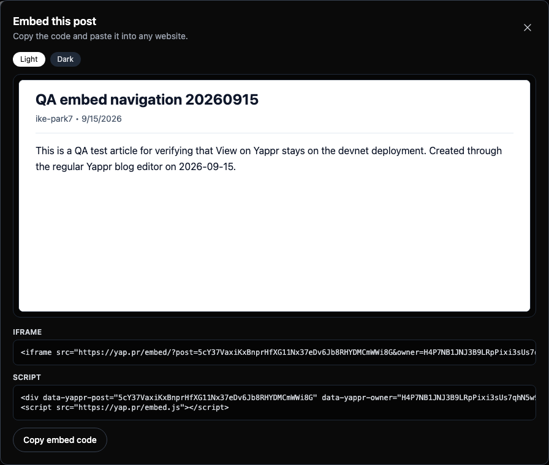
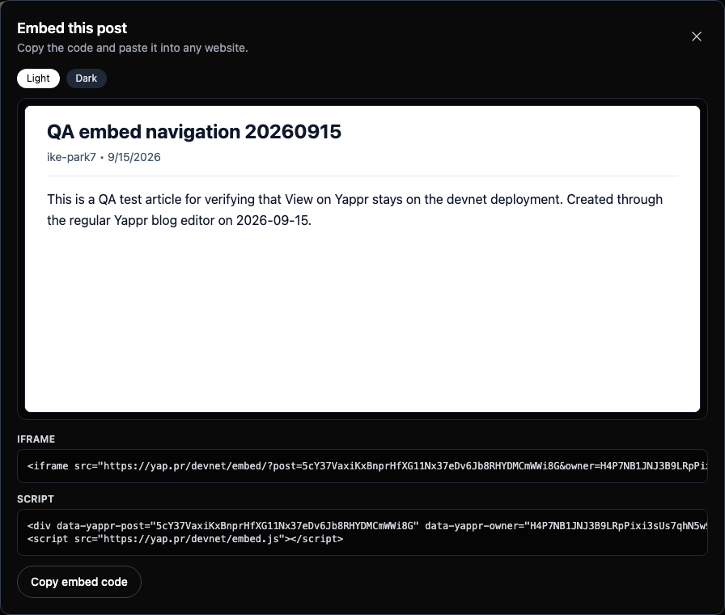
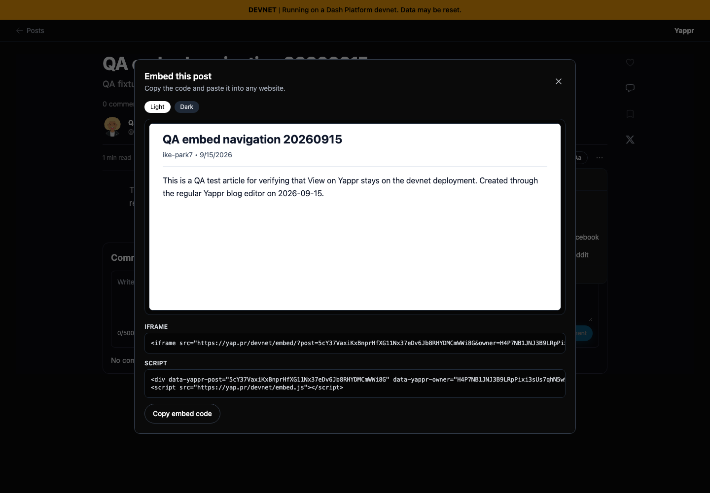
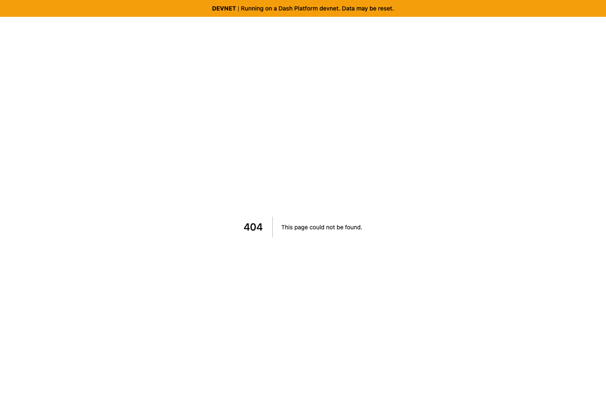
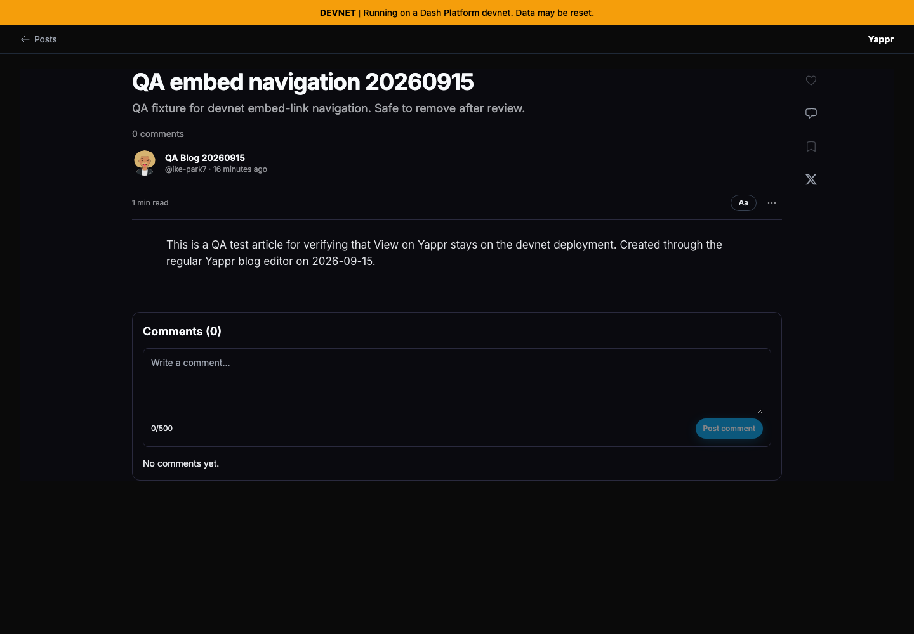
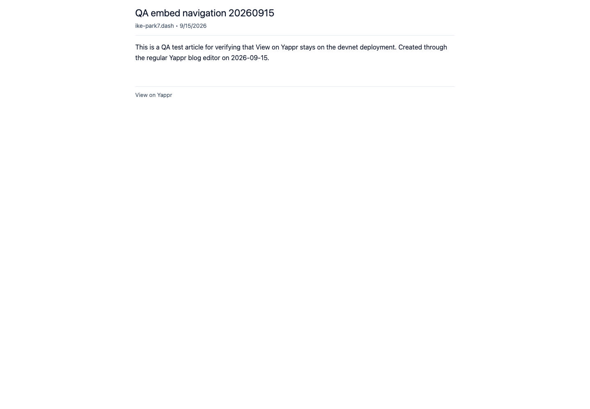

# Yappr PR 417: embed links preserve their deployment

Product PR: https://github.com/PastaPastaPasta/yappr/pull/417

- Before — exact staging base: `4105c5d1c914f5d0838619da93c3b8d28b4a780e`.
- After — full PR head: `5ca005cafe8111fcee1b37aebec212f53421fd0f`.
- Both are independently built production devnet exports, served on localhost:3211 and localhost:4184. HTTP build identifiers and worktree revisions were verified before capture.
- Same real persisted post: `5cY37VaxiKxBnprHfXG11Nx37eDv6Jb8RHYDMCmWWi8G`, owner `H4P7NB1JNJ3B9LRpPixi3sUs7qhN5w9xs9YbQSBFh8Z1`, blog `BkqjYQ95Mm2vNGEaoKbE473jodp7ZPFQr1Mj3jmqw6wA`.
- Title: **QA embed navigation 20260915**. Created through the normal editor and verified signed out. No SDK mocks or reconstructed product UI.

| State | Before — exact base | After — full PR head |
| --- | --- | --- |
| Generated URLs (focus) |  |  |
| Generated URLs (overview) |  |  |
| Clicking View on Yappr |  |  |
| Populated embed (unchanged compatibility) |  |  |

The generated iframe URL changes from `https://yap.pr/embed/` to `https://yap.pr/devnet/embed/`; the script URL changes from `https://yap.pr/embed.js` to `https://yap.pr/devnet/embed.js`. The footer similarly preserves `/devnet/blog/` after the fix.

The before footer escapes to root `/blog`, which produces a 404 on this isolated local devnet export. A separate live observation reached `https://yap.pr/blog/` and displayed TESTNET / Blog not found. The exact-revision screenshots demonstrate the local 404, not that supplementary live screen. After the fix the same article opens with its DEVNET banner.

All eight final PNGs were opened and inspected at original resolution. The global light preference was set in both fresh signed-out browser contexts; the saved blog retains its own dark theme. Chromium, 1440×1000, 1×, en-US, America/Chicago. The only data timing variation is the relative post age. Raw link values and destinations are in [results.json](results.json); capture procedure and evidence matrix are included.

Validation: production devnet build, full lint, all 156 Vitest tests (11 new snippet/script regressions), and the optional real-published-post Playwright case passed with this fixture. Independent implementation review approved. The real-data E2E explicitly skips without E2E_BLOG_POST_ID; it does not invent a document.
