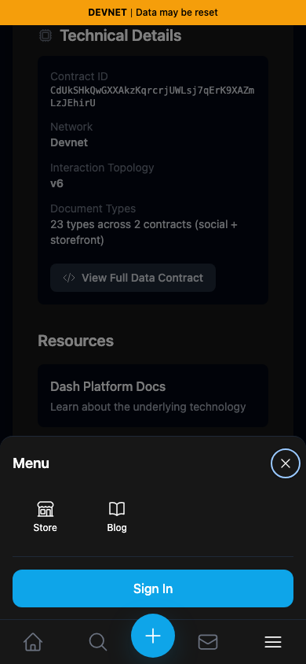
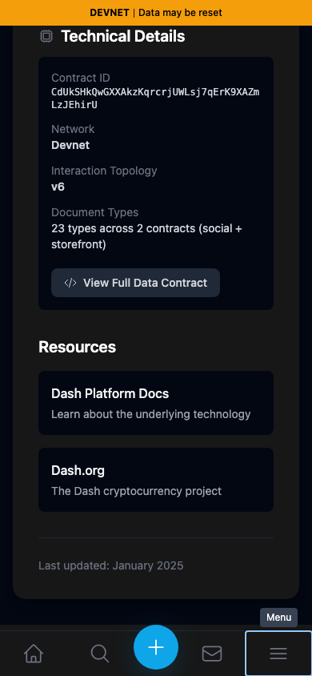

# Mobile menu — integrated comparison

| Surface | Before — exact base | After — full PR head | Shared fixture | Visible delta |
|---|---|---|---|---|
| Mobile Menu open/Escape | c98a6ecd7e26ae5bc9fc8e400e6011eb8465b3a0 | 6c29db1af94892c2ac2f0b72ab661208df1c3242 | Signed-out About page,390×844,dark theme,same scroll position | Focus moves to Close on opening; Escape dismisses and returns focus to Menu |

Separate committed devnet production exports, ports3260/3262. Fresh Chromium contexts with matching dark preference. Four final PNGs inspected at original resolution. UI interactions only; no data writes or mock API responses. This comparison supersedes the historical4105/44061e3 screenshots for the rebased PR.

| Before — exact base | After — full PR head |
|---|---|
|  |  |
|  |  |

JSON observations separately establish closed-sheet accessibility: before the sheet exposes Menu and the next Tab after Dash.org focuses its invisible Close button; after the sheet is inert/aria-hidden and Tab reaches Home directly. Images show opening focus and Escape behavior, not hidden accessibility-tree semantics.

One original commit44061e3 was rebased onto c98a6ecd. Three conflict regions preserved the upstream#416 menu ID, accessible names, disclosure state and tooltip while adding#418 inert/focus handling. Range-diff shows1→1commit with those explainable context changes; the35-line browser regression is unchanged. Full ESLint, TypeScript, exact devnet build and mobile-menu-focus Playwright regression passed. Independent source review approved the integration. The original capture attempt ran before hydration and was rejected; final capture waits for readiness and asserts the open sheet is in the viewport.
