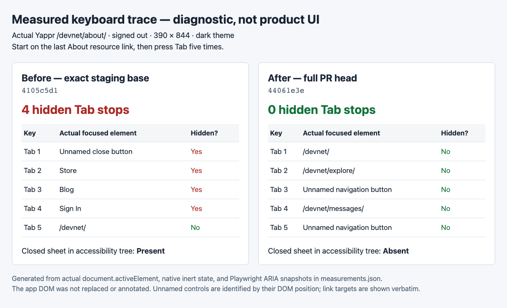
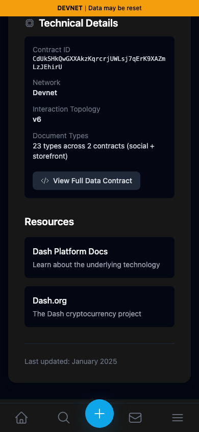
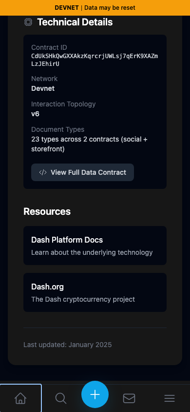
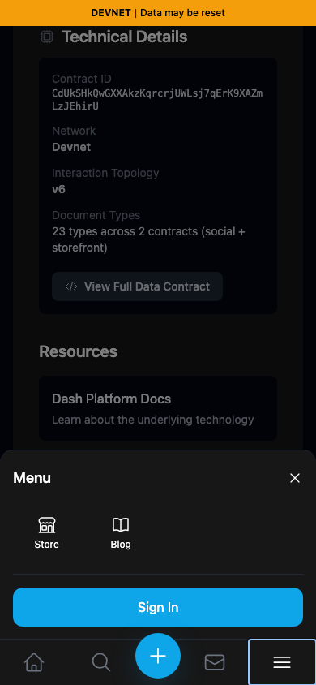
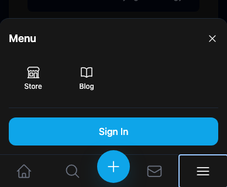
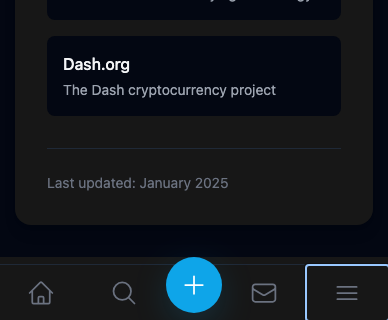

# Yappr PR #418 — closed mobile-menu focus and accessibility

[Product PR](https://github.com/PastaPastaPasta/yappr/pull/418)

| Surface / behavior | Before — exact staging base | After — full PR head | Shared fixture | Expected difference |
| --- | --- | --- | --- | --- |
| Closed mobile sheet and Tab sequence | `4105c5d1c914f5d0838619da93c3b8d28b4a780e` | `44061e3e0e1b2653f01ded0b36fdd32fcf3d4cf2` | Signed-out `/devnet/about/`, 390×844, dark; focus starts on final About resource link | Four hidden stops before Home become zero; closed sheet absent from ARIA tree |
| Open menu with Enter | Same exact base | Same full head | Focus bottom Menu toggle and press Enter | Focus moves from toggle to the menu close button |
| Escape / explicit close | Same exact base | Same full head | Menu opened from same toggle | Escape closes menu; both dismiss actions restore focus to toggle |

## Measured diagnostic

This image is a **generated diagnostic, not an application screenshot**. Every row comes from [the real focus measurements and ARIA snapshots](measurements.json). The [rendered HTML source](diagnostic.html) is included. No product DOM was fabricated, replaced, or annotated. The unnamed controls are identified by their actual DOM position; link targets are reproduced verbatim. Accessible control names are a separate change in PR #416.

## Actual app screenshots

After one Tab from the final About resource link, baseline focus is inside the hidden sheet and has no visible focus ring. The fixed app focuses the visible Home link.

| Before — first Tab | After — first Tab |
| --- | --- |
|  |  |

Opening with Enter leaves focus on the toggle before; after, the close button gains the visible focus ring.

| Before — menu opened | After — menu opened |
| --- | --- |
|  |  |

Pressing Escape leaves the baseline menu open; after, it closes and the toggle has focus. These focused views use identical `(1, 523, 388, 320)` crops with no resizing or annotations.

| Before — Escape | After — Escape |
| --- | --- |
|  |  |

Full-resolution originals: [before Escape](comparison/before/escape.png) · [after Escape](comparison/after/escape.png).

## Actual browser recordings

- [Before keyboard recording](comparison/before/keyboard.webm)
- [After keyboard recording](comparison/after/keyboard.webm)

Both recordings are the actual app viewport with no overlays or substituted UI. They include initial page loading, then focus on the final About resource link, five Tab presses with two-second pauses, focus on the menu toggle, Enter, Escape, and an explicit close. The after recording reopens the menu before exercising explicit close because Escape has already dismissed it. Event times in measurements.json are relative to the ready page rather than the beginning of the loading video.

## Build, runtime, and verification

Both exact revisions were independently built with `npm run build:devnet` and served from their own production `out/` directories. Fresh isolated Chromium contexts used dark theme, `en-US`, `America/Chicago`, a 390×844 viewport, and no signed-in identity. No data or transactions were created. Base/head were verified against the PR metadata before publication.

The new permanent `e2e/smoke/mobile-menu-focus.spec.ts` passed against the final production export, proving closed-sheet ARIA exclusion and native inert state, direct Tab to Home, initial close-button focus, Tab to Store, Escape restoration, and explicit-close restoration. Targeted ESLint and E2E TypeScript passed. An independent source review approved the change.

All final original screenshots, focused crops, and the generated diagnostic were opened and inspected. Recordings were decoded and their two-second sampled frames visually inspected across the entire sequence. No private keys, credentials, account data, or unrelated applications appear. The visible focus and Escape differences match the measured browser state.

## SHA-256

- `9a9ee5b7a9dab4aec850a6994f407bb2055c9003cfe31ea48a1c99abff91d28e` — `comparison/after/escape-focus.png`
- `b0183f7f518527b373105b0bb525fe8830a9563ffc84c3d6f12e348afcf17924` — `comparison/after/escape.png`
- `cce3fb08a4a231f97d40245a5447ab6bb36e3b9ffa49d4dc68dcc98fd8cafc8f` — `comparison/after/first-tab.png`
- `7abc40a0ad8cb9d38cabbf48868f2a7ac57ff921c045f217a1e1349b45438ff4` — `comparison/after/keyboard.webm`
- `0078ea86da11d61f7762d9eade87de0575fa8d622775c53084625063049afd7d` — `comparison/after/menu-open.png`
- `105012bba095b87dd8ea09353e7a6a7693df946eeb8fb3049f1645a53682e188` — `comparison/before/escape-focus.png`
- `86d99591efd5a378272c9b267d53f27c2ab9df2f3b7b57f2d475714e1cd186da` — `comparison/before/escape.png`
- `5aa09cbbd6ae39c6b871a73d45a696ecd8794ee640e37aad34b6c9a68e7a1981` — `comparison/before/first-tab.png`
- `de40479c4887dc35a1cb25ac63e345a5c4638f4a3c25017c2febcf5bf3a10d29` — `comparison/before/keyboard.webm`
- `86d99591efd5a378272c9b267d53f27c2ab9df2f3b7b57f2d475714e1cd186da` — `comparison/before/menu-open.png`
- `b56969c1ebf6d2b9e7b535ad9e8027b0aca0d7f3ff2f68f2ef16bdd7a599c753` — `diagnostic.html`
- `278d761e4f4e20ed37f454320d5d9caa54dede0054886bf3b4463546dc0726b0` — `diagnostic.png`
- `056bbe49265c64ae8a5e4ab3ba5b6f01a47f936210b7bed99c2ef1fa25e5b849` — `measurements.json`
