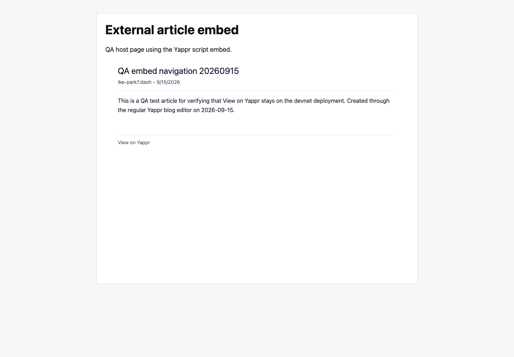
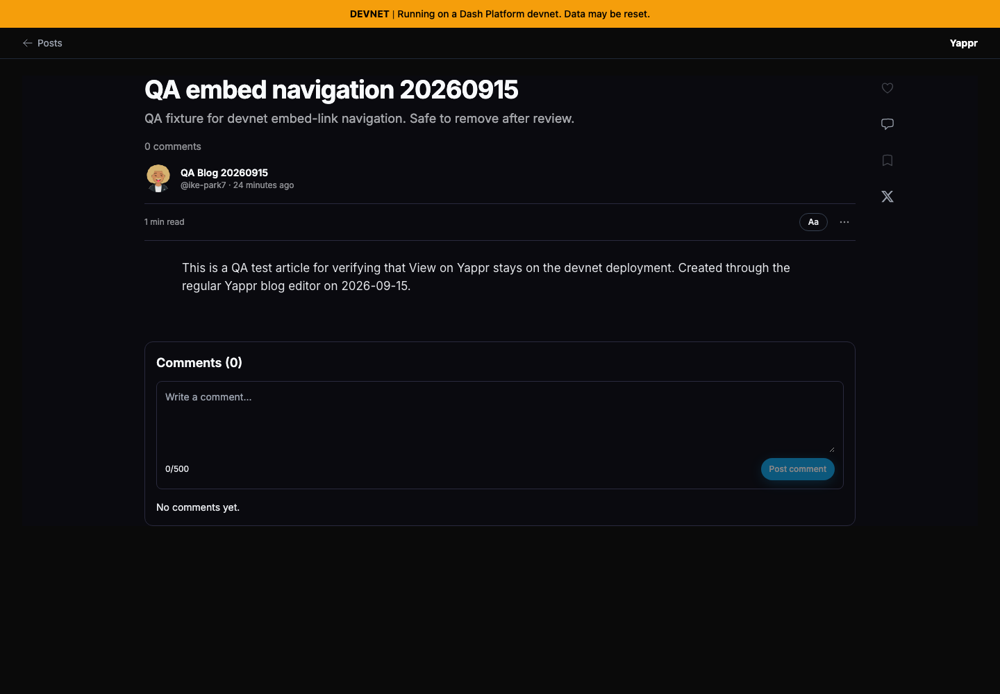

# Yappr PR 420: open the full article from a script embed

PR: https://github.com/PastaPastaPasta/yappr/pull/420

This is stacked on PR 417, which corrects the deployment URLs. The before state here is the exact stacked base, not the original staging revision.

- Before — exact base / PR417 head: `5ca005cafe8111fcee1b37aebec212f53421fd0f`, production devnet export on localhost:4184.
- After — full PR420 head: `70573048d3aeeb39d8f5490ada75037dfae18c18`, production devnet export on localhost:4186.
- Both independently built exports had their HTTP build identifiers verified before capture.
- Same real saved post `5cY37VaxiKxBnprHfXG11Nx37eDv6Jb8RHYDMCmWWi8G`, owner `H4P7NB1JNJ3B9LRpPixi3sUs7qhN5w9xs9YbQSBFh8Z1`, blog `BkqjYQ95Mm2vNGEaoKbE473jodp7ZPFQr1Mj3jmqw6wA`, title **QA embed navigation 20260915**.

The outer **External article embed** page is a disclosed static test host on a separate origin, `127.0.0.1:4185`. It includes the real product script, which creates its own iframe and reads the real published article. No SDK/data mocks or reconstructed product UI. The article was created through Yappr's normal editor.

| State | Before — exact stacked base | After — full PR head |
| --- | --- | --- |
| Host before click (unchanged compatibility) |  |  |
| Host tab after clicking View on Yappr |  |  |

Before, the link click leaves the external host unchanged. The browser logs an invalid sandbox token and rejects navigation. After, the same click opens the full article in the host tab with its DEVNET banner. The implementation replaces the invalid token with `allow-top-navigation-by-user-activation`; it does not permit unprompted top navigation.

All four final screenshots were opened and inspected at original resolution. Chromium, 1440×1000, 1×, en-US, America/Chicago, separate fresh signed-out contexts. Light host/embed; the saved blog's own dark theme is unchanged. Exact link destinations and browser messages are recorded in [results.json](results.json). The matrix and capture script are included.

Validation: production devnet build, full application lint, JavaScript syntax check, all 156 Vitest cases, and the new separate-origin-host Playwright case passed. That browser case failed against the exact stacked base at the expected URL assertion (host remained instead of opening article). It requires an explicitly supplied real E2E_BLOG_POST_ID and skips if absent. Independent code review approved. No unrelated sandbox scenarios were tested.
