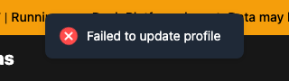
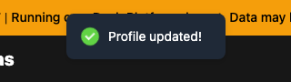
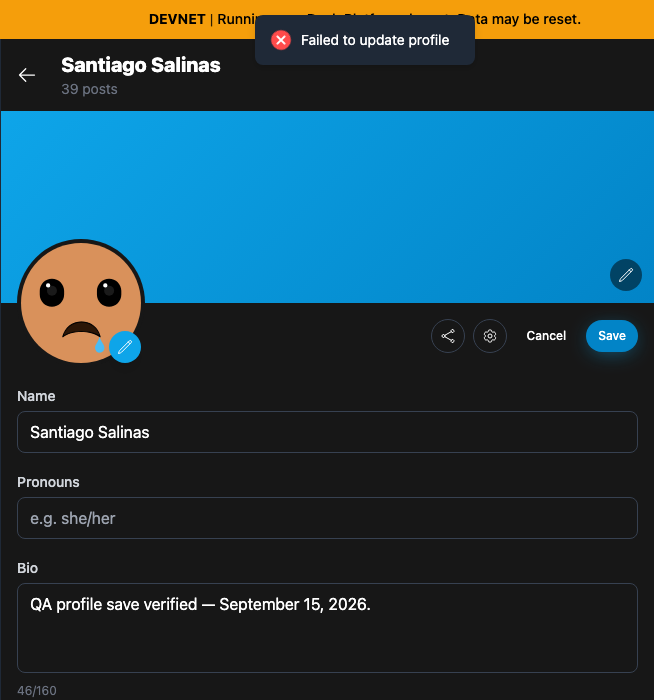
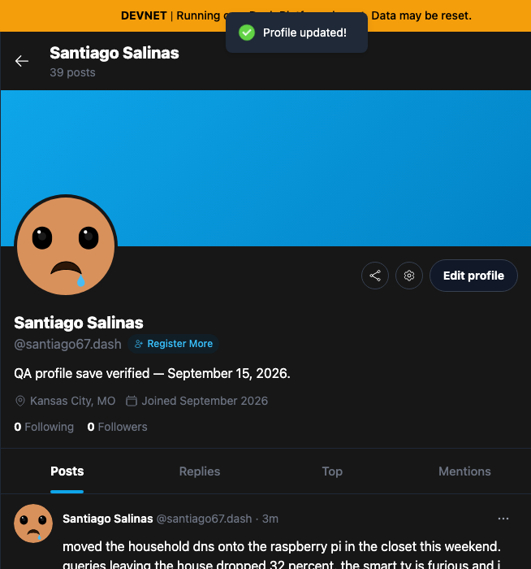

# Yappr PR #421 — profile edits preserve serialized contract fields

[Product PR](https://github.com/PastaPastaPasta/yappr/pull/421)

| Surface / action | Before — exact staging base | After — full PR head | Shared fixture | Visible delta |
| --- | --- | --- | --- | --- |
| Change only Bio and Save | `4105c5d1c914f5d0838619da93c3b8d28b4a780e` | `8fdfd9838442bee1729e7fddd37e46d9dafeb48b` | Santiago Salinas, signed in as seeded persona 35, same stored profile and replacement Bio | Failed-save toast and open editor become success toast, closed editor, and new Bio displayed |

## Before and after

The result toasts at native scale, from identical `(480, 1, 320, 90)` crops:

| Before — failed Save | After — successful Save |
| --- | --- |
|  |  |

| Before — exact staging base | After — full PR head |
| --- | --- |
|  |  |

Focused views are identical `(275, 1, 654, 700)` crops of the actual 1280×1000 app screenshots. No resizing or annotations were applied.

Full-resolution app screenshots: [before](comparison/before/profile-save.png) · [after](comparison/after/profile-save.png).

## Fixture and state verification

- Network: moutai devnet, same live contract `6cyzfCVkov5RqJzRpXTmCAjYWBGqB1SzsBxrsnd8AUyb`.
- Seeded QA identity: `HKnHfmJ7WVNhvzPRagtJDuae6SjezpnzHUgXkuVRBpgK` (`santiago67.dash`).
- Profile document: `E9YQNDpKLYUrjsWBKMUbpRh98Mh22yy4cQEcarZwMWwk`.
- Page: `/devnet/user/?id=HKnHfmJ7WVNhvzPRagtJDuae6SjezpnzHUgXkuVRBpgK`.
- Only the Bio input was edited, to `QA profile save verified — September 15, 2026.`.
- Original Bio: `Bikepacking out of Kansas City. Slow uphill, fast downhill, always hungry.`

Both exact revisions were independently built with `npm run build:devnet`, served from their own `out/` directories, and opened in fresh Chromium contexts at 1280×1000, dark theme, `en-US`, `America/Chicago`. Authentication was restored from the seeded test fixture with its key held only in memory. No markup, responses, app routes, or toasts were mocked. The separate unit tests mock network boundaries; the visual captures and readbacks use the real app and devnet.

The baseline Save failed with `JsonSchemaError: [] is not of type "string", path: /paymentUris`. [The baseline readback](before-readback.json) retained the original content at revision 4. The fixed UI saved successfully, and an [independent SDK readback](after-readback.json) confirmed the new Bio at revision 5. The raw serialized avatar was preserved byte-for-byte.

A fresh browser context then loaded the saved value and restored the original Bio through the normal UI ([restoration screenshot](restore.png)). The existing UI draft also supplies `nsfw:false` when the original optional field is absent; this is unrelated to the fix. A final normal signed SDK replacement restored that absence too. [The final readback](restored-readback.json), revision 7, has **exactly the original contract fields**, with only platform-managed revision/timestamps changed. [Verification summary](verification.json).

The seed account and live timeline are synthetic QA fixtures. Posts, post counts, total network counts, and relative times can change as the shared devnet is used. This comparison makes no claim about those surrounding values. The initial source-only test fixture correction changed the unpublished head; the final evidence was recaptured on the full head listed above. No intermediate-head images were published.

## Validation and inspection

- All 150 unit tests passed on the final head. Five new service regressions assert exact contract-only replacement data, preservation of raw serialized fields, intentional clears, encoding new arrays, same-document revisions, rejected writes, and cache invalidation.
- Targeted ESLint, standalone `npx tsc --noEmit`, and final `npm run build:devnet` passed.
- Independent source review approved the production change.
- Final originals, both focused crops, and the restoration image were opened and visually inspected. The failure and success toasts are fully visible and readable. No keys, credentials, private account material, or unrelated windows appear.

## SHA-256

- `23c85d609597e5a0ed16281455a861b0d98a22e72ac71ed8bc542e292ad95eea` — `after-assertions.json`
- `d47788ff20cd30dd86585a8ec6a6c31e2192aa6aebd9b1540a42e63fa4739e20` — `after-readback.json`
- `1d5b8684112e9d239c598c2d050782e7bf609d3f68ee56eb56c3bcdf0810fc83` — `before-assertions.json`
- `afc18ba7e2fa674e20ab616514424977269b0c2a1260d89a65549520918b88b6` — `before-readback.json`
- `088e7f6634af1f2327584f6c1d46dee41a5ec036eb8b04c87d3c2f1d7bd94b52` — `comparison/after/profile-save-focus.png`
- `b430b07b69b6ee8ed102c85efea5b34609267b352346a9947378baf3f40aba33` — `comparison/after/profile-save.png`
- `c93d5e476c45af0c0e9d1ad13818ad102fb9c5c71699487e9041aec15a3a0918` — `comparison/after/save-result.png`
- `84f03377ccf5057e5f32b1e187436479f7a9bb45a492f2e4fa47346ab44f4641` — `comparison/before/profile-save-focus.png`
- `f9adc129a8ecfc65d656997259c0bbc5350512213717612591e57ac51a6a16ec` — `comparison/before/profile-save.png`
- `056c468267643e6f20efc0a039c211a0668beb66cdac1f43eb6f963fa3b52e41` — `comparison/before/save-result.png`
- `d525b3353b793dbe89c9d28c35a2850549f2f81dee6a0095918d6ff3cc7f1849` — `restore.png`
- `e81aee585a9687b0602eee16d60be48d9fa8cdc14ee9f389cb68e7011ca8780d` — `restored-readback.json`
- `ec54968e69c8ae5e686a594bfcb3f5af7cb36cf8d1e258e6f835a128690a824f` — `verification.json`
