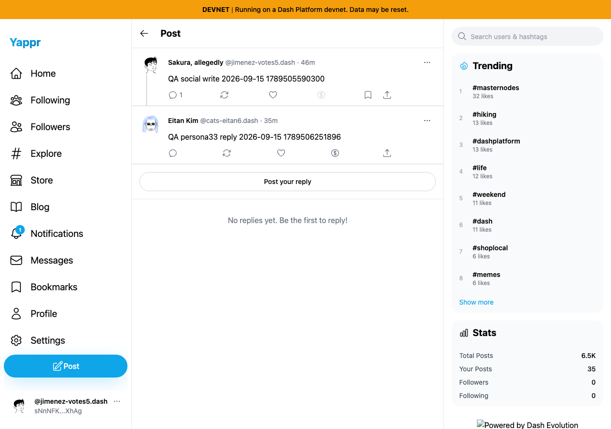

# Reply context author before/after evidence

| Surface | Before | After | Shared fixture | Expected delta |
|---|---|---|---|---|
| Reply detail, parent post card | 4105c5d1c914f5d0838619da93c3b8d28b4a780e | e7e72bce3eef34729d322fb5ea1c391c37c1a910 | Devnet root9mcdDNznWP86bScjmMykF1kzNpecneoFoZVVNAB5qCFd; replyFm49xnhGoKheyBWKPn2KuzgeMwwuVDPgd61MRznovZg4; viewer/root author sNnNFK4vrjhy6nPYpj2FSUhREY8CRG3QZscn61nXhAg | Parent retains resolved name/DPNS handle rather than Unknown User/identity abbreviation. |

Real production builds, fresh browser contexts, 1280×900, light theme. Read-only on-chain fixtures from earlier QA creation; no mocked services. Session restoration is seeded locally; this does not test login. The static local server omits root-only branding images, a local capture limitation already verified healthy on deployed staging.

Both final images were opened at original resolution. The same root/reply and viewer are used, with a15-second settled-state wait. Before: `Unknown User`; after: `Sakura, allegedly` and `@jimenez-votes5.dash`, with the real reply count1 also restored. Relative timestamps advance by a minute between captures; live aggregate sidebar statistics are not controlled fixtures.

| Before — exact base | After — full PR head |
|---|---|
|  |  |

Build and source/test TypeScript checks passed; source and E2E ESLint passed with their respective projects. Independent source review approved the change. The two actual-app browser runs verify the same author consistency assertion added to the existing E2E lifecycle; the full state-changing lifecycle was not re-run locally for this read-only fix.
