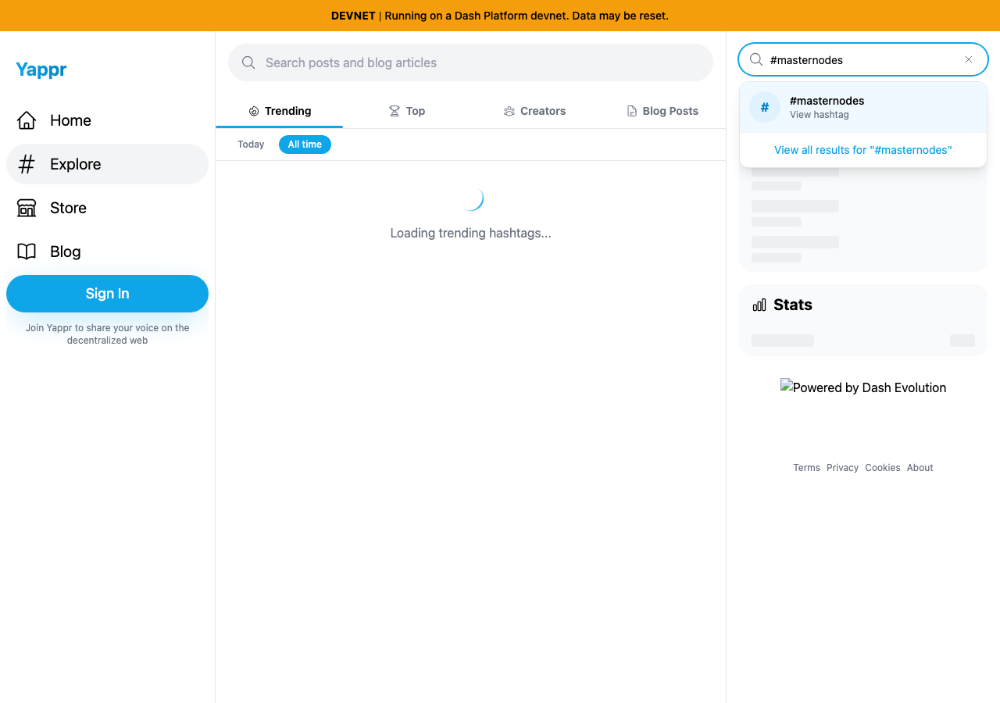
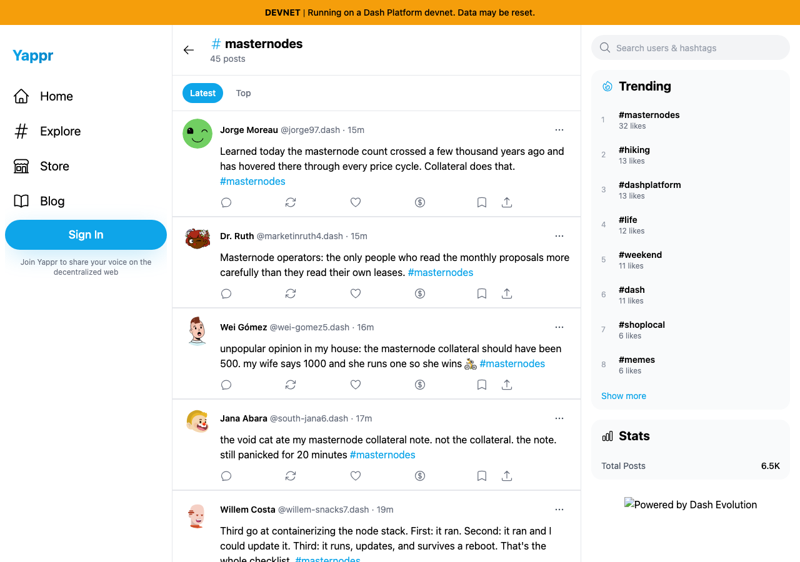

# Hashtag suggestion route before/after evidence

| Surface | Before | After | Shared fixture | Expected delta |
|---|---|---|---|---|
| Sidebar search suggestion | 4105c5d1c914f5d0838619da93c3b8d28b4a780e | 3e95d3be7ee21e49cc280004737151e37a1d2052 | Guest, #masternodes, devnet,1280×900, light | Same suggestion opens a populated hashtag page rather than404. |

Real static production builds and real devnet public reads. No mocked application data. Start at hydrated welcome and follow Explore before typing. The two click/keyboard tests fail on exact base at URL assertion. An initial after-test used the wrong '#masternodes' accessible heading (the # is an icon); corrected to 'masternodes'. That discarded test-selector failure was not an application issue. Live staging also reproduced the wrong route; its host fallback shows a TESTNET404 while the local exact-base build shows DEVNET404.

Final source/test lint, both TypeScript projects, production build, and both browser tests passed. All three selected source images were opened at original resolution. Browser observations show0 cards on the404 versus45 publicly readable cards after navigation. The initial suggestion screenshot intentionally shows the usable dropdown while unrelated trend data is still loading. Local footer branding is unavailable from the base-only static server; deployed assets were separately verified.

Trigger: select **View hashtag** here.

| Before — exact base | After — full PR head |
|---|---|
|  |  |
