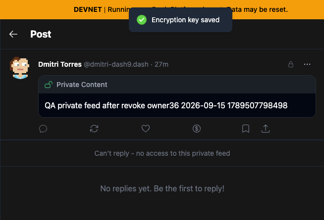
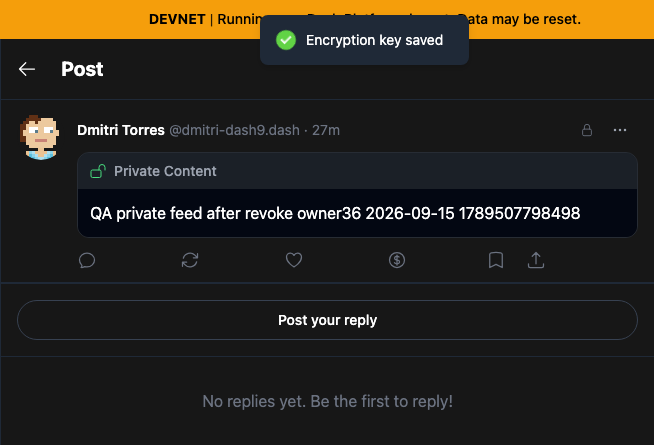
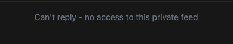
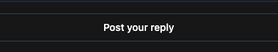

# Yappr PR #424 — refresh private reply availability after key recovery

[Product PR](https://github.com/PastaPastaPasta/yappr/pull/424)

| Scenario | Before — exact staging base | After — full PR head | Shared fixture | Observed result |
| --- | --- | --- | --- | --- |
| Approved follower recovers keys | `4105c5d1c914f5d0838619da93c3b8d28b4a780e` | `7a5376816914384253a57aba44efa192e5cfaf02` | Same owner/follower, same epoch-2 post, fresh auth-only browser contexts | Content decrypts in both; stale reply denial becomes **Post your reply** |
| Retained recipient views epoch-3 post after revocation | Same exact base | Same full head | Same earlier grant and same newly published post | Both settled screenshots show locked content and reply denial; compatibility evidence |

## Visible recovery comparison

| Before — exact staging base | After — full PR head |
| --- | --- |
|  |  |
|  |  |

Context crops use identical `(275, 1, 654, 445)` bounds from the 1280×1000 originals. Reply-control crops use identical `(408, 282, 390, 74)` bounds. No resizing, annotations, or DOM modifications were applied. Full app screenshots: [before](comparison/before/recovery.png) · [after](comparison/after/recovery.png).

## Exact fixtures and procedure

- Network: moutai devnet; social contract `CdUkSHkQwGXXAkzKqrcrjUWLsj7qErK9XAZmLzJEhirU`.
- Owner persona36, Dmitri Torres / `dmitri-dash9.dash`: `7D12htK5tT9cVbEEJwGS3PAnAZyoF11vW1fXjGePe6Jn`.
- Follower persona37, `sabine-ceramics8.dash`: `FSKjtD7izsATQWr6fZSgbJPxiJM3MZNTLGAj1SvtJu2z`.
- Recovery post: `BqYTdPePdeknt4oA2T2P8mmDLZxTzrdf5UzUv7uRsxhq`, epoch 2, visible text `QA private feed after revoke owner36 2026-09-15 1789507798498`.
- New post after revocation: `Cse31om2HvWCiYftNaftF5XzdTB3voR458YqTxqmae9u`, epoch 3.

Both revisions were built independently with `npm run build:devnet` and served from separate output directories. Chromium contexts were fresh and separate, 1280×1000, dark theme, en-US, America/Chicago. Authentication was restored from seeded test identities; keys were held in memory and secret input fields were absent at capture. All follow, request, approve, recover, revoke, and post steps used normal application UI on real devnet. No responses or app markup were mocked.

After the owner approved the request, each recipient context opened the same post without previously recovered feed keys and recovered them using the normal encryption-key flow. Both decrypted the post. The baseline continued to deny replies; the fixed head immediately enabled **Post your reply**. Opening the authorized reply dialog succeeded on the fixed head; no reply was submitted.

## Revocation compatibility and cleanup

The recipient contexts retained their recovered epoch-2 keys. The owner revoked the grant and published the epoch-3 post normally. [Before settled screenshot](comparison/before/revoked.png) and [after settled screenshot](comparison/after/revoked.png) both show locked content and reply denial. The initial automated baseline measurement counted one reply action before it settled; the screenshot 600 ms later does **not** demonstrate a persistent baseline mismatch. No reply action was attempted after revocation. [Timing and measurements](browser-results.json).

[Original](original.json), [approved](approved.json), [revoked](revoked.json), [post-publication](posted.json), and [restored relationship](restored-relations.json) readbacks are sanitized to public identifiers, fields, and ciphertext lengths. Follow/grant/request relationships were restored to their original absent states. The owner feed remains enabled and advanced from epoch 2 to 3 through normal revocation; that epoch advance was not undone. The new synthetic QA private post remains on chain.

## Validation and inspection

149 unit tests passed, including four new key-readiness/subscription tests. Targeted ESLint, standalone TypeScript, and the final devnet production build passed. Independent review approved the change. Public cards do not subscribe or read key state. Readiness requires path keys and a cached epoch at least as new as the displayed post, preserving the existing backwards derivation rules and cryptographic enforcement.

All four original screenshots and four final crops were opened and inspected. The recovery delta is readable, comparable, and contains no credentials. Revocation screenshots are labeled as compatibility evidence, not a visible fix delta. Surrounding live counts and relative times may vary on this shared synthetic QA network.

## SHA-256

- `65cc1d99258dee1b6cf719b481087a6d40947244793021d71b06c201c49358db` — `approved.json`
- `4623e1ea29332fc49d494d41b6fa6fafa4cc602a5a32ceab1408c066d8de2c46` — `browser-results.json`
- `e2dd22719c67440e4eab37feaec0b4b4764d672d3a19e53fcd315a924528ad08` — `comparison/after/recovery-focus.png`
- `a96dc8944b4e96306c712076275df2975c7131311c8bfeac7e3b207a35230bb4` — `comparison/after/recovery.png`
- `2dee52b0ed8f36a4a4fd6911cbe9939c05841de5cc071824a1a4d48e0c0d05f7` — `comparison/after/reply-control.png`
- `d2ee907ee064fef74e3b14ff44fbce5cf9124af16e6efa0da1ca34c0bc7bb677` — `comparison/after/revoked.png`
- `63c0623d2315fbbcad478fd7804923e8f4b8331bad09767e3ffe12d53f097dd5` — `comparison/before/recovery-focus.png`
- `517c1a27b7609a372652ae5fa4dffa764447bf38c20765637ae917ced19fc7da` — `comparison/before/recovery.png`
- `b6c8e5d628425f365793cf36bb66eaf9590a39f0e2f15d4d5e3da3c22ad6dcc5` — `comparison/before/reply-control.png`
- `e313cd68b21de57de21e3ee1a97e6f7e8172819b027a809feee7f58c1a8489cf` — `comparison/before/revoked.png`
- `e6ebbbc8d00d9d4ade4874424da6c9befb79e87e355d47af8dcd1adca705d560` — `original.json`
- `4fe2faaa747fd659b2f38fb35f04822a59aef79f2ab8999542e6487777bf445e` — `posted.json`
- `3ea910d6bda045e82601c6901e39d180b015ff6c4d22966568b81d590d1ec11c` — `restored-relations.json`
- `3167cf529b5fea3fb8b64550c9766ce0074d2b598b88cc00c9e66d5386c17829` — `revoked.json`
