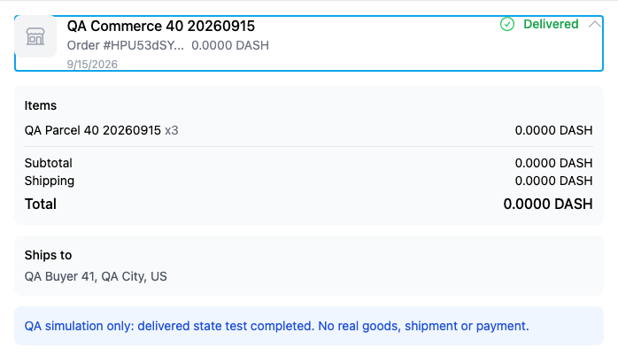
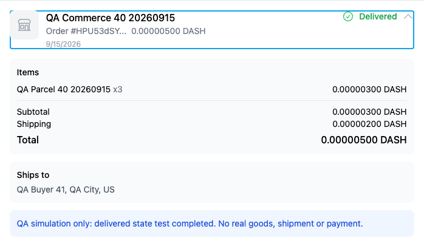
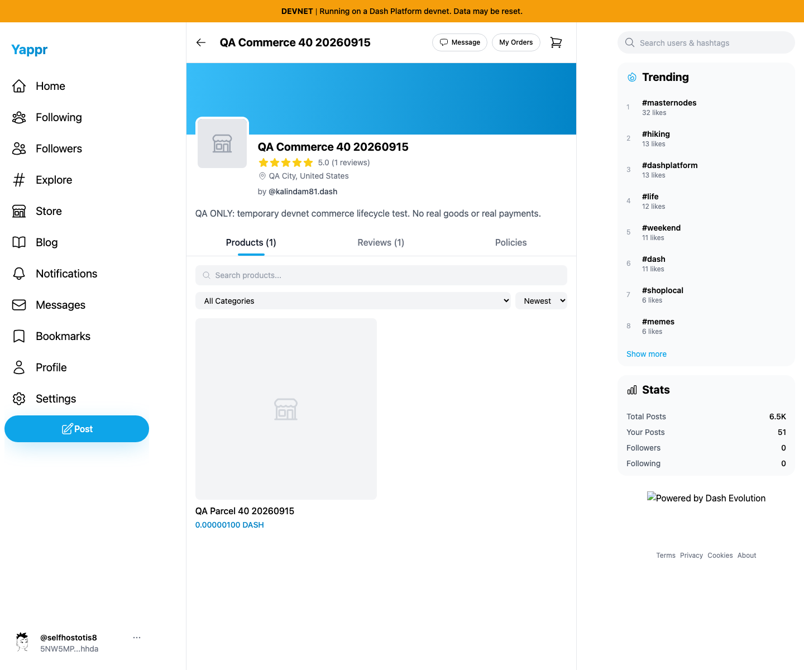
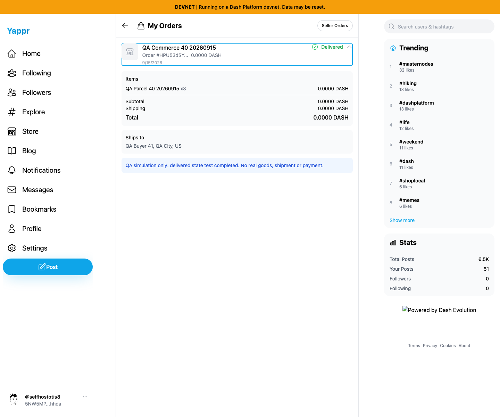
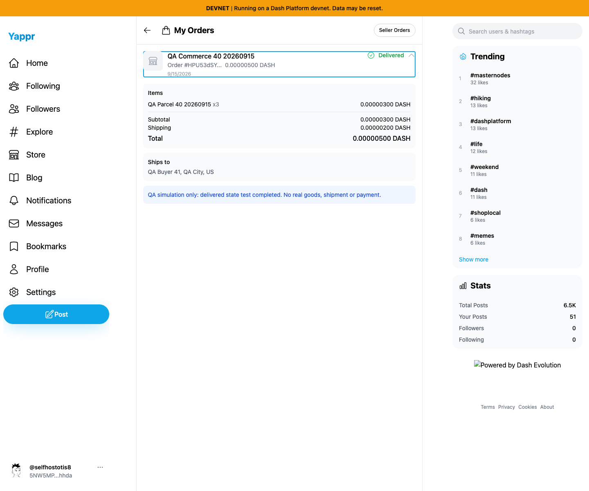

# Yappr PR426 — preserve DASH price precision

Base `4105c5d1c914f5d0838619da93c3b8d28b4a780e`; full head `940d4d2e3eeb13678335c7e0bcc574e4a2fc1d66`. Independently built production devnet exports, base localhost:3211 and head localhost:4188. Same real persisted devnet fixture and assigned buyer41; Chromium1440×1200, en-US, America/Chicago, light theme. Separate browser contexts and normal supported login/key entry. No mocked responses or reconstructed application DOM.

Store `98FYBhEF9Q8xNzbamzy66Dm5cMQ5gm9MoAZaiy518sNp`, product `25n2uxxtBSAWVWZBD86uGXdkHW7nYP25jpgfpPY87qRH`, order `HPU53dSYTHZZ8TBQPhXxHkW5qRgXWAHQWTmYJe9ivDBp`. Product100duffs; order quantity3/subtotal300/shipping200/total500duffs. **No payment or real shipment occurred.** The order is a visibly labeled QA simulation.

All DASH values now show8decimal places, preserving the native currency precision; fiat and BTC formatting are unchanged. The change affects display only. Screenshots show storefront and saved order; shared-formatter unit tests additionally cover1duff, zero, whole amounts and fiat/BTC compatibility. No value storage/payment behavior change is claimed.

| Before — exact base | After — full PR head |
| --- | --- |
|  |  |
|  |  |
|  |  |

All6final PNGs were opened at original resolution and inspected for content, matching fixture and absence of secrets. Full-resolution files are available via the image links. See EVIDENCE_MATRIX.md and SHA256SUMS.
