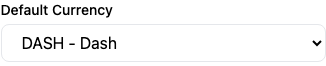
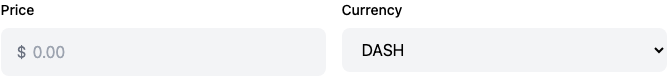
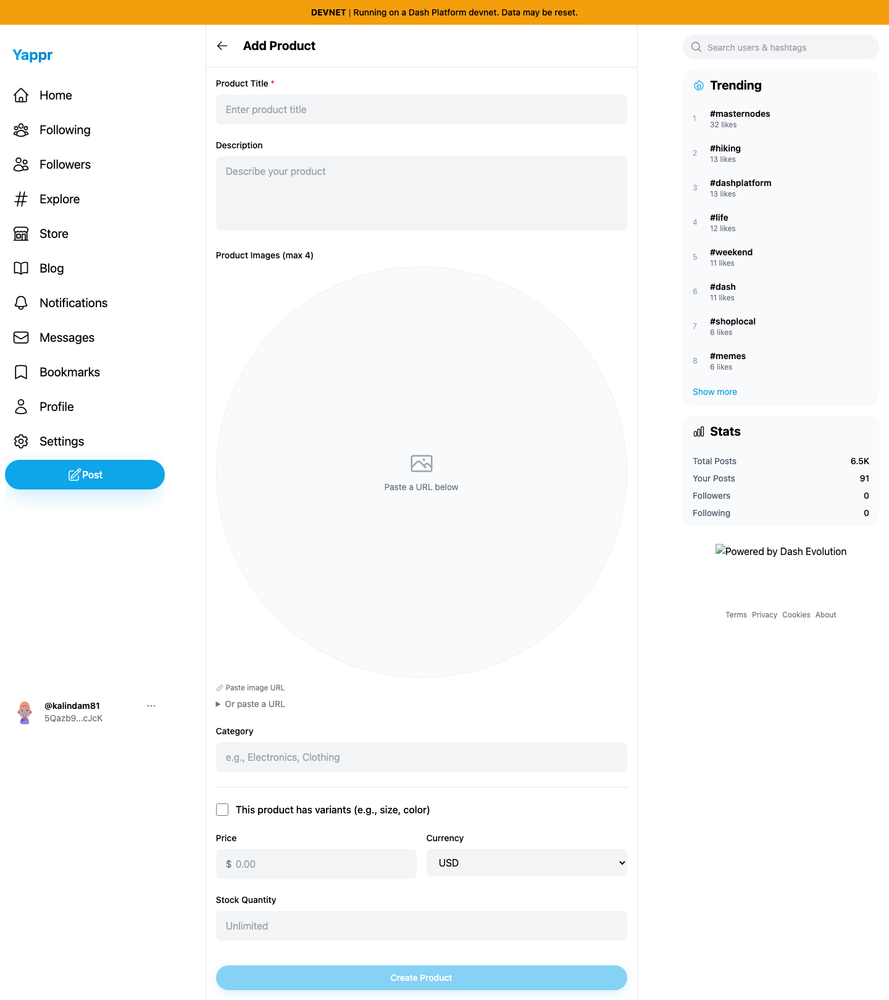
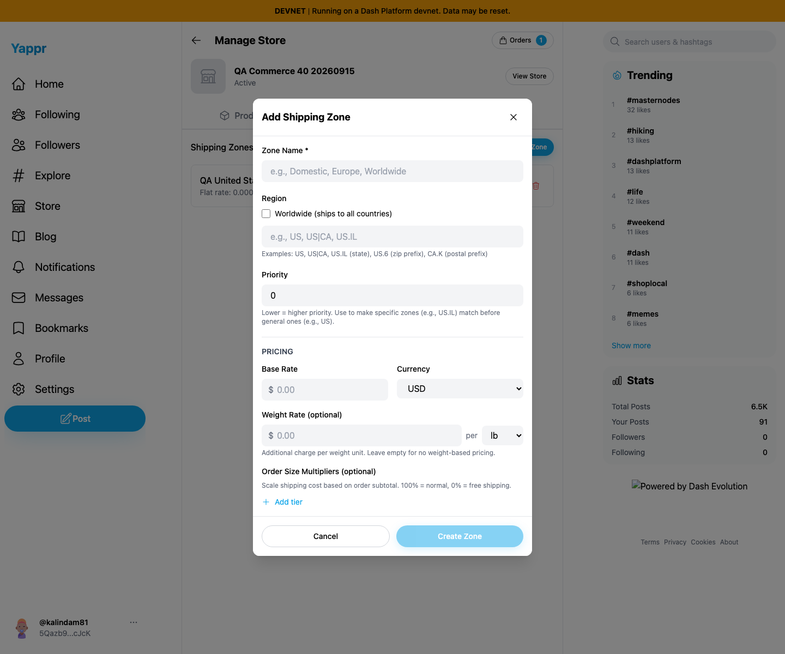

# Yappr PR428 — use the saved store currency

Base `4105c5d1c914f5d0838619da93c3b8d28b4a780e`; full head `0bf37422f36f501c82a0a29775e1084a00a9a8ee`. Separate production devnet builds at localhost:3211 and localhost:4189; same seller40, same store `98FYBhEF9Q8xNzbamzy66Dm5cMQ5gm9MoAZaiy518sNp`, whose saved default was DASH in every paired capture. Chromium1440×1200, en-US, America/Chicago, light. Actual supported UI login; real devnet data, no mocked responses, storage injection or reconstructed DOM.

Before, both new-product and new-shipping forms start USD. After, each starts DASH as configured. CAD is also selectable because it is already supported by the store default selector. Product form loading resolves the default before allowing edits, with a visible load error instead of silently showingUSD on failure.

Saved store default readback:

| Before — exact base | After — full PR head |
| --- | --- |
|  |  |
|  |  |
|  |  |

Compatibility verified through actual UI:

- New product permits manually overriding DASH with CAD.
- New shipping zone permits overriding DASH with CAD; cancel/reopen resets to the store default.
- Temporarily saving the assigned store default as CAD makes both new forms start CAD; existing product retains its own DASH currency. Store default restored to DASH through Save Changes and fresh readback.
- Existing shipping zone retains DASH and exact0.00000200 rate; existing product retains DASH and0.00000100 price. No pre-existing item/rate was rewritten.
- Full lint,145 unit tests and production devnet build passed; separate independent review requested.

All7final images opened at original resolution and inspected. The form screenshots are unsaved examples using the same persisted store. No payment or shipment occurred. See EVIDENCE_MATRIX.md and SHA256SUMS for capture provenance and hashes.
