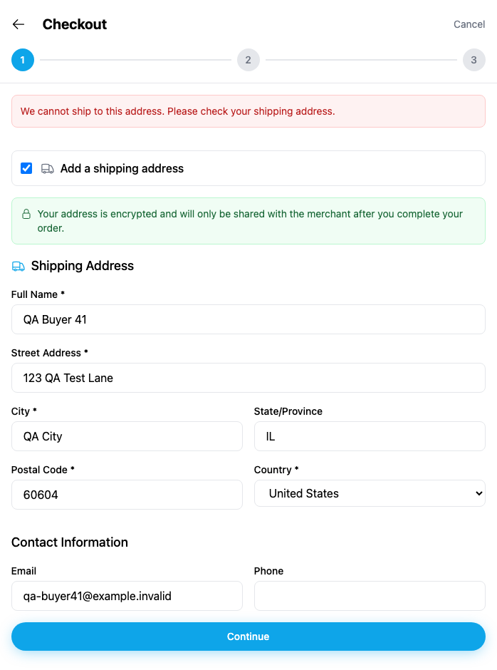
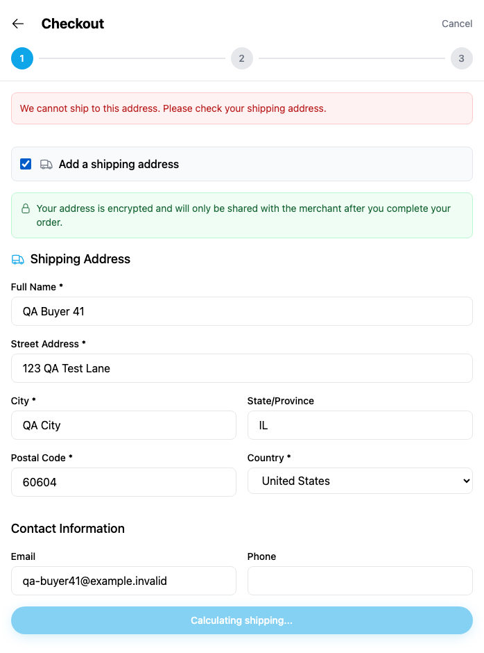
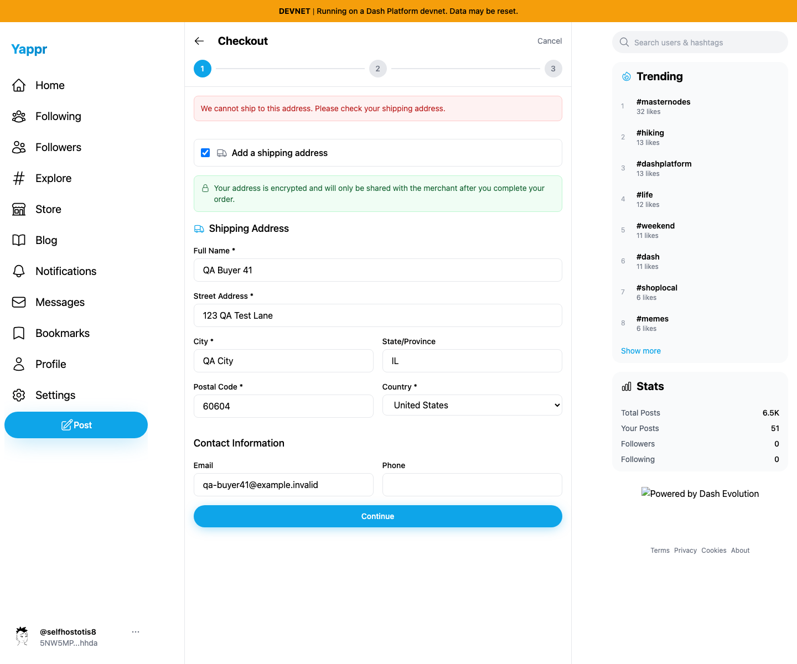
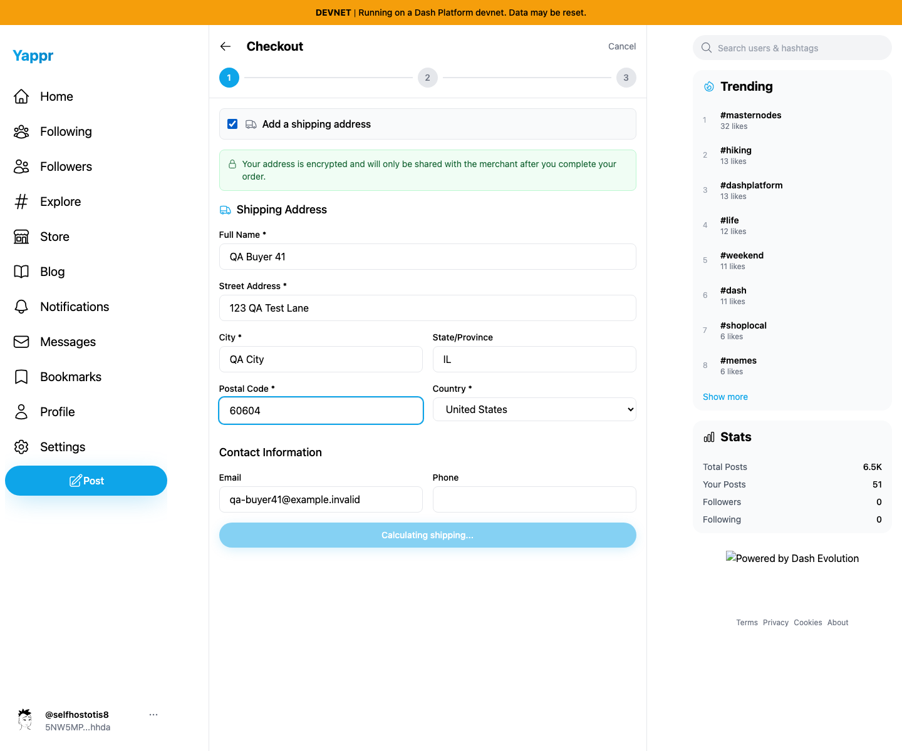
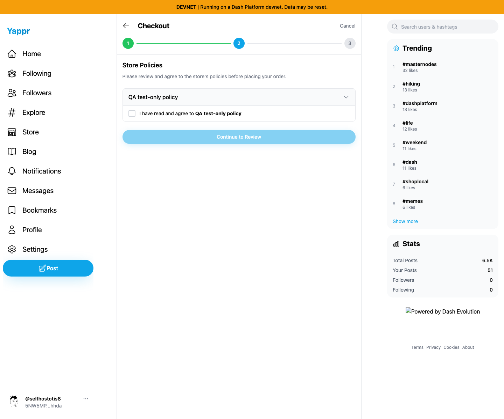

# Yappr PR431 — wait for shipping calculation

Exact base `4105c5d1c914f5d0838619da93c3b8d28b4a780e`; full head `680eac6869e8069d49a4b79126231fde36d1f32b`. Independently built production devnet exports at localhost:3211 and localhost:4190. Same assigned buyer41, store `98FYBhEF9Q8xNzbamzy66Dm5cMQ5gm9MoAZaiy518sNp`, product `25n2uxxtBSAWVWZBD86uGXdkHW7nYP25jpgfpPY87qRH`, quantity1 and synthetic US address shown. US shipping zone is already configured. Chromium1440×1200, en-US, America/Chicago, light; separate contexts and normal login/encryption-key entry.

Before: change postal code to60604 and promptly click Continue, then Skip on the save-address prompt. The pending lookup is treated as no matching shipping zone, so checkout rejects the accepted address. Identical untouched address succeeds after the request completes.

After: Continue is disabled and reads Calculating shipping... until the lookup finishes, then the same address advances to policies. Stale address calculations are ignored. No network delay was injected and no responses, storage or application DOM were mocked.

| Before — exact base | After — full PR head |
| --- | --- |
|  |  |
|  |  |

The same US address advances after calculation:

Additional actual UI checks: changing the country to unsupported Canada still rejects after the lookup settles; turning off shipping permits continuation. No order or payment submitted during these checks. Independent review, lint,145 unit tests and production devnet build passed. All5final screenshots were opened at original resolution and inspected. See EVIDENCE_MATRIX.md and SHA256SUMS.
