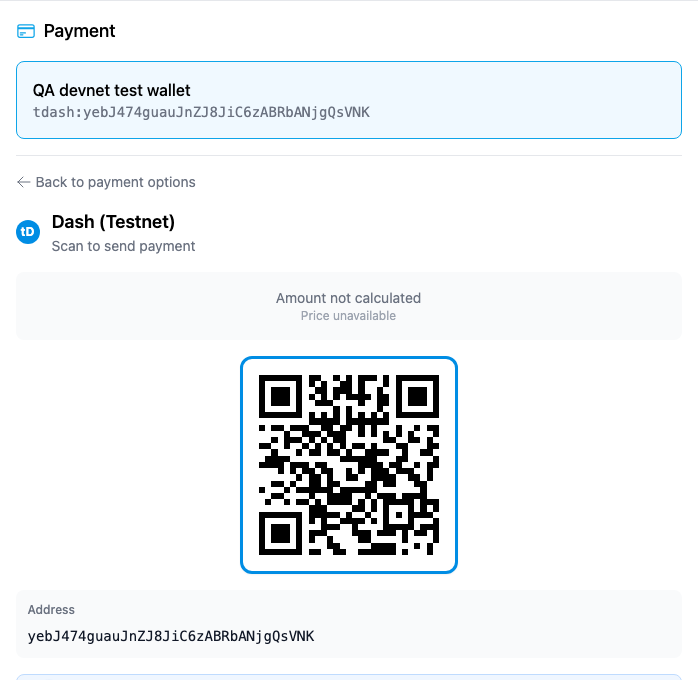
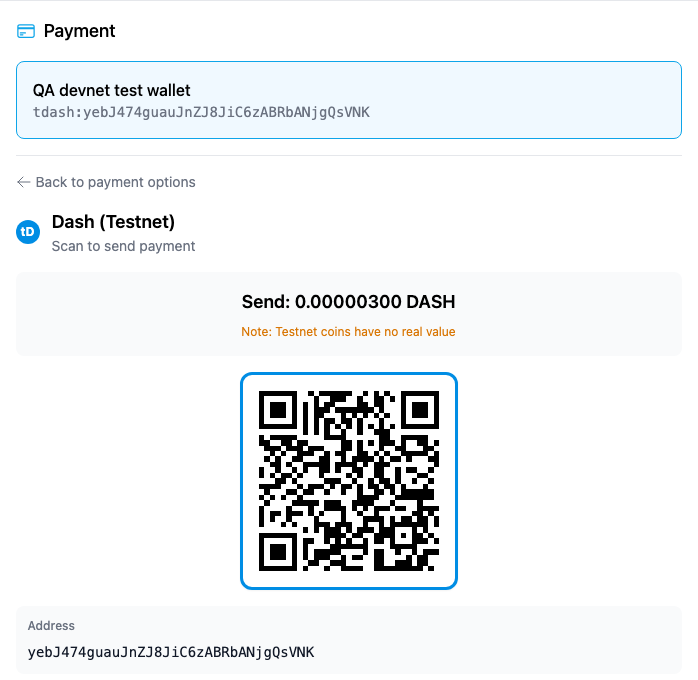
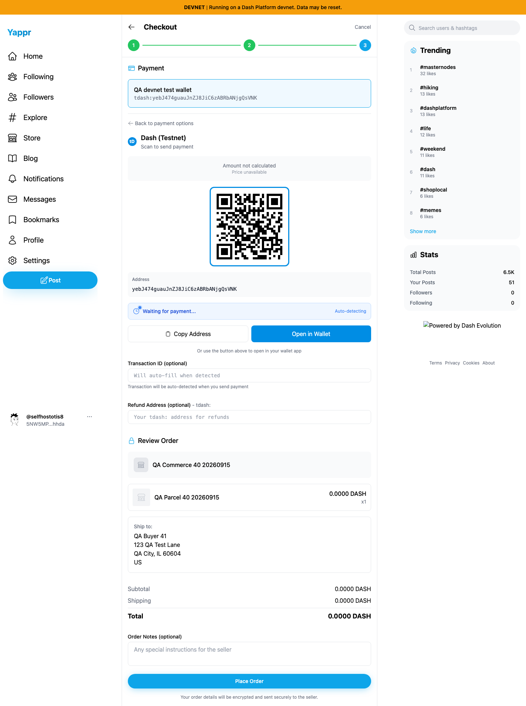
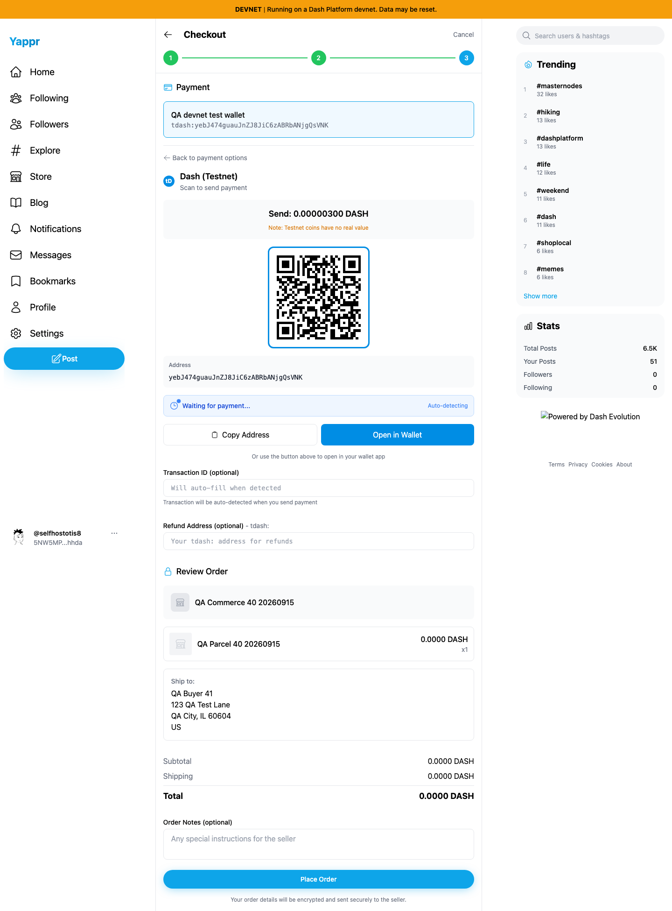

# Yappr PR432 — same-currency payment amount

Exact base `4105c5d1c914f5d0838619da93c3b8d28b4a780e`; full head `79e2d96eaabfbd1ad220bdd12e860401079714f7`. Independent production devnet builds at localhost:3211 and localhost:4191. Same assigned buyer41, store `98FYBhEF9Q8xNzbamzy66Dm5cMQ5gm9MoAZaiy518sNp`, product `25n2uxxtBSAWVWZBD86uGXdkHW7nYP25jpgfpPY87qRH` quantity1, product100duffs plus US shipping200duffs, total300duffs. Same synthetic QA address, postal60604, and same owned test payment address. Chromium1440×1200, en-US, America/Chicago, light, separate contexts and normal supported sign-in/encryption-key entry. No mocked responses, app DOM or storage.

Before: a DASH order with a tdash payment address calls exchange APIs and displays Amount not calculated / Price unavailable. After: the payment amount is exactly0.00000300 DASH without an exchange lookup. A passive request observer saw0CoinGecko/CryptoCompare requests during the fixed payment step.

| Before — exact base | After — full PR head |
| --- | --- |
|  |  |
|  |  |

The actual screenshot QR codes were decoded offline with Apple Vision:

- Before: `tdash:yebJ474guauJnZJ8JiC6zABRbANjgQsVNK`
- After: `tdash:yebJ474guauJnZJ8JiC6zABRbANjgQsVNK?amount=0.00000300`

**No payment, wallet launch or order submission occurred.** The separate4decimal order-summary display bug is intentionally still visible in both revisions and is fixed independently in PR426.

Independent review, lint,151 unit tests and production devnet build passed. Tests cover matching DASH/tdash/BTC/Lightning schemes without network access (including refresh), unchanged fiat conversion through APIs and unsupported schemes. All4final PNGs were opened at original resolution and inspected. See EVIDENCE_MATRIX.md and SHA256SUMS.
