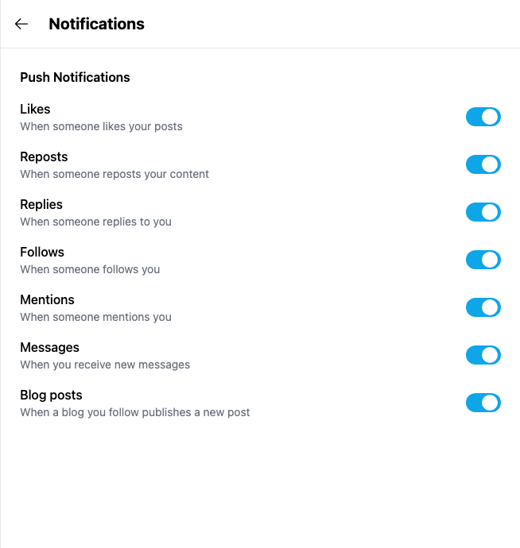
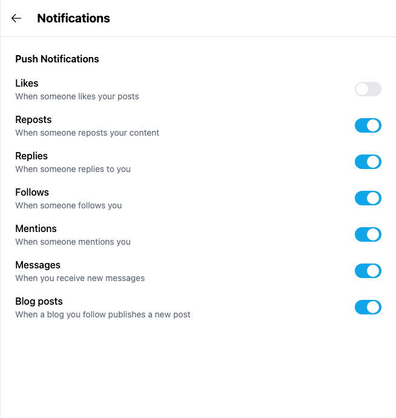
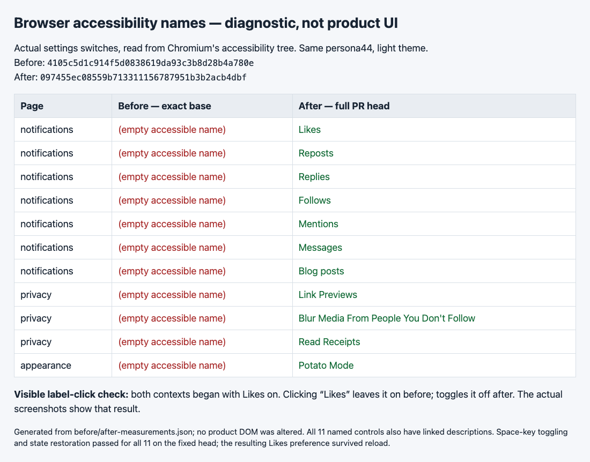

# Yappr #433 — settings switch names and label clicks

Before exact staging base: `4105c5d1c914f5d0838619da93c3b8d28b4a780e`.
After full PR head: `097455ec08559b713311156787951b3b2acb4dbf`.
Both revisions built independently with `npm run build:devnet`; fresh Chromium contexts, 1280×1000, scale1, light theme, en-US, America/Chicago.

Shared existing devnet fixture: persona44 identity `4WJqx5yBKTW3v6FbkvwNZpGvWyafDzTjMSZLZEYwtC8R`. Signing key remained in memory and was never displayed. Only disposable browser preferences were changed; no Platform documents were written.

| Behavior | Before state | After state | Expected delta |
| --- | --- | --- | --- |
| Click the visible Likes text | Fresh Likes preference on | Fresh Likes preference on | Before remains on; after turns off |
| Accessible switch names | Seven notifications, three privacy, Potato Mode | Same eleven controls | Empty names become actual visible labels |
| Compatibility | Same controls and initial defaults | Same controls and initial defaults | Space toggles and restoration work; Likes result survives reload |

The screenshots were captured immediately after the same click on the visible **Likes** text. Blue/on before versus gray/off after demonstrates the label gesture. Both started on. Focused images use identical native-resolution crops, x275 y40 w654 h690. Surrounding asynchronous sidebar content differs in the full context images; no claim depends on it.

| Before — exact base, label click does nothing | After — full head, label click turns Likes off |
| --- | --- |
|  |  |

[Full context before](comparison/before/context.png) · [Full context after](comparison/after/context.png).

The diagnostic is explicitly **not product UI**. It reports actual Chromium accessibility-tree measurements from all eleven switches. The product DOM was never altered. See [before measurements](before-measurements.json) and [after measurements](after-measurements.json). All11 switches are named and described after; Space-key toggling and restoration passed for all11. Likes persisted on reload. No video is claimed or published.

Validation: targeted ESLint, standalone TypeScript, production devnet build, and independent source review passed. All five published PNGs were opened and inspected at original resolution.

## SHA-256

- `7c0cd8995eb245b8bd2ed0ec26cc74a078fb01377874b70156913c0d3b974ccc` — `after-measurements.json`
- `87efe0a4b2a114c6ac12433eb9735d309badbd9513f292d4ef26db69b0b20ba1` — `before-measurements.json`
- `d179f35411afdcc6bb478806ee44d141b71da0c6a1958d11861dc42f7ab5b10b` — `comparison/after/context.png`
- `58b9dcc30f71035b49b557e903f4ac2b433e47070133d73551416680a8bcf786` — `comparison/after/notifications.png`
- `e2d9f781d9629d39dfc3cafc0ede741b5f3e5b9db4b425f4bb7afc926eff61dd` — `comparison/before/context.png`
- `800ec4c4eabfe9bf3aa8b472d3b112ce5ece827060da36165a1037d96f192e48` — `comparison/before/notifications.png`
- `3b4b02088bde255489fb9acf0baa93a75245433c5181b960cc214116c0850883` — `diagnostic.html`
- `433c0d73a166a53d113f269e52e23a0f67d2e6ba3d43c660dad70020524f0adf` — `diagnostic.png`
