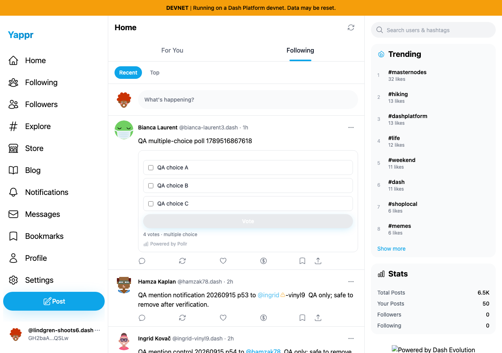
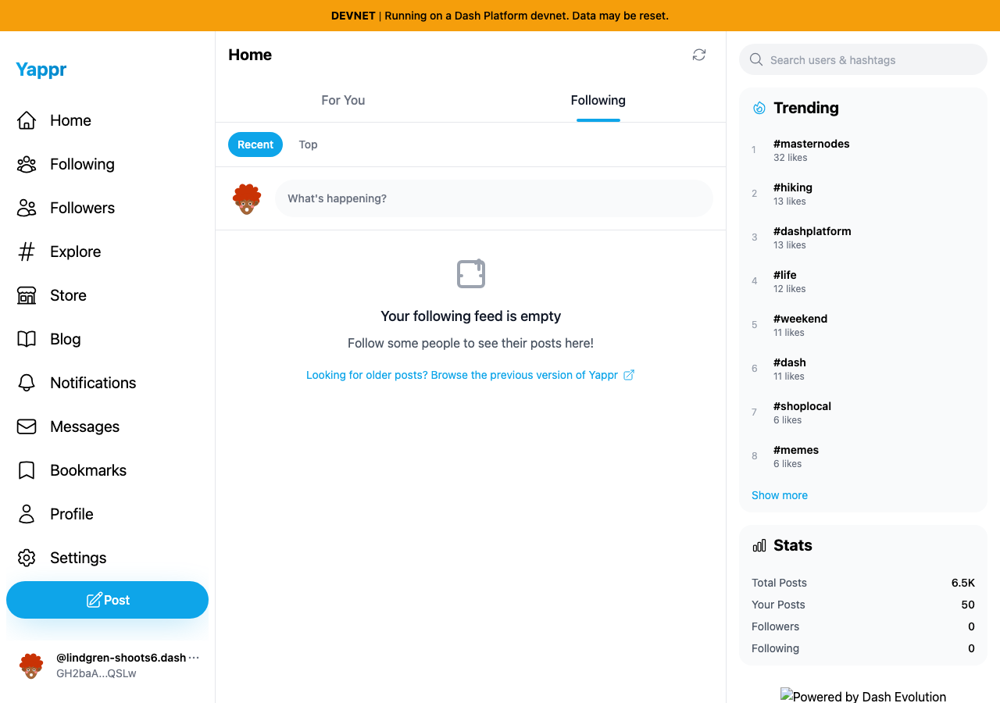

# Following tab race — integrated final comparison

| Surface | Before — exact base | After — full PR head | Shared fixture | Visible delta |
|---|---|---|---|---|
| Following selected while For You loads | c98a6ecd7e26ae5bc9fc8e400e6011eb8465b3a0 | 6e3a6240e38c6fbae2c0314633870ac6b6635724 | Persona50, no follows,1280×900,light |37unrelated cards after18seconds versus correct empty state |
| Manual refresh | same | same | same viewer | Both correctly empty; compatibility control |

Separate committed devnet builds, ports3260/3266 and fresh Chromium sessions. Viewer `GH2baAjjMokUyzj5KNQbzbsf4QnaPhRjtUPCqSBnQSLw` has no follows, checked through the actual Following list first. No API responses/content were mocked. Scoped QA sessions were provisioned; this is not login evidence. Public feed data/relative times may vary between sequential captures. All four final PNGs opened and inspected at original resolution.

| Before — exact base | After — full PR head |
|---|---|
|  |  |
|  |  |

Populated For You compatibility:37initial cards,57after pagination, all unique; Following empty and return to For You passed. Source lint, full TypeScript,209unit tests and committed devnet build passed. Independent source review approved.

Rebase preserved the original0913a309commit as a368cb41, retaining upstream enabled gating/composite enrichment/cursors. Range-diff1→1context/integration changes were independently reviewed. A second signed commit6e3a6240addresses the valid cached enrichment review: it captures generation and checks both before setData and inside its updater. Four deterministic real-hook callback tests cover delayed completion after refresh, effect cleanup, queued updater invalidation, and current-view success preserving fresh content. Three regression cases fail on the prior rebased head and all four pass after correction. These tests use mocked services and a captured effect/data-setter harness; screenshots do not claim to demonstrate the specific cached-attribution race.

This comparison supersedes the historical4105/0913screenshots for the rebased PR. Local base-path-only serving omits root footer branding; live branding is separate.
