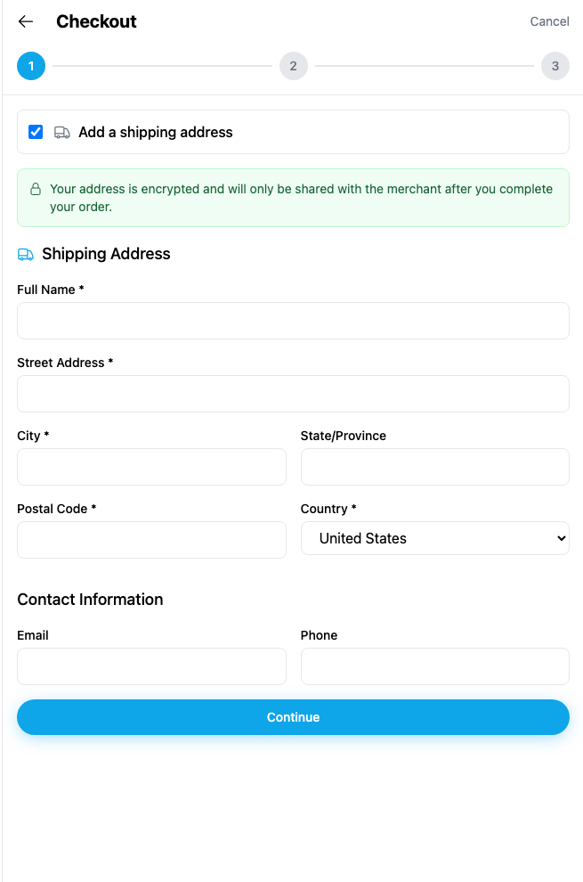

# Yappr #435 — checkout address/contact labels

Before — exact staging base `4105c5d1c914f5d0838619da93c3b8d28b4a780e`.
After — full PR head `d5711f335a0c78a0cd203203b52d210837c66ecc`.
Both independently built with `npm run build:devnet` and served from separate output directories.

Chromium1280×1100, scale1, light theme, en-US, America/Chicago. Fresh independent authenticated browser contexts. Shared existing devnet fixtures: persona41 `5NW5MP2yVzqGavBCZtpfJ72CcGhiN2vX7RsdtJpQhhda`, store **QA Commerce 40 20260915** (`98FYBhEF9Q8xNzbamzy66Dm5cMQ5gm9MoAZaiy518sNp`), product **QA Parcel 40 20260915** (`25n2uxxtBSAWVWZBD86uGXdkHW7nYP25jpgfpPY87qRH`). Auth key remained in memory and never appeared on screen.

| Surface | Shared initial state | Gesture | Expected delta |
| --- | --- | --- | --- |
| Checkout shipping/contact | Empty address/contact, US country, shipping checked | Click Full Name text | Before no focus; after visible blue focus ring |
| All8 form fields | Same initial state | Read AX tree; click each label on fixed build | Actual names on all8; matching field focus on each |

Normal UI route: store → product → Add to Cart → cart → Checkout from store → Add a shipping address. Then click **Full Name**. No inputs were filled, no order placed, no Platform writes. The same product was added only to each disposable local cart.

| Before — exact base, label click does not focus field | After — full head, label click focuses field |
| --- | --- |
|  |  |

[Full app context before](comparison/before/context.png) · [after](comparison/after/context.png).
Native-resolution matching crops: x273 y50 w655 h990. All four final PNGs opened and visually inspected. No DOM/requests were mocked. Live unrelated sidebar counts can vary; no claim depends on them.

[Before accessibility measurements](before-measurements.json) · [after accessibility measurements and all8 focus checks](after-measurements.json). All8 labels now name their own input/select. Existing validators, values and submit callbacks are unchanged. This evidence does not claim order submission coverage.

Targeted ESLint, standalone TypeScript, devnet production build, independent source review, and ordinary browser label/focus assertions passed.

## SHA-256

- `c89d3277dabbc56bac4949bab222ac0d7a0c6dd5a8499ca5c9709f87bd0355a8` — `after-measurements.json`
- `d1897fc8afe546b10da76123e654827fd42f32a40503efad1b58c4ecc285f4d7` — `before-measurements.json`
- `ca73edcbb0440786b3b64eb9a8748946f46a880c846a311e1c1d6ca3dfad0593` — `comparison/after/checkout.png`
- `828468711106b6beef815f3e10a55b8d5cff75396fa6e1d0da1abbfea170c77a` — `comparison/after/context.png`
- `2900318dd52d5839a4ac18fc06ddfdfd434584d39af5eb04645508e778c11795` — `comparison/before/checkout.png`
- `d0b56cffe20cc646d150d4b9618c5b300fdda1da718b431d34442b194f6abf78` — `comparison/before/context.png`
