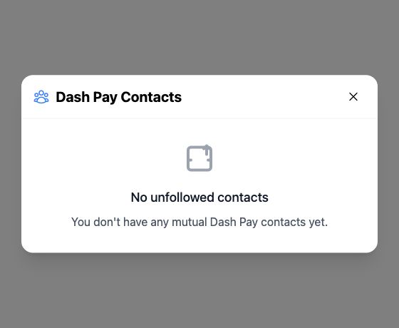
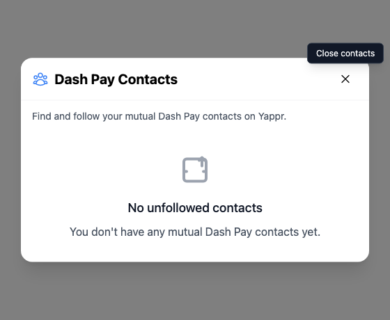

# Yappr #436 — Dash Pay Contacts dialog semantics

Before — exact staging base `4105c5d1c914f5d0838619da93c3b8d28b4a780e`.
After — full PR head `fa58063098973c6d308e937b90d32a56e854e3ae`.
Both independently built with `npm run build:devnet`; separate output directories and fresh independent authenticated Chromium contexts. Source tree remained clean after the signed commit; staging was checked to remain at the stated base.

Same existing persona44 `soren-notes7.dash`, identity `4WJqx5yBKTW3v6FbkvwNZpGvWyafDzTjMSZLZEYwtC8R`. Viewport1280×1100, scale1, light theme, en-US, America/Chicago. Auth fixture initialized the local session only; key remained in memory and never appeared in any input or screenshot. No product DOM or requests mocked. All input fields stayed empty. Unrelated asynchronous sidebar loading/counts can vary in full context; no claim depends on them.

## Evidence matrix and gesture

| Before state | After state | Shared fixture / visible delta |
| --- | --- | --- |
| Exact staging base | Full committed PR head | Same empty-contact state; focus close → after exposes a visible purpose and close tooltip. |

Focus the close control in the same settled **No unfollowed contacts** dialog. Before there is no explanation or tooltip; after the dialog states its purpose and the focused close control shows **Close contacts**.

### Contacts

| Before — exact base | After — full head |
| --- | --- |
|  |  |

[Full context before](comparison/before/contacts-context.png) · [full context after](comparison/after/contacts-context.png).

## Validation

Both revisions: Escape and the close button dismiss the dialog. Fixed revision: actual dialog accessible description and close accessible name match their visible text. Contact discovery succeeded; no follow actions were submitted.

[Actual browser AX measurements before](before-measurements.json) · [after and interaction checks](after-measurements.json). Accessibility semantics are measured from Chromium; screenshots show actual product gestures. Matching crops preserve native resolution: x360 y320 w560 h460. Every final focused and context PNG was opened and visually inspected before publication.

Targeted ESLint, standalone TypeScript, production devnet build, and independent source review passed. No cryptographic, network, data or submission behavior was changed.

## SHA-256

- `1614c01d8f049ac09a47b90038430155848407b0e687fac47eb4c52d360076f6` — `after-measurements.json`
- `fd4df9825145d6d3a5378a18656ae857ea9e20a59cc672f1ddb06a889d646b4b` — `before-measurements.json`
- `4f5a9e28bd2728505e58c18de05cb9c239ab6e8cf3601ff6e3762f42c38d5802` — `comparison/after/contacts-context.png`
- `674f40ba30ed2a3b18536f5870021b507de7a0b233a7d68fbed7ba7c60f09819` — `comparison/after/contacts.png`
- `abd953139cead755e448cc60b5196fd063d01b3c7de9d68e7d0d85f435fe194d` — `comparison/before/contacts-context.png`
- `a21515fcf9825590a758e1ba1110f113b9804ed740f5b825026b97fc49b69203` — `comparison/before/contacts.png`
