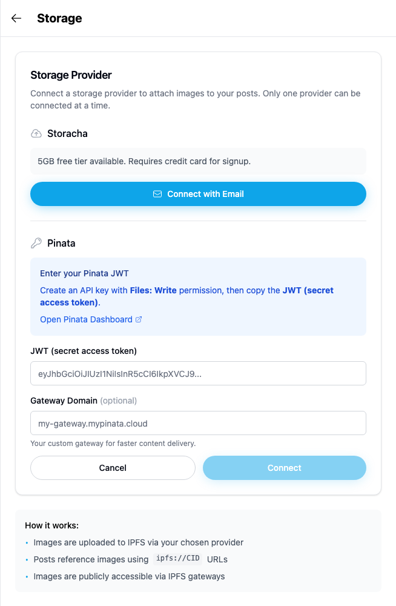
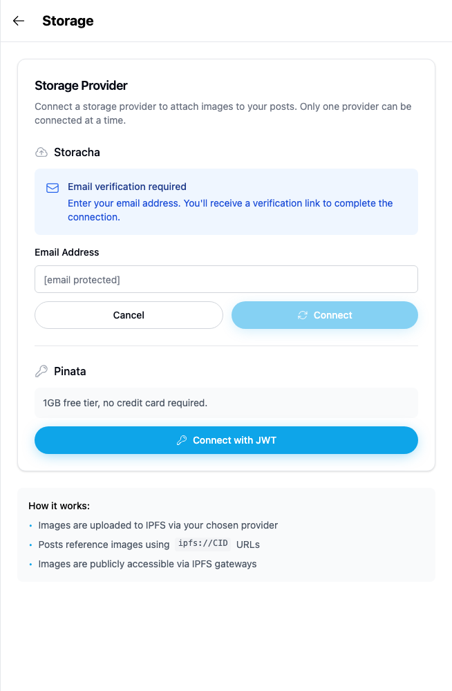

# Yappr #437 — Storage provider field labels

Before — exact staging base `4105c5d1c914f5d0838619da93c3b8d28b4a780e`.
After — full PR head `d4994c473fe815b05e23aad31b5552834ca803e9`.
Both independently built with `npm run build:devnet`; separate output directories and fresh independent authenticated Chromium contexts. Source tree remained clean after the signed commit; staging was checked to remain at the stated base.

Same existing persona44 `soren-notes7.dash`, identity `4WJqx5yBKTW3v6FbkvwNZpGvWyafDzTjMSZLZEYwtC8R`. Viewport1280×1100, scale1, light theme, en-US, America/Chicago. Auth fixture initialized the local session only; key remained in memory and never appeared in any input or screenshot. No product DOM or requests mocked. All input fields stayed empty. Unrelated asynchronous sidebar loading/counts can vary in full context; no claim depends on them.

## Evidence matrix and gesture

| Before state | After state | Shared fixture / visible delta |
| --- | --- | --- |
| Exact staging base | Full committed PR head | Same disconnected providers and empty fields; click visible JWT/email labels → purple focus ring only after. |

Click **JWT (secret access token)** in the empty Pinata form and **Email Address** in the empty Storacha form. Before neither label focuses its field; after each field receives the purple focus ring. Gateway Domain is also associated and separately focus-checked.

### Pinata

| Before — exact base | After — full head |
| --- | --- |
|  |  |

[Full context before](comparison/before/pinata-context.png) · [full context after](comparison/after/pinata-context.png).

### Storacha

| Before — exact base | After — full head |
| --- | --- |
|  |  |

[Full context before](comparison/before/storacha-context.png) · [full context after](comparison/after/storacha-context.png).

## Validation

All three labels name and focus their corresponding fields after. Both empty Connect buttons remain disabled, and Cancel closes both forms. No credential, external email, billing or connection was submitted. External provider integration is not claimed.

[Actual browser AX measurements before](before-measurements.json) · [after and interaction checks](after-measurements.json). Accessibility semantics are measured from Chromium; screenshots show actual product gestures. Matching crops preserve native resolution: x275 y40 w654 h1000. Every final focused and context PNG was opened and visually inspected before publication.

Targeted ESLint, standalone TypeScript, production devnet build, and independent source review passed. No cryptographic, network, data or submission behavior was changed.

## SHA-256

- `9641fed5aa8ba4515acb0e34540ea2dc869e584bafaf9a6709bae4f7cee85fa6` — `after-measurements.json`
- `766eb1b34bf9cc1c8c8112fffe729e1796accd1fd78e9c648e38dcfbba710f2f` — `before-measurements.json`
- `493ca0fabe99b57eac1aca6dcbcd5666bd68273958010dd97ca436569540d949` — `comparison/after/pinata-context.png`
- `c64663fd99ce3f3c00c619b72db5ebb7ed8ac704a3c50f26781a65d77e6f7915` — `comparison/after/pinata.png`
- `4e2df68a496acac51355d4b0613f60178a8110da20f2cdbdd08fb80fa4d59020` — `comparison/after/storacha-context.png`
- `384abf49a6e2a64f6537785552069285f079a044251b616927a27d29519f8b1b` — `comparison/after/storacha.png`
- `9d82691509fb94d152f5d7cfa15fb1079d00d98d67e052cc4409c8d4534d55fa` — `comparison/before/pinata-context.png`
- `641f1ad314b6e53340f2571d153b8d48a2f55a85b47f997c541d3058fef6df72` — `comparison/before/pinata.png`
- `178c867486bfedce86bd886306bedde8b2db3c4673fcf54091762264404761fb` — `comparison/before/storacha-context.png`
- `88ca7affda34d0209fb7fa2ccd4850f31f0b4f1745fba3d3750ccccb00fda94a` — `comparison/before/storacha.png`
