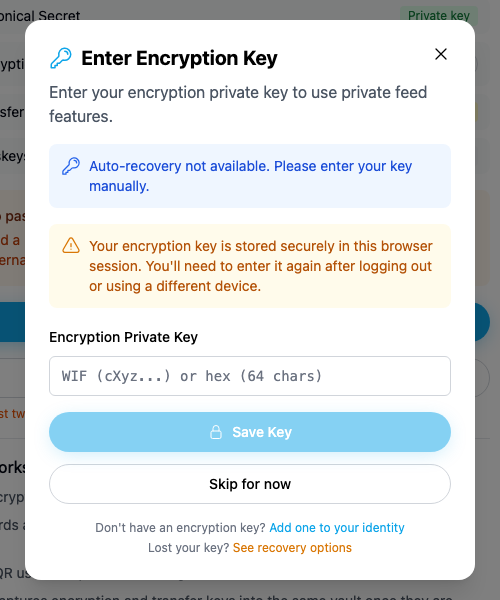
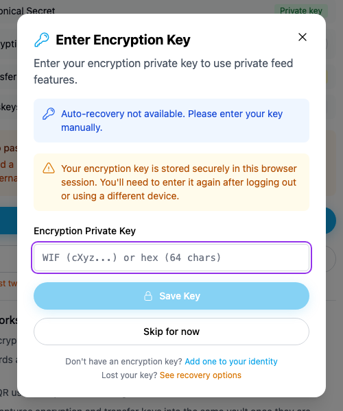

# Yappr #438 — Encryption Private Key form label

Before — exact staging base `4105c5d1c914f5d0838619da93c3b8d28b4a780e`.
After — full PR head `137de86c928155fe0f4ccd23958240b60794c9bf`.
Both independently built with `npm run build:devnet`; separate output directories and fresh independent authenticated Chromium contexts. Source tree remained clean after the signed commit; staging was checked to remain at the stated base.

Same existing persona44 `soren-notes7.dash`, identity `4WJqx5yBKTW3v6FbkvwNZpGvWyafDzTjMSZLZEYwtC8R`. Viewport1280×1100, scale1, light theme, en-US, America/Chicago. Auth fixture initialized the local session only; key remained in memory and never appeared in any input or screenshot. No product DOM or requests mocked. All input fields stayed empty. Unrelated asynchronous sidebar loading/counts can vary in full context; no claim depends on them.

## Evidence matrix and gesture

| Before state | After state | Shared fixture / visible delta |
| --- | --- | --- |
| Exact staging base | Full committed PR head | Same failed automatic derivation and empty key field; blur initial autofocus then click label → purple focus ring only after. |

After the same auto-recovery-unavailable state settles, click the information text to remove initial autofocus, then click **Encryption Private Key**. Before the field stays unfocused; after it receives the purple focus ring. The displayed WIF/hex text is the unchanged empty-input placeholder.

### Encryption

| Before — exact base | After — full head |
| --- | --- |
|  |  |

[Full context before](comparison/before/encryption-context.png) · [full context after](comparison/after/encryption-context.png).

## Validation

Fixed revision: key input accessible name is Encryption Private Key. Both revisions: empty Save Key remains disabled and Skip for now dismisses the dialog. No key was entered, saved or modified.

[Actual browser AX measurements before](before-measurements.json) · [after and interaction checks](after-measurements.json). Accessibility semantics are measured from Chromium; screenshots show actual product gestures. Matching crops preserve native resolution: x390 y250 w500 h600. Every final focused and context PNG was opened and visually inspected before publication.

Targeted ESLint, standalone TypeScript, production devnet build, and independent source review passed. No cryptographic, network, data or submission behavior was changed.

## SHA-256

- `82e80a9e0f5e20e6e7348ac75d904adb5377978cf2ea5733e0edcba8db6dead8` — `after-measurements.json`
- `5911fbfe83c52085460c56fd00b2ed14853115195a535f36a6727fd2424fdcdc` — `before-measurements.json`
- `902b3b60244230dfab4c36422c8c3fc21ccad9c13ff98e212dbe59bea3890674` — `comparison/after/encryption-context.png`
- `65c4ee34abafeb6bc23b2542d0f599904c7168cdf3225242b365e45d5142cc8c` — `comparison/after/encryption.png`
- `93ef4a3299e2222d0d18734f57c3d047a3a6a9d604039834c1d8b5dc2aae2948` — `comparison/before/encryption-context.png`
- `a36a9d39954ccb404906fcc94a2f3f055cd518659442951f3b6a78b10a75b22c` — `comparison/before/encryption.png`
