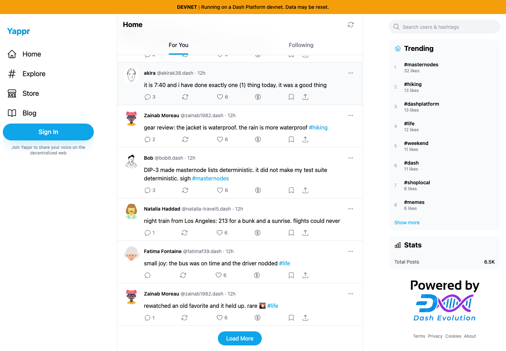
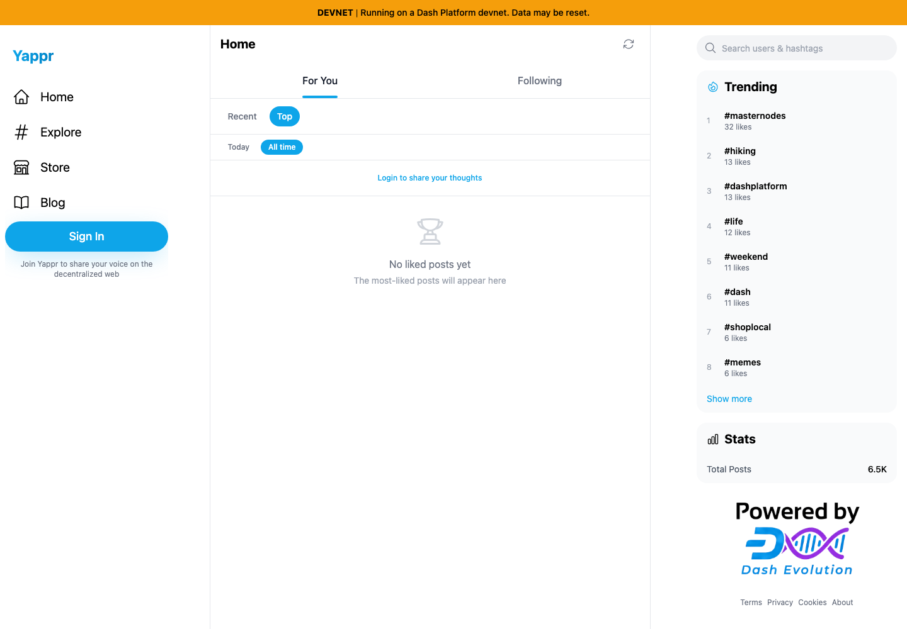

# Yappr PR 439 — preserve the Top feed during expansion

Product PR: https://github.com/PastaPastaPasta/yappr/pull/439

Before: `733faf53cd893cba861476a4af75b442ed67ca72`. After: `2acddf709f1a5d1778b3855c2463aac26b840454`. Independent production devnet builds, served locally on ports 4203 and 4202, using the same static-server helper. Separate guest Chromium contexts, 1440×1000, en-US, UTC, light theme. Real live devnet posts, no mocked responses, injected application state, or altered screenshots.

The branch was rebased onto frozen staging 733faf53; range-diff preserved both commits, with only the new error tests renamed to retain staging’s separate account-cache test. This comparison supersedes artifact commit `cb4dc136e9a56f0902abc53c0cbbd6f6b948a1ac`, whose after images represented the earlier PR head. The new head also propagates ranking and hydration failures before replacing an existing page.

All four runs started with the same 20 post IDs at scroll position 1,973. Successful expansion produced 40 cards: the base jumped to 0, while the head stayed at 1,973. Offline expansion left the base with zero cards and no Load More button; the head retained 20 cards, the button, and scroll position 1,973 through both failed attempts.

| State | Before — exact base | After — full PR head |
|---|---|---|
| Same first 20 posts; ready to expand |  |  |
| Successful expansion to 40 posts |  |  |
| First 20 posts before disconnecting |  |  |
| Expansion with browser transport offline |  |  |

The browser's transport was explicitly switched offline for the final row. No server or SDK responses were fabricated. The fix retains the existing 20 cards and the retry button after repeated failures. These screenshots demonstrate retention, **not successful reconnection**.

Known separate limitation (QA77): an offline request can exhaust the SDK address pool. After restoring connectivity, further reads can continue returning “no available addresses” without sending a request; a page reload restored normal reads in the control check. The Following identity-list read also remains a separate fail-soft path; this PR addresses ranking and hydration failures, including one failed per-author ranking.

Validation: 240 unit tests, including nine ranking/hydration/error-cache regression cases; lint; full TypeScript and e2e TypeScript; production devnet build; independent review. Real-network browser regressions verify successful expansion preserves the original cards and scroll, changing the ranking window resets to at most 20, and two failed offline attempts retain all cards and Load More. Successful retry after a transient service error is covered by unit tests.

[Observed post IDs and scroll positions](observations.json). [Evidence matrix](evidence-matrix.json). [SHA-256 checksums](sha256.json). All final PNGs are unaltered browser screenshots inspected at original resolution. Live relative times and incidental sidebar counts may change independently.
