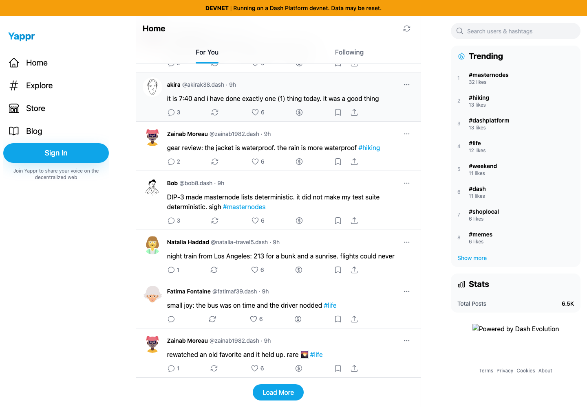
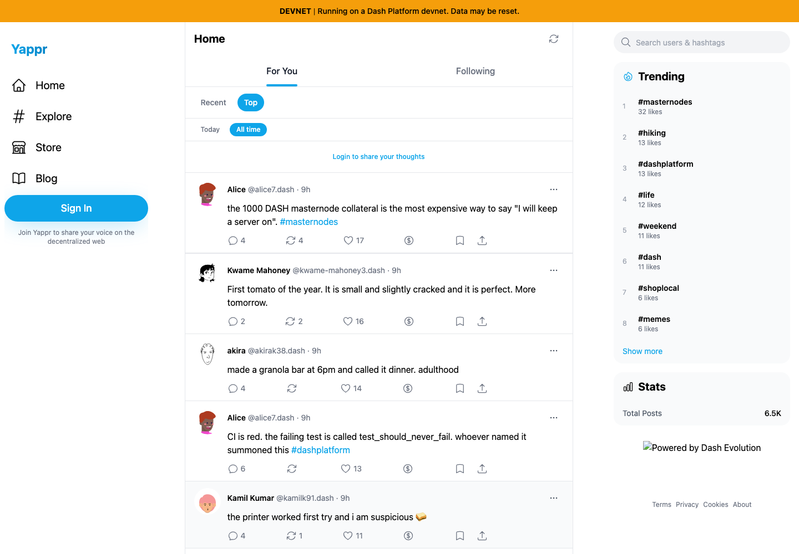
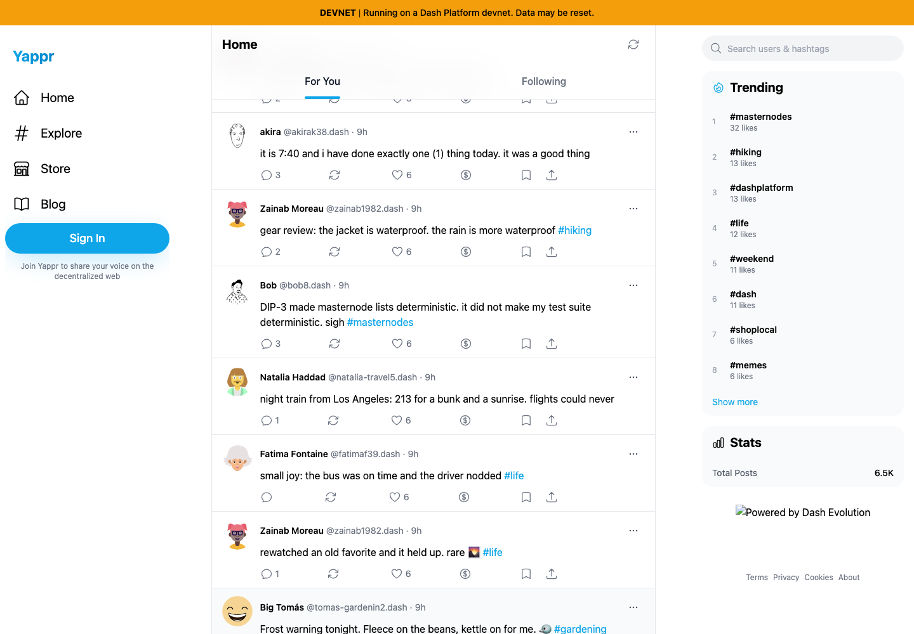

# Yappr PR 439 — Top pagination preserves reading position

Product PR: https://github.com/PastaPastaPasta/yappr/pull/439

Before: `4105c5d1c914f5d0838619da93c3b8d28b4a780e`. After: `c6e59eaf5b8d64bdcf4e9930c2ce2f5a38137bcb`. Each revision was independently built for devnet and served locally (3211 and4192). Final after build stamp was `c6e59eaf`; before checkout was clean at the exact base. Chromium guest contexts,1440×1000, en-US,UTC,light theme; no browser state reused. Real live devnet public posts.

Both runs began with the same20 post IDs and scroll position1973. Clicking Load More expanded to40. The base jumped to scroll0 and the first ranked post; the fix remained at1973 with the same end-of-first-page cards and the next card appearing below. [Observed IDs and metrics](observations.json). Live relative timestamps and network data can change independently.

| State | Before — exact base | After — full PR head |
|---|---|---|
| Ready to load more, same first20 |  |  |
| After clicking Load More |  |  |

All four final PNGs were opened and inspected at original resolution. No credentials are visible. Images are unaltered browser screenshots. The unrelated footer logo is unavailable in both captures.

Validation:145 unit tests; lint; production devnet build; e2e TypeScript; independent review. The real-network smoke regression failed against base (scroll2253→0), passed with this change, and verifies window changes reset the expanded ranking to at most20 cards. API failure preservation and stale request invalidation were source-reviewed; no network failures were fabricated.
