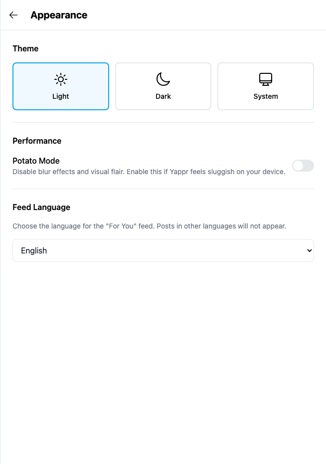
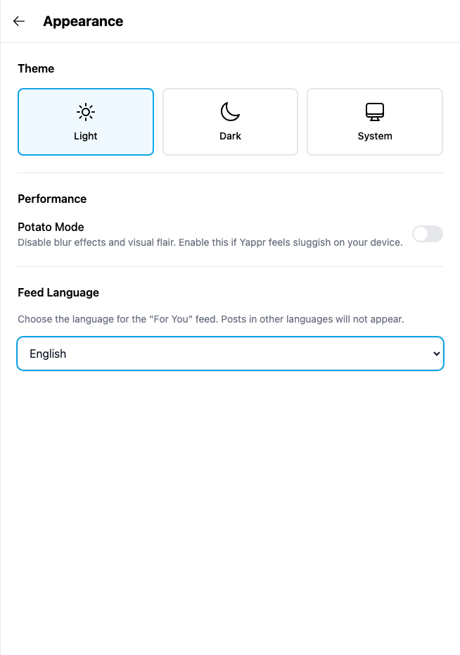

# Yappr #441 — Feed Language selector label

Before — exact staging base `4105c5d1c914f5d0838619da93c3b8d28b4a780e`.
After — full PR head `093c7adf85e978c29fa2aee80b5ed35b0a087aff`.
Both independently built with `npm run build:devnet`; separate output directories and fresh independent authenticated Chromium contexts. Source tree remained clean after the signed commit; staging was checked to remain at the stated base.

Same existing persona44 `soren-notes7.dash`, identity `4WJqx5yBKTW3v6FbkvwNZpGvWyafDzTjMSZLZEYwtC8R`. Viewport1280×1100, scale1, light theme, en-US, America/Chicago. Auth fixture initialized the local session only; key remained in memory and never appeared in any input or screenshot. No product DOM or requests mocked. All input fields stayed empty. Unrelated asynchronous sidebar loading/counts can vary in full context; no claim depends on them.

## Evidence matrix and gesture

| Before state | After state | Shared fixture / visible delta |
| --- | --- | --- |
| Exact staging base | Full committed PR head | Same Appearance English selection; click Feed Language → select focus only after. |

Click the **Feed Language** heading in Appearance with English selected. Before the selector remains unfocused; after the visible label gives it the blue focus ring.

### Appearance

| Before — exact base | After — full head |
| --- | --- |
|  |  |

[Full context before](comparison/before/appearance-context.png) · [full context after](comparison/after/appearance-context.png).

## Validation

The fixed select is named Feed Language and has its explanatory accessible description. On both revisions Spanish selection persists after reload and is restored to English in the disposable browser context. This checks preference persistence, not feed translation.

[Actual browser AX measurements before](before-measurements.json) · [after and interaction checks](after-measurements.json). Accessibility semantics are measured from Chromium; screenshots show actual product gestures. Matching crops preserve native resolution: x275 y40 w654 h930. Every final focused and context PNG was opened and visually inspected before publication.

Targeted ESLint, standalone TypeScript, production devnet build, and independent source review passed. No cryptographic, network, data or submission behavior was changed.

## SHA-256

- `30942afda51cf173ed1d33b2b8053b486c06273b5d1f3d0ea39cb0f48c6a4691` — `after-measurements.json`
- `766609552231fe77b64c25cc98a743bf3c69f40aae50109e160f297b0ace8182` — `before-measurements.json`
- `b2ef58c60200a9dce00c924b8aeb689b1f4a08d6ffec3bbe7272ae18b7067a09` — `comparison/after/appearance-context.png`
- `aa1bb6bc3f633f8a7323d980ec0f2fb6467bb8681a33f3e607a7bb8ad4a543cc` — `comparison/after/appearance.png`
- `77b6929a0b94e242be34e7a6e3aee3a94473fe57bddb2563287d138d09e557a6` — `comparison/before/appearance-context.png`
- `546dc7a298fce7b453c2ae4c482280ede3c3c7a82342221a14dd2247d3b07249` — `comparison/before/appearance.png`
