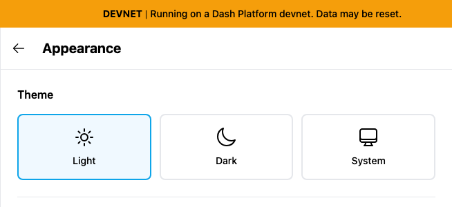
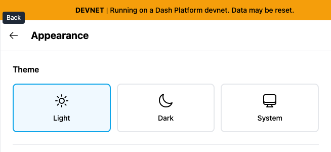

# Yappr #442 — Settings Back control name

Before — exact staging base `4105c5d1c914f5d0838619da93c3b8d28b4a780e`.
After — full PR head `0e1008e0e9054f48b8969518317c234602b59d8f`.
Both independently built with `npm run build:devnet`; separate output directories and fresh independent authenticated Chromium contexts. Source tree remained clean after the signed commit; staging was checked to remain at the stated base.

Same existing persona44 `soren-notes7.dash`, identity `4WJqx5yBKTW3v6FbkvwNZpGvWyafDzTjMSZLZEYwtC8R`. Viewport1280×1100, scale1, light theme, en-US, America/Chicago. Auth fixture initialized the local session only; key remained in memory and never appeared in any input or screenshot. No product DOM or requests mocked. All input fields stayed empty. Unrelated asynchronous sidebar loading/counts can vary in full context; no claim depends on them.

## Evidence matrix and gesture

| Before state | After state | Shared fixture / visible delta |
| --- | --- | --- |
| Exact staging base | Full committed PR head | Same Appearance page opened from Settings; focus Back → visible tooltip only after. |

Open Appearance from the Settings menu, then focus the Back arrow. Before it has no name or tooltip; after it exposes **Back** and displays the tooltip.

### Appearance

| Before — exact base | After — full head |
| --- | --- |
|  |  |

[Full context before](comparison/before/appearance-context.png) · [full context after](comparison/after/appearance-context.png).

## Validation

The fixed button has accessible name Back. On both revisions pressing Enter on the button returns to the prior Settings menu, preserving browser history navigation.

[Actual browser AX measurements before](before-measurements.json) · [after and interaction checks](after-measurements.json). Accessibility semantics are measured from Chromium; screenshots show actual product gestures. Matching crops preserve native resolution: x275 y0 w654 h300. Every final focused and context PNG was opened and visually inspected before publication.

Targeted ESLint, standalone TypeScript, production devnet build, and independent source review passed. No cryptographic, network, data or submission behavior was changed.

## SHA-256

- `55be673accde938d4d92af5b4c81a12ac629f51f039dec23068fccf15ff9bacd` — `after-measurements.json`
- `48c4ec399774d2ec272abd94326985e66bdefcf02839a66393d972c95b169826` — `before-measurements.json`
- `4464c4dceedb8164f7f1b0e01522da71110c7846962339aba677372f9cd873d1` — `comparison/after/appearance-context.png`
- `7d184e3b6c56268dbf9fff8b89faf21c4bf52ba102acf74697fd43d81c7d46a2` — `comparison/after/appearance.png`
- `f2295b7f9aef77f78e4a9d0d78cdb8602389259eb30489c2e2eef25f1ac1ab56` — `comparison/before/appearance-context.png`
- `3679d9a19b54672c70951939be0a4b0b1e2041182ca8602f7a2792544bbdfd31` — `comparison/before/appearance.png`

Correction: this final-head comparison supersedes the initial draft captures, where the sticky page header obscured the tooltip. The final build places the tooltip above that header; the current after images visibly show Back.
