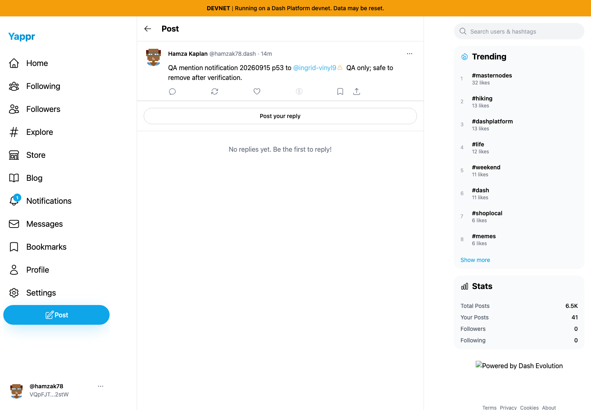
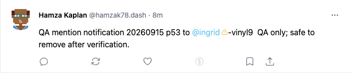
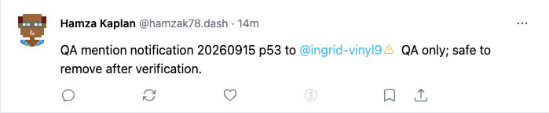
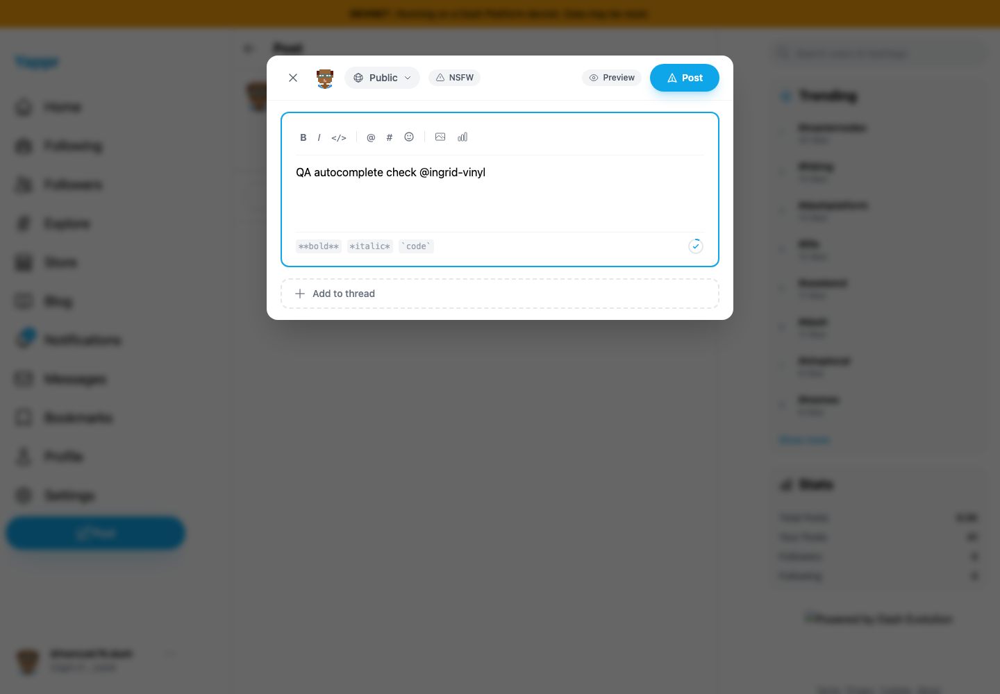
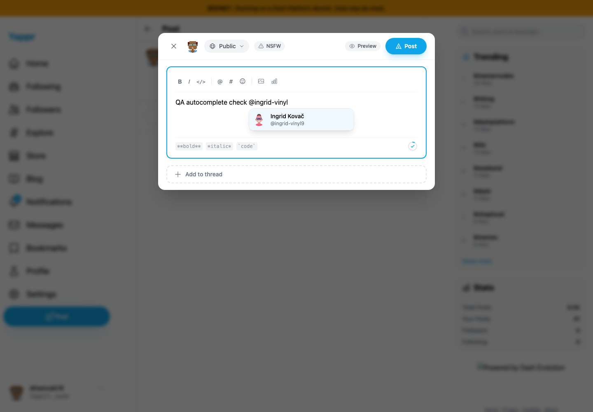
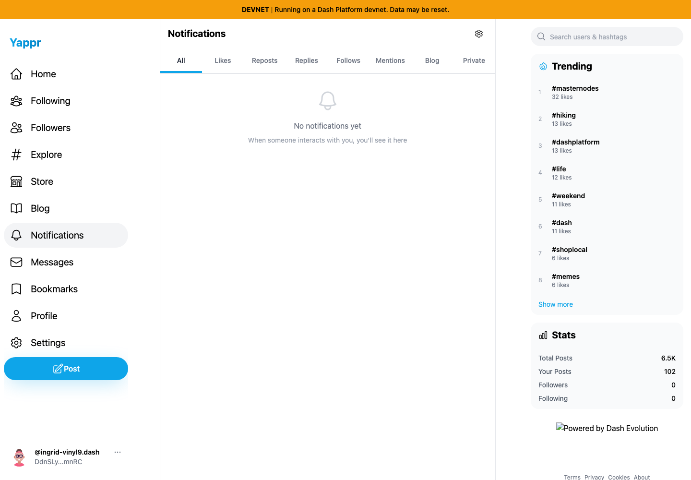
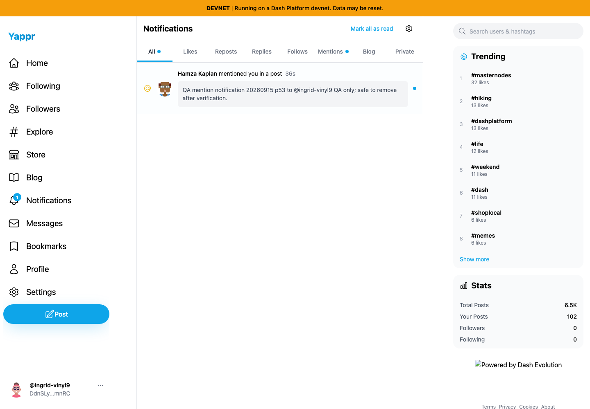

# Yappr PR 444 — Hyphenated DPNS mentions

Product: https://github.com/PastaPastaPasta/yappr/pull/444

Before: `4105c5d1c914f5d0838619da93c3b8d28b4a780e` (independently built baseline, server 3211). After: `b08d889f87cd94ee1f4ec977331b90e3d69827e4` (independent devnet production build, server 4193, build stamp `b08d889f`). All after images were recaptured from fresh contexts at this final head; intermediate `872251be` images are not included. Chromium, 1440×1000, en-US, UTC, light theme, separate normal sign-ins through the supported UI. Real devnet data; no SDK, network, storage or DOM substitutions.

Assigned author: persona 53, @hamzak78, `VQpFJTzQqdTzMQQcJmKhARpXBE5f9GjwRZ8UMCY2stW`. Recipient: persona 54, @ingrid-vinyl9, `DdnSLypHfhbYHJUgLrLWEK1Qv1e4SVaFCc8UDpeZmnRC`.

The rendering pair uses the same post `4faUhcYZGdYhYf1BLKwg7RPgGdDQjcBDdpLAtBs5nmtg`. The old post retains its missing-index warning because this fix does not retroactively write mention documents. The complete mention now resolves and clicks through to the intended identity.

The notification pair compares the recipient after the original failed write with a new QA-only post published from the fixed build: `AGRLKvfiUQWdhadft4GG3Z4V2v9zoxCuy8BQS9M5ZHTx`. These are different real writes with matching text/author/recipient. The final notification persisted after reload, appeared in All and Mentions, and opened that new post. Nonhyphen control post `9gWVtfjkRp9dytJiKZ3FJENZnt3sqppe5V3bc1VkZavs` delivered successfully on baseline.

| Behavior | Before — exact base | After — full PR head |
|---|---|---|
| Full post context |  |  |
| Readable same-post detail |  |  |
| Typing @ingrid-vinyl |  |  |
| Recipient notifications |  |  |

[Observed IDs and results](observations.json). Relative timestamps and the sidebar name suffix differ with normal async hydration; neither is the claim under test. All eight PNGs were opened at original resolution, including reinspection after recapture. No credentials appear.

Validation: 150 unit tests, lint, final production devnet build, independent review of initial change and final autocomplete correction. Unit tests cover indexing normalization/deduplication and cursor-bounded autocomplete with hyphens, midword cursor, empty/ordinary/newline queries, and punctuation/email boundaries. Browser verification caught and corrected an additional backward-scan guard before final publication.
