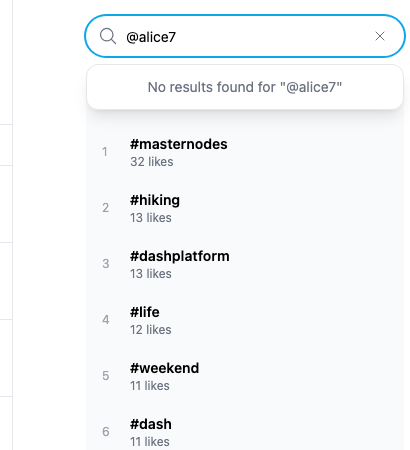
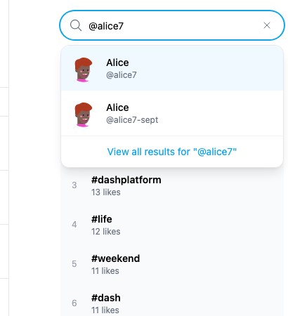

# Yappr #445 — sidebar searches accept @ handles

Before exact staging base `4105c5d1c914f5d0838619da93c3b8d28b4a780e`. After full PR head `0efafda0f197cb6c8bce710c65b767340d04dc13`. Both independently built with `npm run build:devnet`, separate output directories, fresh guest Chromium contexts at1440×1100, scale1, light theme, en-US, America/Chicago.

| Surface | Same fixture/gesture | Before | After |
| --- | --- | --- | --- |
| Explore sidebar search | After Explore loads, type alice7 then @alice7 | @alice7 shows No results | @alice7 shows Alice matches |
| Ordinary usernames | alice7 and whitespace-padded alice7 | Alice matches | Same matches |
| Hashtags | #masternodes | Hashtag suggestion | Same suggestion |

Shared existing devnet profiles: **Alice @alice7** (identity `AnvD14VL4sM55HkAZMxUnp6GwQW39Sf5FuJT6pKnpqig`) and **Alice @alice7-sept**. After Enter on the selected @alice7 result routes to that exact identity. Existing query text remains @alice7; only the DPNS search term is normalized. #masternodes suggestion and Escape dismissal were also checked. Hashtag routing is outside this PR.

No identity session, credentials, fixture writes, or product-DOM/request mocks were used. Explore/trending data was allowed to load before typing, in both captures. Tests of search during initial application loading are separate from this prefix fix.

| Before — exact base | After — full head |
| --- | --- |
|  |  |

[Full app before](comparison/before/context.png) · [after](comparison/after/context.png). Matching native-resolution crops:x1020 y40 w410 h450. All four final PNGs were opened and inspected. Unrelated live counts may change; no claim depends on them.

[Before browser checks](before-measurements.json) · [after browser checks](after-measurements.json). Targeted ESLint, standalone TypeScript, devnet production build, independent source review, and actual browser prefix/plain/whitespace/hashtag/selection checks passed.

## SHA-256

- `95d38b2e772504e88f866afc78705139de97c239a1a92817643947bd2181e9ff` — `after-measurements.json`
- `96f1ff28a2cf034a568f3ba82dbcb3c1c09ceb4d1a4a851bf40fdb53c02dc8b0` — `before-measurements.json`
- `a3bf9f3f4e009b3e68f769d0c709a16aac11a9255f87c8b0c25461ebd303e269` — `comparison/after/context.png`
- `20a4d3a57c06f05f1e28502d9bdb785153453f148ecb09e5030da0ca4b3c0bf2` — `comparison/after/search.png`
- `a50d06bec8834cd48f76ee69782fe001275079524de0ecf2b56d34f71182e228` — `comparison/before/context.png`
- `f1a053763673f4aecb2b20c3048765c1c5f71b0f5fbdeab69940c8276d45fd3b` — `comparison/before/search.png`
