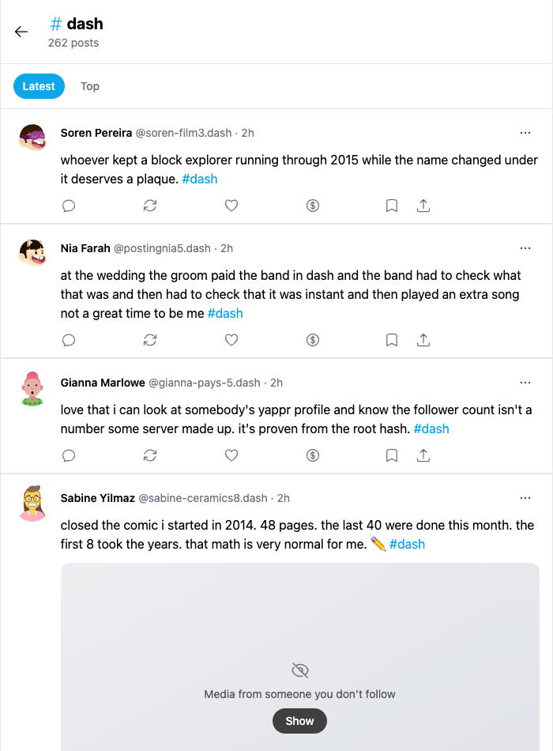
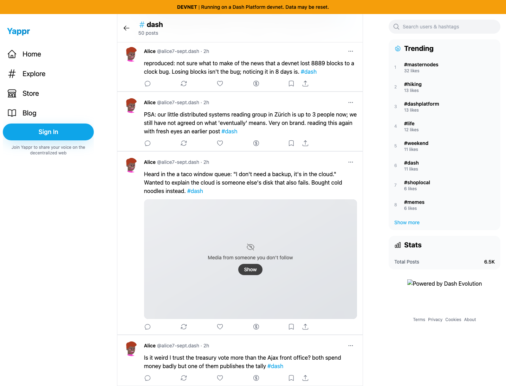
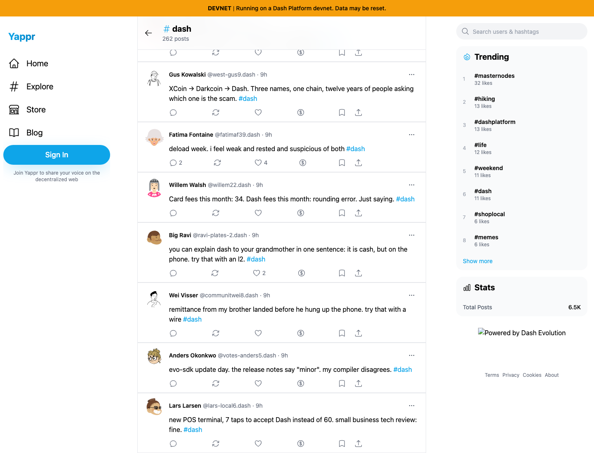

# Yappr #448 — reach older Latest hashtag posts

Exact captured staging base `eb895be71a7207c73fb9329ac9d9bb7b398f53da`; full PR head `3114a282dfb50130812ac6e142b04964db5e9857`. The branch was rebased after staging merged its composite-query performance change. Both final revisions were independently built with `npm run build:devnet` in separate worktrees and outputs. Earlier local4105 captures are superseded and are not published here.

Fresh guest Chromium contexts,1440×1100, scale1, light theme, en-US, America/Chicago. Same existing devnet #dash corpus and matching first50 post IDs; no fixture writes or product DOM/request mocks in these screenshots.

| Surface/gesture | Before | After |
| --- | --- | --- |
| Load #dash Latest, scroll until no continuation remains, return to top | Stops at50 |262 unique posts, ordered newest first |
| Scroll to end |50th post, by Alice, about treasury |262nd post, by Lars Larsen, about a POS terminal |
| Initial header |50 posts |50+ posts while continuation may exist |

The end screenshots intentionally show different records: the change makes older records reachable. Their exact IDs/timestamps are in the measurement JSON. Known older post `47siV2hYg3qgPmzjfXfSNtHbY5CNc2epHx4cKqHQcrba` is included after and inaccessible through the base's50-post list. After page sizes:50,100,150,200,250,262. Entry-animation delay is capped at0.45s so deeper pages remain promptly visible.

| Before — exact base | After — full head |
| --- | --- |
|  |  |
|  |  |

[Full context before](comparison/before/context.png) · [after](comparison/after/context.png). [Initial header before](comparison/before/initial.png) · [after](comparison/after/initial.png). Focused images are native crops x333 y40 w700 h950. All8 final PNGs were opened and inspected; no credentials or private session state appear.

Browser checks on final head: four-post #grovedb, nonexistent tag, complete #dash traversal, unique chronological IDs. Separately injected offline continuation preserved50 posts and exposed manual Load more posts; restored network +manual retry reached100 unique posts. A delayed real continuation request while clicking #memes could not append stale #dash data or suspend the new feed. Fault injection is only in those checks, not the images. [Retry checks](hashtag-extra.json) · [navigation checks](hashtag-transition.json).

Targeted ESLint, standalone TypeScript, devnet build, and independent updated source review passed. Simplifier considered consolidating the two page queries; direct bounded duplication avoids unnecessary abstraction. The initial-load error UI's preexisting empty-state behavior is outside this pagination fix.

## SHA-256

- `e2c3ddd99b1864aae3747327ff97544ac7491c4f13dc96044359829c089a43b3` — `after-measurements.json`
- `8be606b0f71c07faa91138de3fb0e720655fa7549719d8355c9d337504e3fa9b` — `before-measurements.json`
- `0ff126eee01b57284cdaf1899d0e2c56266c4a025d38b7c8fc8400f17ce5080f` — `comparison/after/context.png`
- `e07063174c88616708317645bb22c2189a90ebe17ce5b8cceb40cafa0ee72be9` — `comparison/after/end.png`
- `8a200c9fae68e4fd7fa5a834aaedf90a54dca31007cb827c3af8a1baf19d599b` — `comparison/after/initial.png`
- `1ab26deece9279d0635f6767c3109112cbc6b85832c8fc7e2fa32dd6207e4f7d` — `comparison/after/overview.png`
- `89766e8bf23cb23b97ab7fed3e2e4e564df5461073a59a1d882917f089f783fe` — `comparison/before/context.png`
- `33f813bfcef7e505a0687d27eec7ef98b25ecc2009035b4364d22f2b50a31021` — `comparison/before/end.png`
- `ad67b80ed73ae36e9bcdde35214539b5db6c878b5217237a72e7a53b667ecfbf` — `comparison/before/initial.png`
- `ad67b80ed73ae36e9bcdde35214539b5db6c878b5217237a72e7a53b667ecfbf` — `comparison/before/overview.png`
- `ef0cb0aa4061caab4b643686c6e53f6c74939bf9d71256c738469fd1b80de03b` — `hashtag-extra.json`
- `58d79671ef18a73e0e9194e71c9cbfdc6e2428c911eb261151e51db0fb5f89b0` — `hashtag-transition.json`
