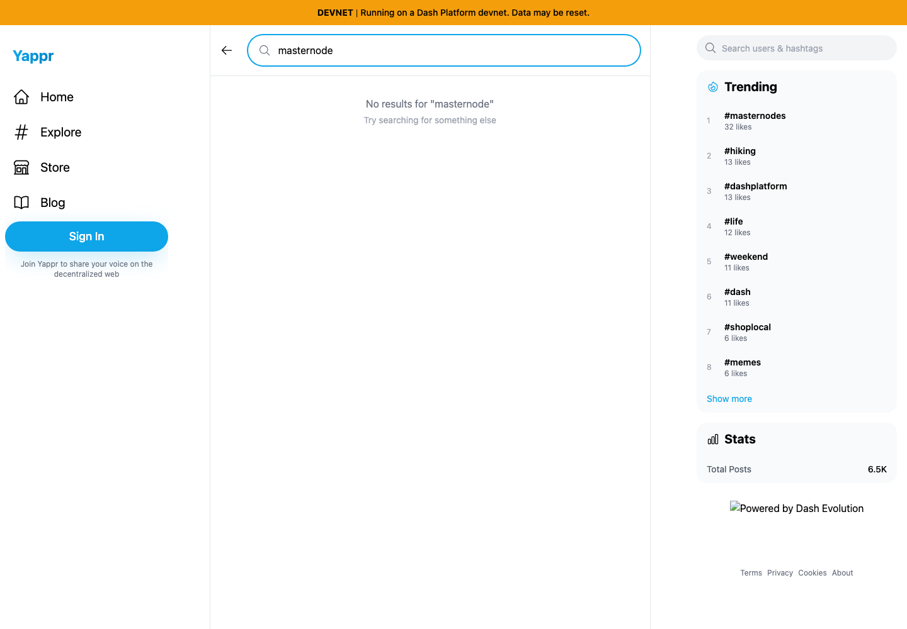
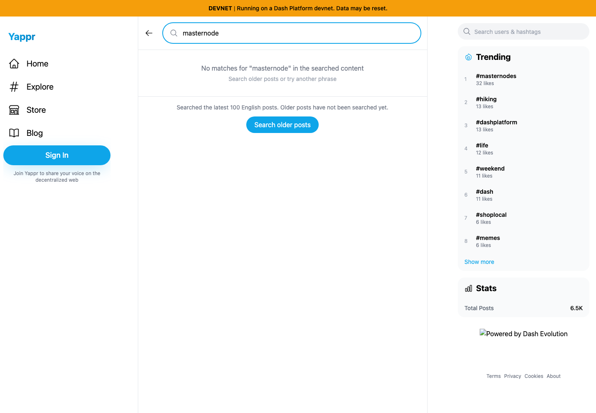
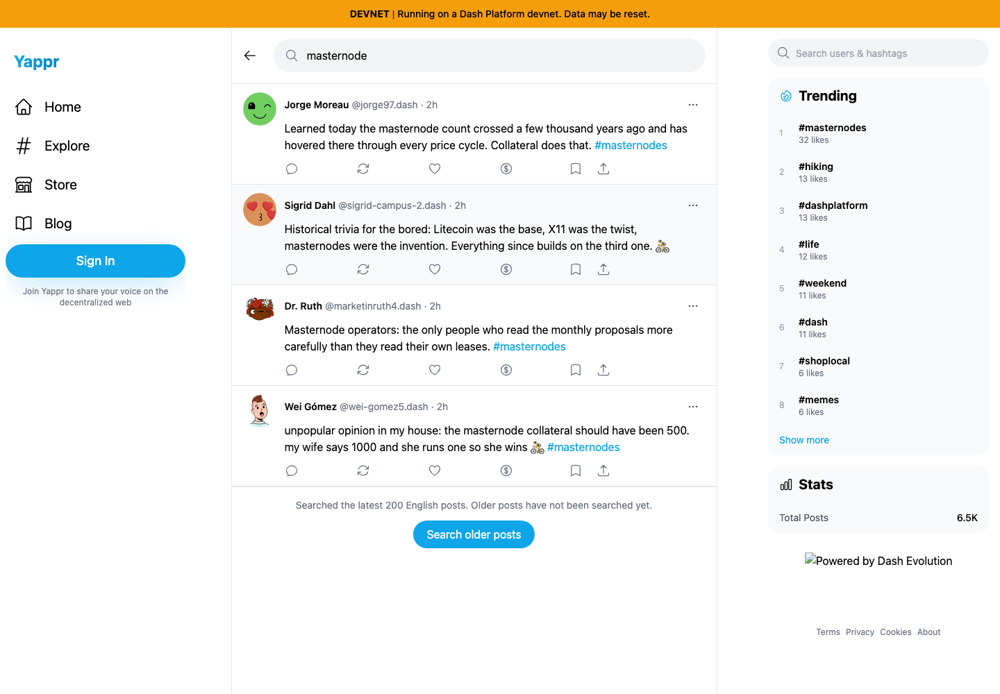
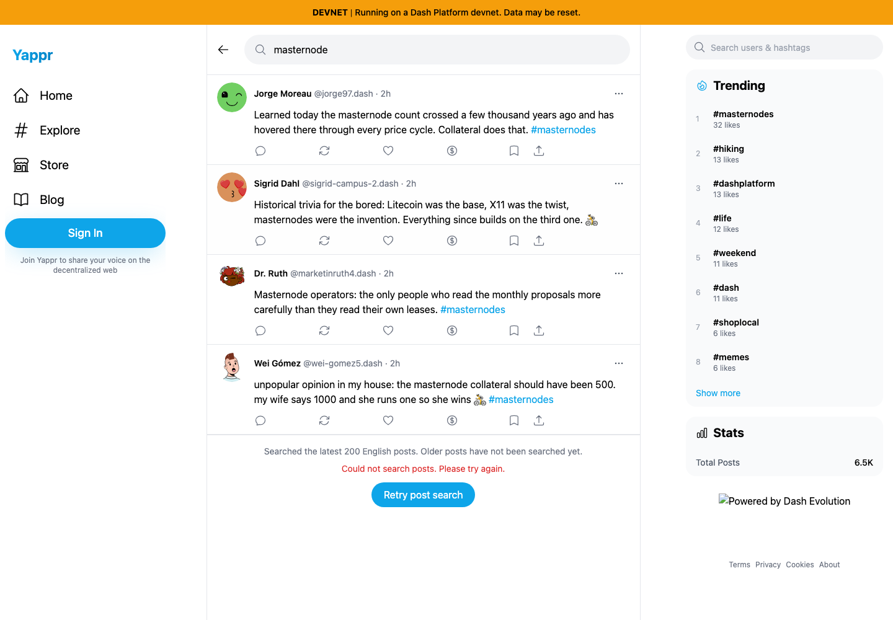
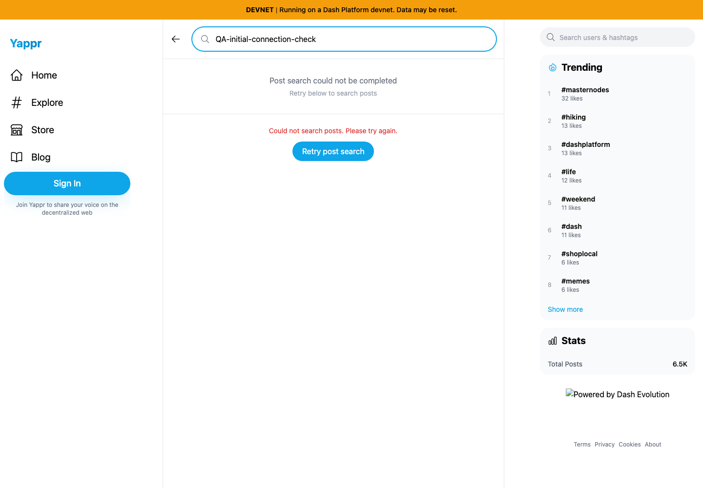
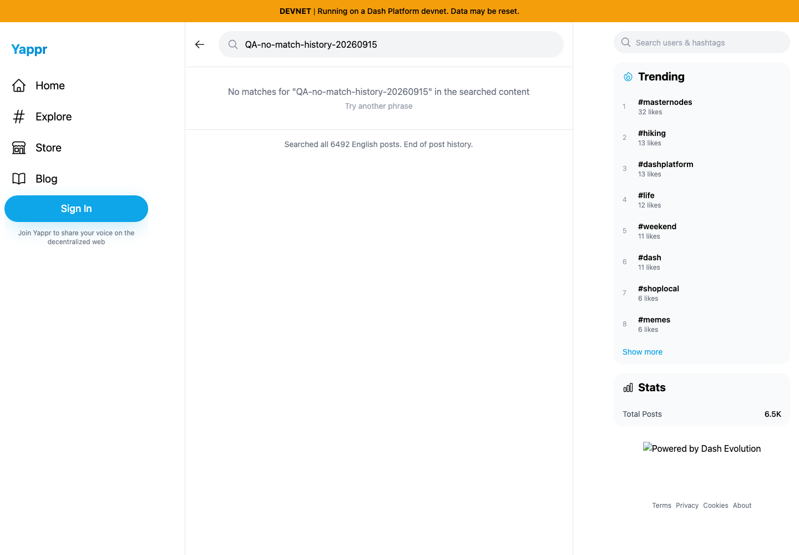

# Yappr PR 450 — Search older post history

Product: https://github.com/PastaPastaPasta/yappr/pull/450

This final comparison explicitly supersedes artifact `fff6d0545097053231a9fb6ac51d697e45163b8d` (base 4105c5d1 / head c4bd6206), which preceded the newly merged staging enrichment change. Every screenshot was recaptured and reinspected after rebasing; no intermediate images are used below.

Before: `eb895be71a7207c73fb9329ac9d9bb7b398f53da`, clean independent baseline build/server 3240, observed build stamp `eb895be7`. After: `8daa34c0db30efa338c3bcbed762c810b406dd2f`, independent production devnet build/server 4194, observed build stamp `8daa34c0`. Separate fresh Chromium guest contexts; 1440×1000, en-US, UTC, light theme. Live devnet timeline and ordinary UI interactions. No SDK, network response, storage, or DOM substitution.

Searching `masternode` finds no match among the first 100 English posts on both builds. The base declares no results and offers no continuation. The fixed build states the searched scope; one continuation reaches four older matching records after 200 scanned documents. A physical double click still advances only one page. Exact IDs: `CEzcAWEwXgDWRoB8zyim5MFd9kLAndEYWbVfPaGK5C7M`, `7d6rcf4FWCod2sX2MbRgLQmv8ARGPCNTYdCyGZrmhbNz`, `AE58MQrqmBMWDwfWWfhWBFfcKKD9oZtdBXcX41yfxf1R`, `7ueyYwTuPpS3pdAHBZx8Z5Xo3eg5VuSKAQ4ZtMZCBY9J`.

| Before — exact base | After — full PR head |
|---|---|
|  |  |

The older matching records become reachable after continuing:

Upstream PR 405 fixed the blank-author defect (QA-49). That fix was verified on this exact baseline and preserved during integration: continued results display resolved authors and engagement.

A browser offline transport setting was enabled to test actual connectivity loss; no successful or failure response was forged. The next-page failure retained all four records and the cursor. Restoring browser connectivity and Retry reached 300 scanned posts and five matches.

A separate first-page offline failure shows a failure state rather than a misleading empty result. The first retry after reconnect still failed transiently; a subsequent retry succeeded without discarding or duplicating data.

A no-match phrase was continued through the real entire English timeline. It ended after 6,492 documents and removed the continuation button. Counts are live and may grow after capture.

[Recorded IDs, cursor scope, and checks](observations.json). Query replacement during an in-flight continuation discarded older results, trimmed/repeated QA queries agreed, Unicode and punctuation queries remained stable, and clearing restored Explore tabs. Articles retain their existing separate discovery/search limits; this continuation is explicitly for English posts.

Validation: 189 unit tests, lint, final production devnet build, independent code review and simplification pass. Tests verify zero-match continuation, raw cursor progression past deleted/timestamp-tied records, short/empty exhaustion, and surfaced failures. All six final PNGs were opened and inspected at original resolution. No credentials are visible.
