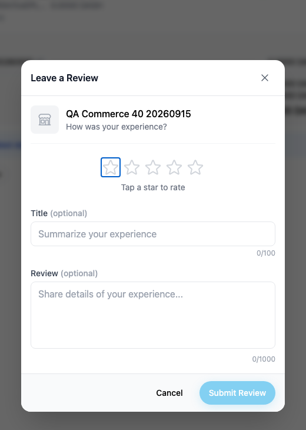
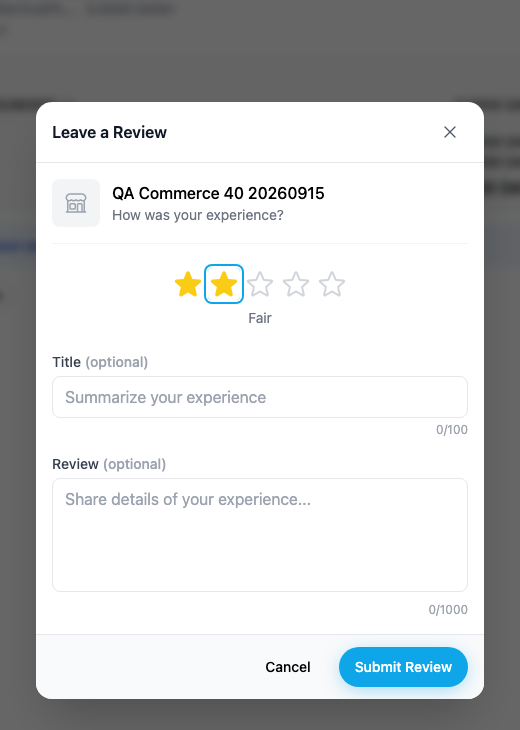
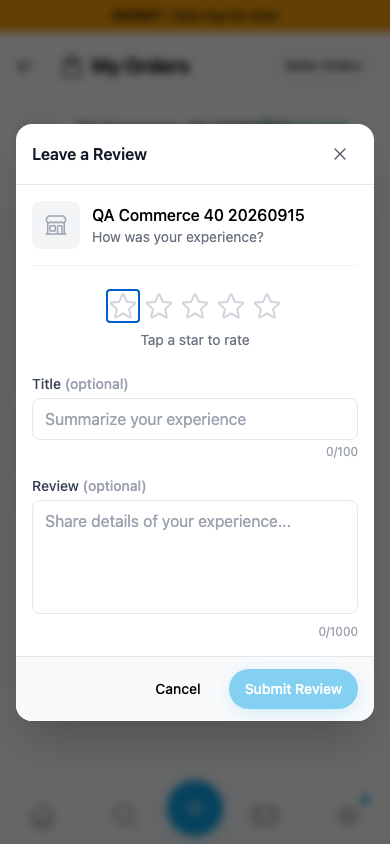
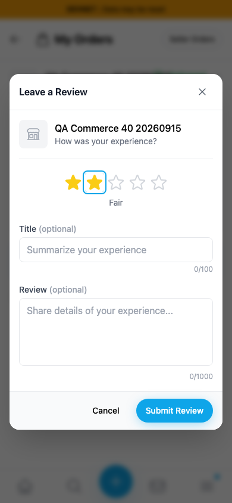

# Yappr #451 — keyboard-accessible review rating dialog

Exact captured staging base `eb895be71a7207c73fb9329ac9d9bb7b398f53da`; full PR head `80cd00e69a0ad63cb57714c122269611edf056a7`. Both independently built with `npm run build:devnet`, separate worktrees/output directories, fresh Chromium contexts. Desktop 1440×1100; mobile 390×844; scale 1, light theme, en-US, America/Chicago.

Shared buyer `5rxCEiuGfwPkYFQ94mvxDaDG7W7dEdpU2zhq7aTLJ1cM`, store `98FYBhEF9Q8xNzbamzy66Dm5cMQ5gm9MoAZaiy518sNp`, product `25n2uxxtBSAWVWZBD86uGXdkHW7nYP25jpgfpPY87qRH`, and order `3m7cxEPLdVZN9aaen3BdPEYZjsuke3CAaGiKRc6azQHW`.

The order is a **synthetic devnet QA fixture**: buyer52 placed an unpaid order through the real checkout, without shipping/contact details or a payment transaction. Seller40 simulated Delivered through its normal order UI. No real payment or shipment occurred. Auth and encryption session restored from dedicated QA credentials; no credential fields or secrets appear in screenshots. No product DOM or API mocks.

| Surface/gesture | Before | After |
| --- | --- | --- |
| Focus first rating star, then ArrowRight | First star remains focused; no rating; Tap a star to rate; Submit disabled | Second star focused, two stars selected, Fair, Submit enabled |
| Same gesture at 390px width | Unselected | Two stars selected, dialog fits |
| Accessibility tree (nonvisual) | Five unnamed buttons; unassociated fields; missing description | Named Rating radio group, five named radios with checked state, associated Title/Review fields, Close review and dialog description |

| Before — exact base | After — full head |
| --- | --- |
|  |  |
|  |  |

[Full context before](comparison/before/context.png) · [after](comparison/after/context.png). Desktop focus views are native crops x460 y150 w520 h730. All six final PNGs opened and inspected; the pointer was moved away before capture. Both captures precede review submission and use the same unreviewed order.

Browser checks: arrow selection and wrap, Space and click, five names/checked states, visible selection clearing a hovered five-star preview, optional field-label focus, accessible dialog description, disabled empty submit, Cancel reset, and narrow layout. Keyboard tests use a 100ms keydown duration so Radix's scheduled focus runs before keyup. [Before checks](before-measurements.json) · [after checks](after-measurements.json).

**Post-capture write verification:** selected 4 stars using Space, Tab moved directly to Title, submitted explicitly synthetic QA text. Fresh Orders reload removed the duplicate-review action; fresh Store Reviews readback showed the title/body. [Submission checks](submission-check.json). This verification is procedural, not represented by the unsubmitted screenshot pair.

Targeted ESLint, standalone TypeScript, devnet build, and independent final source review passed. Simplifier replaced keyboard-handler preview coordination with value-change reset and pointer-movement preview; no extra abstraction was added.

## SHA-256

- `209478764cdbf4a8cb5d5abd5913aa40b6bd06234dbdfd73f52fe3c869fc7705` — `after-measurements.json`
- `ac1901522d10f83ca6959e5f7a412757fc627988b510592649f1a21e14a5b532` — `before-measurements.json`
- `b44daf2ec246787903ac96c5c7a38bd00dd2d10a334ffc99835c984478dc8f2f` — `comparison/after/context.png`
- `ca72ecdae7989ad55f532053058eb045124a99cb673f4f63f480d8058722224c` — `comparison/after/dialog.png`
- `ebd06136f943ba139dd457d4ba48c19e21af4ce48798db2d8b9019d047f9ae53` — `comparison/after/mobile.png`
- `5533cba5b6cd25b616d8e3bc4bbfe880abe36f6181144603707ae076a800fa2f` — `comparison/before/context.png`
- `649f9307eac30e585561daaaa56ba469df28ad9a415f2fcc934f8a2d7761ccda` — `comparison/before/dialog.png`
- `44f14a91160792a94ed0dd0ee373f397e1e2f4cd2f1e993325d8a1456aea34c0` — `comparison/before/mobile.png`
- `b26db9d56c476c912d63a44bd7024f19a37d2ee0090d4c43d64e81cad2518920` — `submission-check.json`
