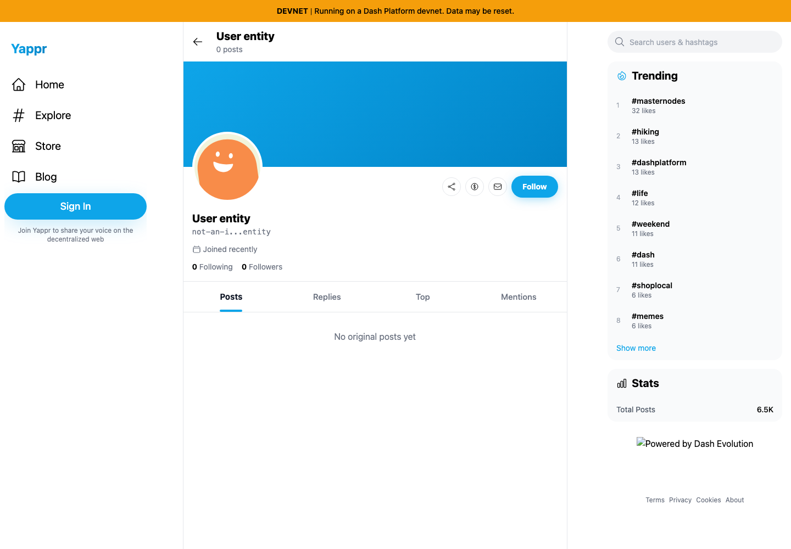
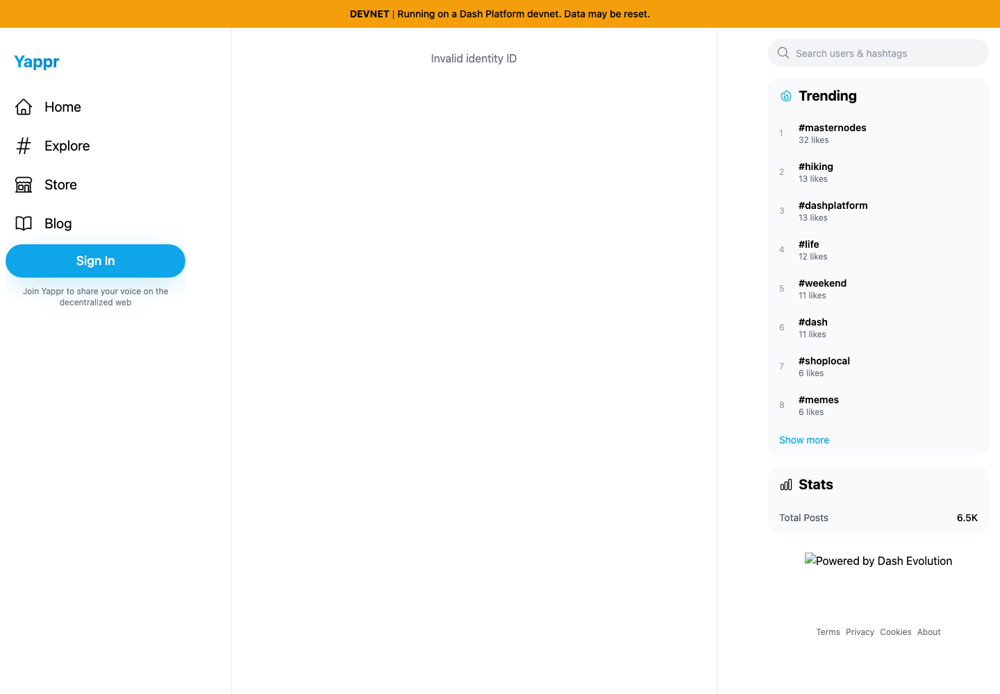

# Yappr PR #455 — malformed profile identity

PR: https://github.com/PastaPastaPasta/yappr/pull/455

Before: `eb895be71a7207c73fb9329ac9d9bb7b398f53da` (independently built staging checkout, port3240). After: `c072b3e1722d0099c0f5fe9ab13882c4f82fdf7b` (independently built PR checkout, port4195). Both use `npm run build:devnet` and the real devnet.

| Surface | Shared fixture | Visible delta |
|---|---|---|
| Public profile | `/devnet/user/?id=not-an-identity`, separate fresh guest Chromium contexts, 1440×1000, en-US, UTC, light | Before displays a fallback profile, Joined recently, and Follow. After displays Invalid identity ID. |

| Before — exact base | After — full PR head |
|---|---|
|  |  |

No DOM, browser storage, network response, or SDK injection. The malformed value is a normal direct route input. The unrelated Evolution badge image fails in both environments and is not part of this change. Screenshots were captured after sidebar counts/trends settled, opened at original resolution, and inspected.

Nonvisual/compatibility verification: lint, production build, 186 existing unit tests. Real UI checks reject invalid Base58 alphabet and identifiers decoding to31/33 bytes; missing ID still says User not found. Alice `AnvD14VL4sM55HkAZMxUnp6GwQW39Sf5FuJT6pKnpqig` remains11 posts/15Following/73Followers. Back/Forward between valid/invalid routes works. Valid32-byte ID `HHTEVaETWsabcpHK7zcS7xzqqGhWKKTcfLd93boP4HjN` retains identical fallback behavior on both revisions; this does not establish whether that identity exists. No network-failure behavior or identity existence checks changed. Independent code review approved.
