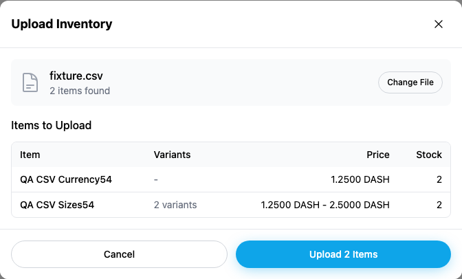
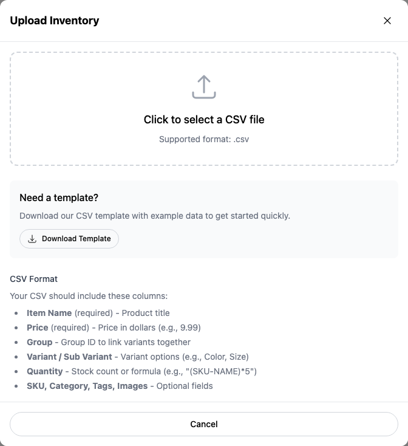

# Yappr #457 — inventory CSV currency units

Exact captured staging base `eb895be71a7207c73fb9329ac9d9bb7b398f53da`; full PR head `f31f6657e764f366113a879d47ae1d79ff7198a8`. Independent `npm run build:devnet` outputs in separate worktrees. Fresh Chromium contexts at 1440×1100, scale 1, light theme, en-US, America/Chicago. The modal screenshot is a native element capture; no resizing or annotations.

Same seller40 (`5Qazb9Ncc7LgLSSWkPj36Qpp5ZpEoQEcHNR2Ync7cJcK`), DASH store (`98FYBhEF9Q8xNzbamzy66Dm5cMQ5gm9MoAZaiy518sNp`), and exact [input CSV](fixture.csv). Its single product price is **1.25 DASH**, with variant prices **1.25 and 2.50 DASH**. Both preview screenshots are unsubmitted. These same synthetic products already exist from the earlier roundtrip checks; captures were cancelled without duplicate writes. No product DOM or API mocks. Dedicated QA auth restored; no secrets shown.

| Before — exact base | After — full head |
| --- | --- |
|  |  |

[Full context before](comparison/before/context.png) · [after](comparison/after/context.png). All eight final PNGs opened and inspected. The help screen also now says Price in DASH instead of dollars:

| Before — exact base | After — full head |
| --- | --- |
|  |  |

[Full help context before](comparison/before/help-context.png) · [after](comparison/after/help-context.png). Before preview rounds its incorrectly tiny values to0.0000; this PR fixes the underlying units. The separate low-value display precision issue belongs to PR426.

The base parser turns1.25 into125duffs; a real baseline upload independently opened as **0.00000125 DASH** in the editor. The corrected upload opens as **1.25000000 DASH**. This is a persisted value error, not only a formatting change.

The actual Platform write/readback checks below were completed at prior reviewed implementation head `92c1f40ef3ce96fe35b50403360f6adc3881abb6`. The only subsequent code change is the displayed currency help line; parser/export source remains identical. Current screenshots were recaptured at the final head. Those earlier roundtrip checks used isolated synthetic products, without changing the preexisting product40:

- DASH single product `9Tshw8avzu4My9S86kDg9XTMjo4ukNrVTUFGbyKZJ9Qk`; variant product `38M9XgzPqHBZu1ABvoiceRA31eAJ8NW3hhryTPt6MWM1`. After upload, fresh inventory and editor retained1.25; actual export retains1.25000000 and2.50000000. Reimport of the actual downloaded file shows the same intended amounts, then Cancel avoids duplicate writes. [DASH checks](DASH-roundtrip.json).
- USD QA store `CM5fhHWoXy9hk3UMtLQdiQphp2LyTpmBWsRanrakYLaD`, owner buyer52 `5rxCEiuGfwPkYFQ94mvxDaDG7W7dEdpU2zhq7aTLJ1cM`, product `CtPyBrfgEVGDQBz8uodjBiBHtRkiysCKpfhJtEYBoMLY`. Created through the real store form; no payment method configured. Import/export/reimport and fresh editor retained **1.25 USD**. [USD checks](USD-roundtrip.json).

| Export the same persisted product | Before downloaded Price | After downloaded Price |
| --- | --- | --- |
| DASH single 1.25 |1250000.00 |1.25000000 |
| DASH Large variant2.50 |2500000.00 |2.50000000 |
| USD1.25 |1.25 |1.25 |

Actual downloaded files: [DASH before](DASH-base-export.csv) · [DASH after](DASH-export.csv) · [USD before](USD-base-export.csv) · [USD after](USD-export.csv). Export values are data evidence, not fabricated product screenshots. The format still omits per-row currency metadata; these are uniform-currency stores, and mixed-currency roundtrip is not claimed.

Validation: nine meaningful parser regressions (DASH/BTC eight-decimal units, fiat cents, one duff, variants/minimum price, nonfinite and unsafe amounts), targeted ESLint, standalone TypeScript, devnet build, and independent final source review passed. Existing currency helpers remove duplicate conversion assumptions; no new abstraction or unrelated cleanup. No payment or shipping transaction occurred during this test.

## SHA-256

- `133b0f4739bd890601dd3f30aed0e1a073110b9a936445e69add1c54aa2084bb` — `DASH-base-export.csv`
- `674e22a5b5a7e6cb7573026cf76fe9b05b2ffb35cb5198f4a0be85b6f0e5ba07` — `DASH-export.csv`
- `650452c4339fbc5ce1c3d7cf57ea95b255135f4ce78e7c885a2330a1d8100011` — `DASH-import.csv`
- `791c89e6a6ea2419de41dd1abdb4f16e0576cf4dd9bda74ec0ea14e3529f28e7` — `DASH-roundtrip.json`
- `b74b5fc30f57a843f8bc2dad7ca848b6dfaf764f3600b4f65776e5814c0cff58` — `README.md`
- `7cf761a09f2c8dbb1c404026112cda185eb1373d6019379853297efea83dc5c7` — `USD-base-export.csv`
- `7cf761a09f2c8dbb1c404026112cda185eb1373d6019379853297efea83dc5c7` — `USD-export.csv`
- `d53aa0d41b88c0b9e3d940322d21ddf2ca6c5d252e6dd51014c816ecb5af99d8` — `USD-import.csv`
- `82bcb0518293084f6642ab9d6c9787ed8703d84063625c5290f0acb35744708b` — `USD-roundtrip.json`
- `f1f86421238691ed8e6f0f2d4cf593700ebf4fbddb3b7f3b239e2beb05d91552` — `after-measurements.json`
- `0b919a398ee92ea339bbce0c3f6b27e9e610da4d7a0388261e32caf9127b3b56` — `before-measurements.json`
- `fa44e5bb9ad4b5630f835552586a608927e6c289d38894a59d84c3e207e07547` — `comparison/after/context.png`
- `99c95433e9fd708f28007657963860c3e523565b5940b4acced2c494b3996c04` — `comparison/after/help-context.png`
- `f3e03598096ddf4c856056b8471924f69eba3409df5659ced178ab1145122af0` — `comparison/after/help.png`
- `9412a9ff88069525c929049a2a4bf6863d2e1b0d86153449615e254b41694451` — `comparison/after/preview.png`
- `427dde485c11585e87160a64d89372f2f57d5e3e6cdf49547f487511c564be00` — `comparison/before/context.png`
- `2e97f4ed670ab508e85814d83c6a913e72ae791331d1007d487bfd02b1afd06e` — `comparison/before/help-context.png`
- `76e794ba3cedaaedcd5b396a322a74eade35580fbb78a260c13bce7b5afd91b0` — `comparison/before/help.png`
- `fb62cdccb36ccf99808aaf6be4afabf2efcdbc63922946d9bab8588b504818b4` — `comparison/before/preview.png`
- `650452c4339fbc5ce1c3d7cf57ea95b255135f4ce78e7c885a2330a1d8100011` — `fixture.csv`
