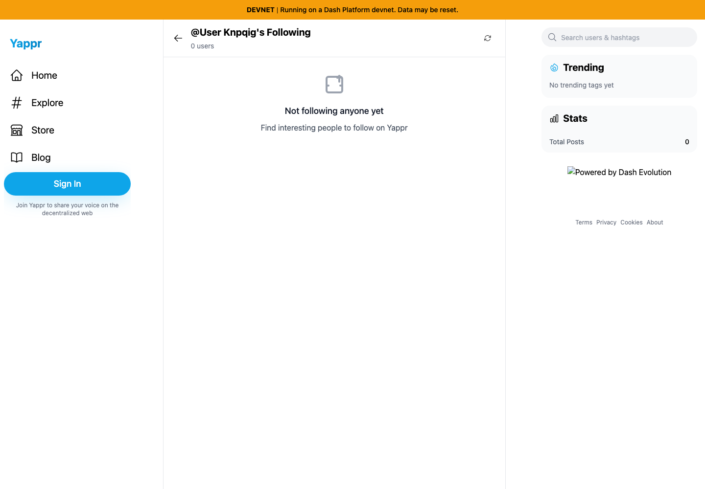
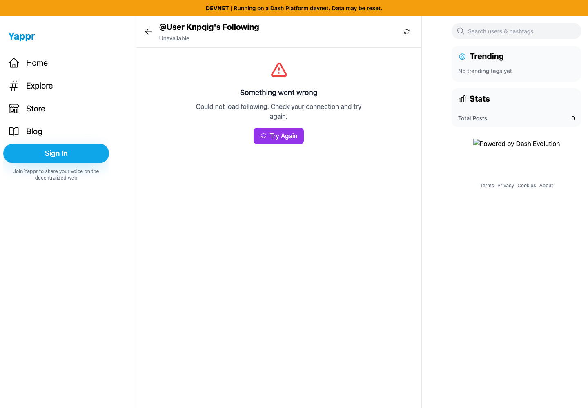
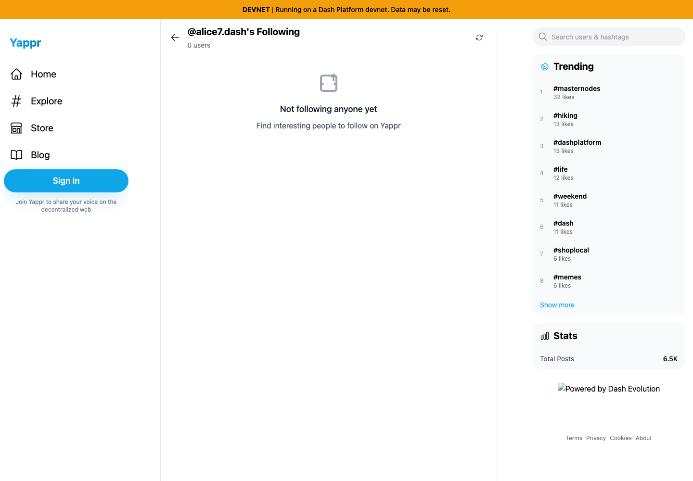
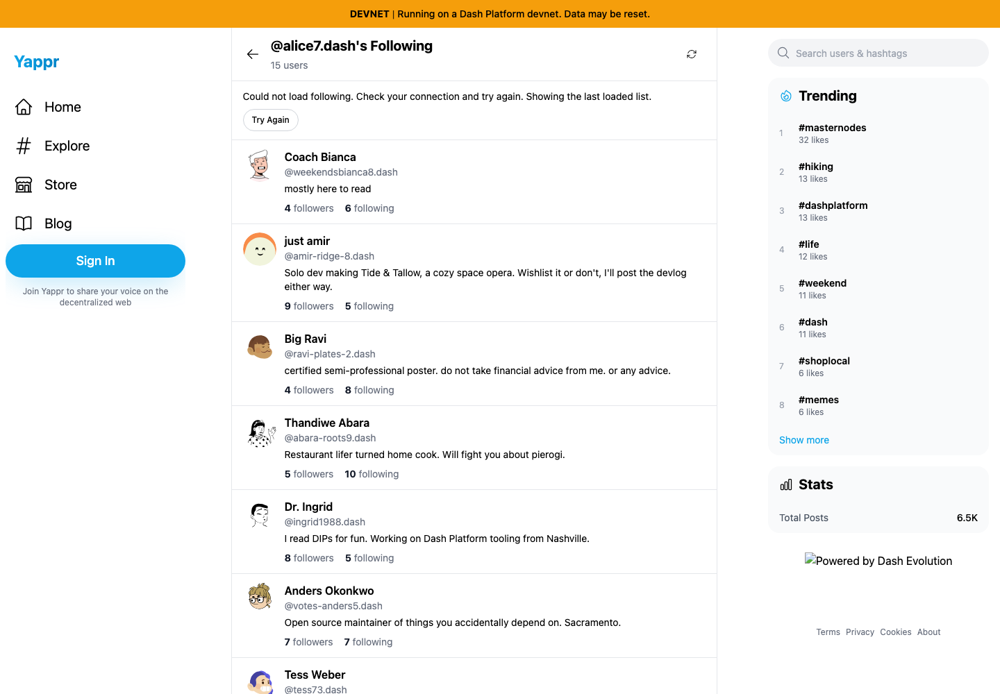

# Yappr PR #458 — connection-list load failures

PR: https://github.com/PastaPastaPasta/yappr/pull/458

Exact before: `eb895be71a7207c73fb9329ac9d9bb7b398f53da` (independent staging build,3240). Exact after: `ee3956e89e9140765ddb771d0715861665be0ec3` (independent PR build,4196). Both were production `npm run build:devnet` builds using the real devnet.

Shared fixture: Alice `AnvD14VL4sM55HkAZMxUnp6GwQW39Sf5FuJT6pKnpqig`,15 following,73 followers. Fresh separate guest Chromium contexts,1440×1000,en-US,UTC,light. Ordinary UI navigation and buttons; only browser offline transport was controlled. No injected DOM/storage/SDK responses or fabricated network responses.

| Surface | Before — exact base | After — full PR head |
|---|---|---|
| Initial read interrupted after page shell loads |  |  |
| Refresh after successful15-user read, browser offline |  |  |

Initial pair: load Alice following, wait for main shell after DOMContentLoaded, make browser offline, wait for settled state. Base claims0 users/Not following anyone yet; head says Unavailable with retry. The offline initial DPNS/trend/stats lookups also fail on both revisions, so the header uses identity-tail fallback and sidebar shows zero; those separate behaviors are unchanged.

Refresh pair: load the same Alice list online until15 users and sidebar settle, make browser offline, click Refresh, wait for settled state. Base discards the known list and claims0. Head retains15 and explicitly says it is the last loaded list, with Try Again. The first7 retained records are within the screenshot; all15 were verified in the DOM.

All four final images were opened and inspected at original resolution. Reconnect+retry restored15 in both initial and refresh scenarios. Followers similarly retained73 during failed refresh. Its first immediate reconnect retry still failed while SDK transport recovered; a later retry succeeded and cleared the warning. A real zero-user list (hamzak78, `VQpFJTzQqdTzMQQcJmKhARpXBE5f9GjwRZ8UMCY2stW`) remained a normal successful empty state. Alice15→Coach Bianca6 (`DK5mX2V9yn1WtKWSMpo4HLDpo8HF6LmVDuztsnnF2fwx`)→Back15 passed.

Validation: lint,190 unit tests including strict-read failure versus true-empty distinctions for both methods and unchanged opt-out fallback, production build, independent review APPROVED. The unrelated Evolution badge image is broken in both builds. No test writes or identity mutations were required.
