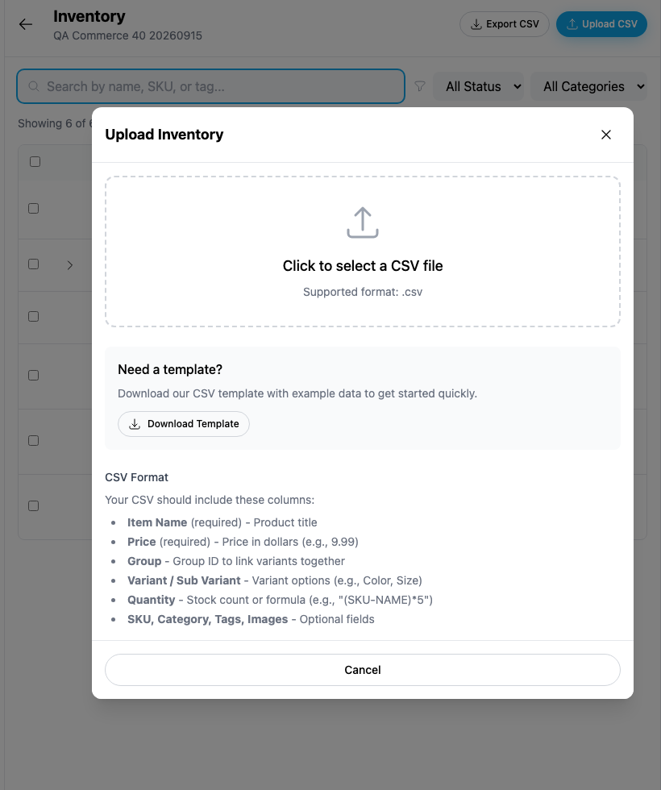
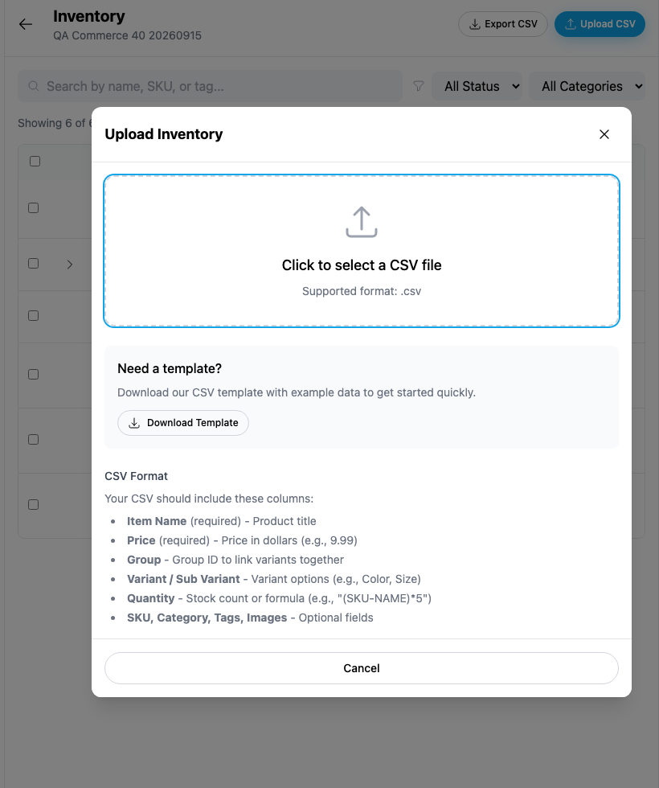

# Yappr #462 — keyboard-accessible inventory upload

Exact captured staging base `eb895be71a7207c73fb9329ac9d9bb7b398f53da`; full PR head `191f52a64fc19ecdae5ae7729e4ee41249448cd4`. Independently built with `npm run build:devnet` in separate worktrees. Fresh Chromium contexts,1440×1100, device scale1, light theme, en-US, America/Chicago. Focus crops are native pixels from rectangle x270/y50/820×980; no resizing, annotations, product DOM changes, or API mocks in the screenshots.

Same seller40 (`5Qazb9Ncc7LgLSSWkPj36Qpp5ZpEoQEcHNR2Ync7cJcK`) and synthetic DASH store (`98FYBhEF9Q8xNzbamzy66Dm5cMQ5gm9MoAZaiy518sNp`) with six products. Both screenshots: open **Upload CSV**, then press **Tab** once. Before, the focus ring is on the background inventory search; after, the CSV picker button has visible keyboard focus inside the dialog. Dedicated QA authentication restored, no secrets shown.

| Before — exact base | After — full head |
| --- | --- |
|  |  |

[Full context before](comparison/before/context.png) · [after](comparison/after/context.png). All four final PNGs opened and inspected.

Behavioral checks, separate from the visible focus comparison:

- Base exposes zero dialog roles; Escape leaves overlay open. Head exposes one dialog named Upload Inventory, with its description.
- Twelve Tab and twelve Shift+Tab presses remain inside the dialog. Enter on the focused picker opens the real native file chooser; selecting an empty CSV shows validation and disables Upload0Items.
- Escape, outside click, close icon and Cancel close normally; Escape/outside/close restore the Upload CSV opener. Mobile390px dialog/picker flow fits.
- [Actual upload-lock check](upload-lock-checks.json): briefly held the real DAPI broadcast request for one synthetic zero-stock product, **QA UploadLock59** (`2UDAJXVxt8sEPk7yU19nUNUg6noK7ZKrC37Ti8mNXcBh`). During the hold, aria-busy was true, close was disabled, and Escape/outside did not dismiss. Released the unchanged request; upload completed and fresh inventory/editor readback confirmed it. This is disclosed timing control, not a mocked success. No payment or shipment.

Targeted ESLint, standalone TypeScript, devnet build, and independent final source review passed. Existing Radix primitive provides the focus/keyboard semantics; no new shared abstraction. Currency-unit and display behavior belong to separate PRs and are unchanged here.

## SHA-256

- `b3f0e2633bf1464ee371f1d84674a57b9475fe9276325e4a4f4b6c61cb829912` — `after-measurements.json`
- `a60a381d5752590b2b78ad0e039391d61eb450e1d18d21f06f6c06b7a3d745bf` — `before-measurements.json`
- `56c40f2c5ac4932951cacd94ff41c67205082055be5b850990b93189b544ba50` — `comparison/after/context.png`
- `ace6cda5735260aea310e51b1c68ce995aeff6da20a649a3beb34b0727a7dba3` — `comparison/after/focus.png`
- `9e5b006ea18425710149bcf076e3ce33f84c705e73f7c68eaad98610342ddf88` — `comparison/before/context.png`
- `8576ea2a2a5e0fcfe889addb16a0ac5ad22d20cc445718956ef2aac31d34f562` — `comparison/before/focus.png`
- `7b4ce0a8993e3f2d4f5e0f26afce645a21b55a6ce82bad96422cc375be2834a3` — `upload-lock-checks.json`
