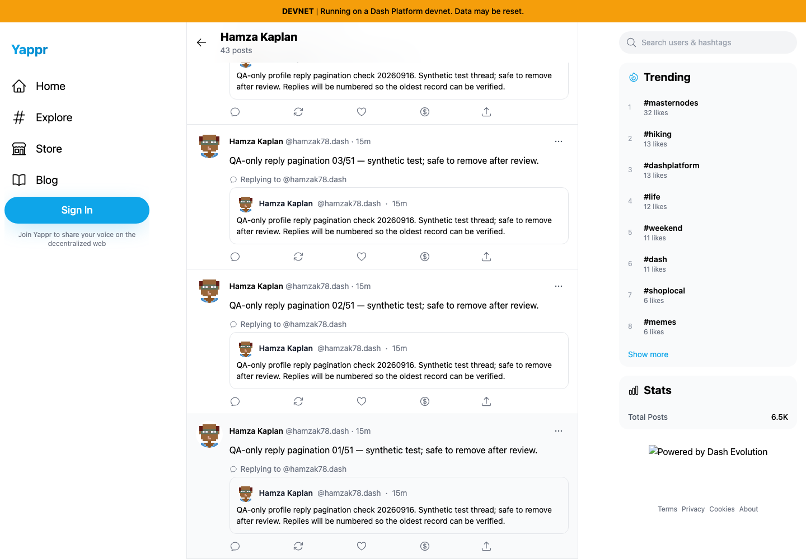
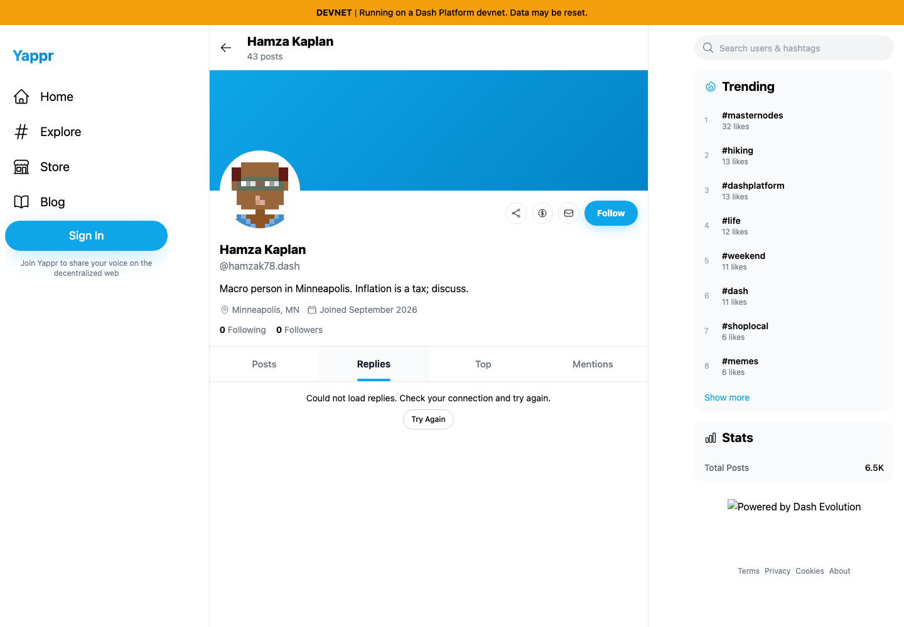

# Yappr PR #463 — complete profile reply history

PR: https://github.com/PastaPastaPasta/yappr/pull/463

Exact before: `eb895be71a7207c73fb9329ac9d9bb7b398f53da` (independent production build, port 3240). Exact after: `f5c4fde97a51c4d12dac111ea5f2bcc6c688d7bd` (independent production build, port 4197). Both `npm run build:devnet` builds talk to the real devnet. Separate fresh guest Chromium contexts, 1440×1000, en-US, UTC, light.

The synthetic fixture was created through the normal signed-in UI as persona 53, `hamzak78` (`VQpFJTzQqdTzMQQcJmKhARpXBE5f9GjwRZ8UMCY2stW`). Root `GxQsnTzcYAHpKUVLHB79mMky1cqtbaP3qHHDZWDKntvo` and 51 numbered replies explicitly identify themselves as QA-only. [All public record identifiers](fixture.json). No injected DOM, browser storage, SDK behavior, or network responses. Offline checks use browser transport control only. The screenshots record the fixture at capture time; later cleanup may tombstone these test records.

| Surface | Before — exact base | After — full PR head |
|---|---|---|
| Bottom of available profile replies |  |  |
| Initial Replies read fails |  |  |

Before history ends with reply 02/51: 50 unique cards, no continuation. After clicking Load more replies, reply 01/51 becomes reachable: all 51 unique IDs, no missing IDs, and continuation disappears at the end. The header’s 43 posts is the unrelated count of original posts, not a reply count. Relative timestamps naturally advance during the capture session.

[The new continuation control](comparison/after/next-page-control.png) and [an incremental error retaining the first 50 replies](comparison/after/incremental-error.png) show the intermediate states. Parent-root context remains visible for the older reply. The initial error pair disconnects the browser only after the profile header and Posts tab finish loading, then opens Replies. Reconnecting and clicking Try Again restores the first 50; an offline continuation retains its cursor and all cards, then recovers to 51 after retry.

Validation: production build, lint, 188 unit tests; the new 51-record service regression fails against the exact base (undefined cursor instead of reply-49) and passes against the head. Double-click continuation returned exactly 51 unique records. Switching to Alice showed her four replies with no QA fixture leakage; Back reset persona 53 to its first page. Independent review approved. Simplification kept one shared initial/next/retry loader and centralized identity-specific reset state. All six final screenshots were opened and inspected at original resolution.

The root thread already paginated correctly and showed all 51 records on the base. During fixture creation, replies 25 and 41 were absent after automatic refresh but visible after a full reload; no duplicate writes were retried. These intermittent refresh observations are recorded separately and are not claimed fixed by this PR. The unrelated Evolution badge image is broken on both builds.

Cleanup completed at 2026-09-16T00:41:48Z: all 51 synthetic replies and the root were deleted through normal owner menus and confirmation dialogs. Reload verified 51 reply tombstones and a root-post tombstone. [Cleanup record](cleanup.json). Screenshots above preserve the valid capture-time fixture; the public records are now tombstones.
