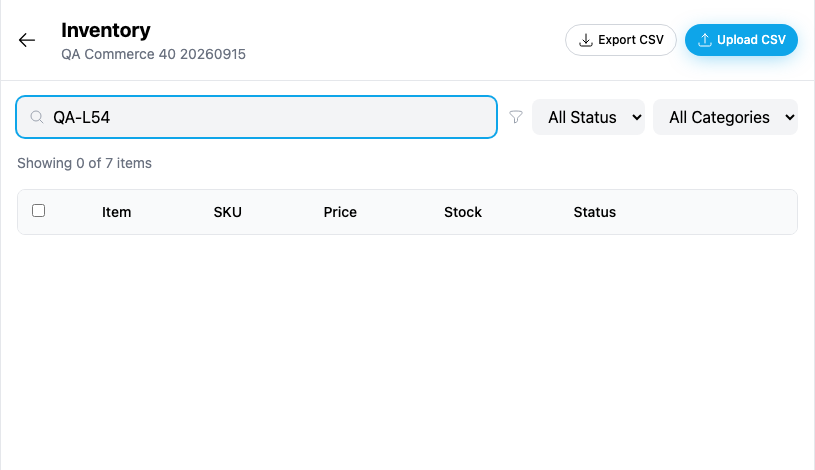
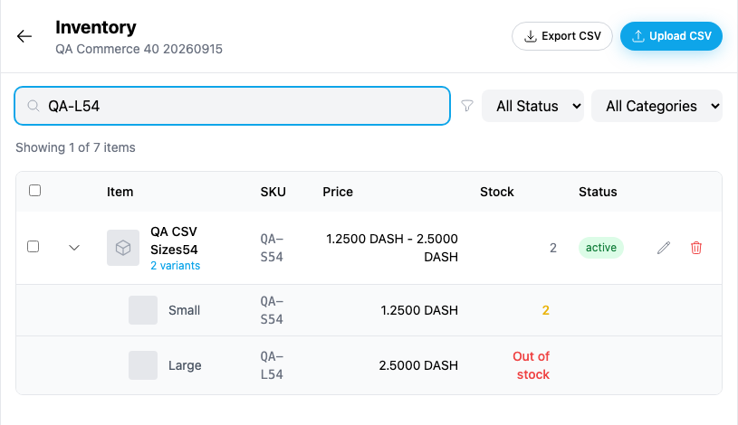

# Yappr #464 — inventory search includes variant SKUs

Exact captured staging base `eb895be71a7207c73fb9329ac9d9bb7b398f53da`; full PR head `088a0cea8e062cffeba6d9623b90be34214c174f`. Independent `npm run build:devnet` outputs in separate worktrees. Fresh Chromium contexts at 1440×1100, scale 1, light theme, en-US, America/Chicago. Focus captures use native browser clip x275/y40/815×470; no resizing, annotation, DOM alteration, or API mocks. All four final PNGs inspected.

Same synthetic seller40 (`5Qazb9Ncc7LgLSSWkPj36Qpp5ZpEoQEcHNR2Ync7cJcK`), store (`98FYBhEF9Q8xNzbamzy66Dm5cMQ5gm9MoAZaiy518sNp`) and persisted product **QA CSV Sizes54** (`38M9XgzPqHBZu1ABvoiceRA31eAJ8NW3hhryTPt6MWM1`). The product has Small SKU `QA-S54` and Large SKU `QA-L54`; the parent SKU happens to match Small. Both captures first expand the product, then search `QA-L54`. Before gives 0 of 7 products; after returns the matching product with its existing expanded variants, making the actual matching SKU visible. No auth secrets shown.

| Before — exact base | After — full head |
| --- | --- |
|  |  |

[Full context before](comparison/before/context.png) · [after](comparison/after/context.png).

Procedural compatibility checks: exact/lowercase/partial secondary SKU, existing parent SKU, title, plain product with missing SKU, clearing query, unknown query and category filtering all passed. The query matches a product whenever any combination SKU contains the same case-insensitive substring. No test write was needed.

Targeted ESLint, standalone TypeScript, devnet build and independent source review passed. One predicate added to the existing search, with no new abstraction.

## SHA-256

- `e6c004d89790fcb21847e7fdfa0d7962c8324fdadd5638ab531ba8d79a4ccc0a` — `after-measurements.json`
- `3aa1599018e838e48e7637e9a62d786c3730a7b6bc7b36ac72a7548ddf44b7b6` — `before-measurements.json`
- `d6e54ae74b7955a6056456f9ea8d9ba8232115f7ac94fc1146056997dd65d616` — `comparison/after/context.png`
- `35538d1e7df3aefe4cf2afc62a004c1e3ef0f437169538d7decd0832c3b93e73` — `comparison/after/search.png`
- `8b57aac014563bd73669f1fedf118c626e3683df921cb9e138ce3674d3b32489` — `comparison/before/context.png`
- `98de95fb3a93e38ab0ab0a03eb0ea060435b5b04cae254e6ba2e5e945d37cfd2` — `comparison/before/search.png`
