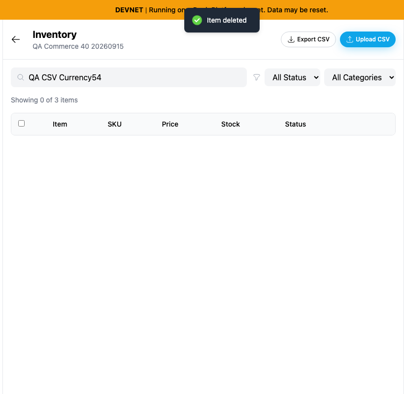
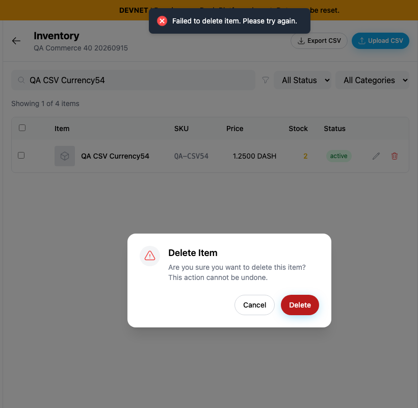
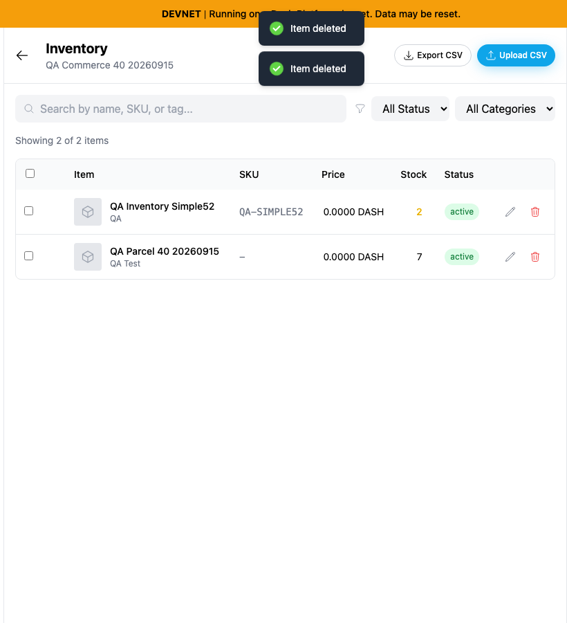
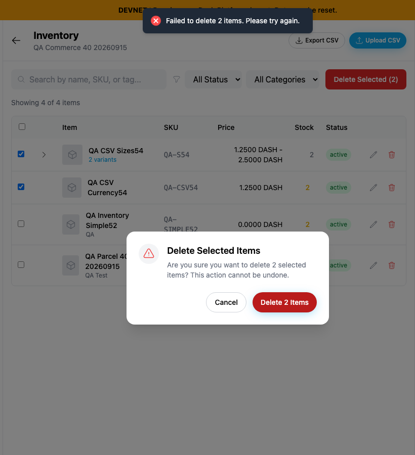
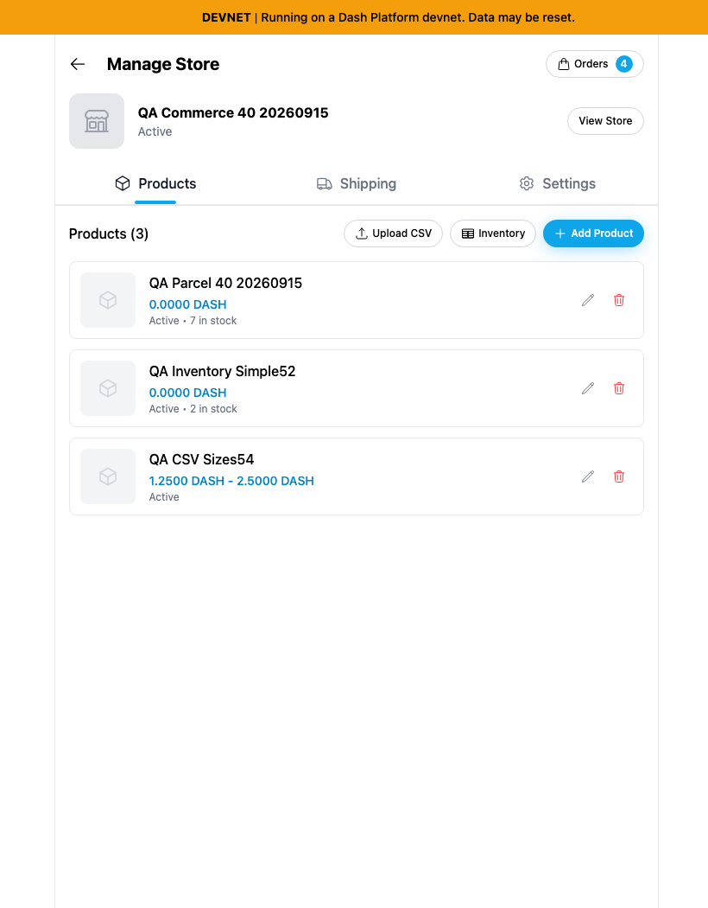
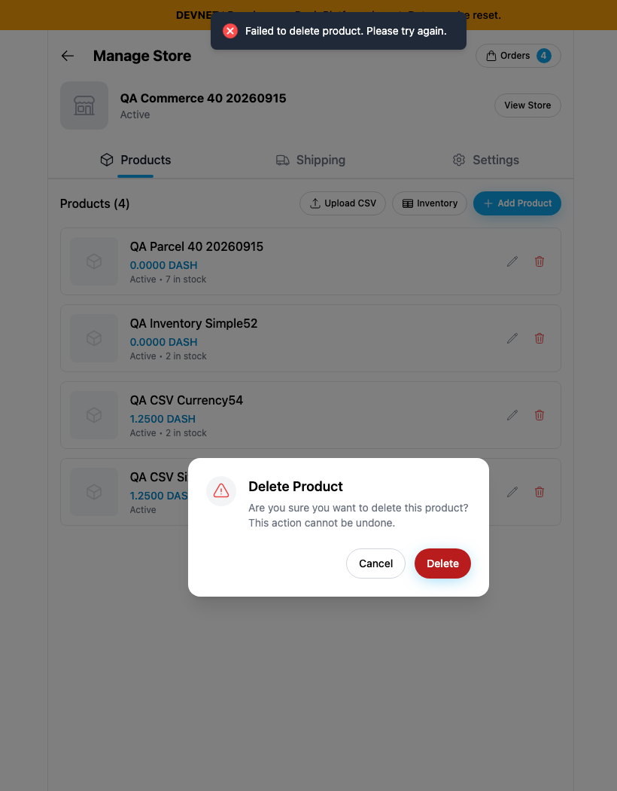

# Yappr #466 — report failed product deletions honestly

Exact captured staging base `eb895be71a7207c73fb9329ac9d9bb7b398f53da`; full PR head `638f8ba3c43a35c2885ab96737746ae672083231`. Independently built with `npm run build:devnet` in separate worktrees. Fresh Chromium contexts, light theme, en-US, America/Chicago, scale 1. Inventory single/bulk viewport 1440×1100; management 1440×1400 so the retained product and dialog are both visible. Matching before/after framing. Focused native browser clips x270/y0/820px wide, height800(single),900(bulk),1050(management). No resizing, annotations or product DOM changes. All twelve final PNGs opened and inspected.

**Disclosed client fault injection:** load actual synthetic products, open confirmation, then set the browser offline before pressing Delete. No fake success responses. Each failed attempt is followed by restoring connectivity and a fresh online reload, confirming that the supposedly deleted products still exist. No test identity secrets shown.

Shared seller40 identity `5Qazb9Ncc7LgLSSWkPj36Qpp5ZpEoQEcHNR2Ync7cJcK`, store `98FYBhEF9Q8xNzbamzy66Dm5cMQ5gm9MoAZaiy518sNp`, with the same four actual products before each attempt. Primary fixture **QA CSV Currency54** (`9Tshw8avzu4My9S86kDg9XTMjo4ukNrVTUFGbyKZJ9Qk`); bulk additionally selects **QA CSV Sizes54** (`38M9XgzPqHBZu1ABvoiceRA31eAJ8NW3hhryTPt6MWM1`). Both retained after these captures. Different displayed totals are the bug itself: base removes unconfirmed products locally; head preserves all four.

| Surface | Before — exact base | After — full head |
| --- | --- | --- |
| Single inventory deletion |  |  |
| Bulk deletion |  |  |
| Store management |  |  |

Full contexts: [single before](comparison/before/context.png) · [after](comparison/after/context.png); [bulk before](comparison/before/bulk-context.png) · [after](comparison/after/bulk-context.png); [management before](comparison/before/management-context.png) · [after](comparison/after/management-context.png).

Procedural success/retry checks used separate disposable synthetic rows; see [retry-checks.json](retry-checks.json):

- Partial bulk: first real broadcast for QA UploadLock59 succeeded; subsequent broadcasts for QA Inventory Zero52 were deliberately aborted. Only confirmed first row disappeared; failed second row stayed selected with a retryable dialog.
- Remove interruption, retry remaining selected row: actual deletion succeeded; fresh inventory confirmed both absent. Existing QA Parcel40 and Simple52 preserved.
- Two newly imported zero-stock fixtures QA Delete63 Single/Manage exercised successful inventory and management deletion. Fresh online readback confirmed both absent. No payment/shipment.
- An early management readback assertion was corrected to wait for dialog completion and inspect DOM existence: modal accessibility isolation hides background roles before the pending request completes. This automation correction is recorded, not reported as a product bug.

Targeted ESLint, standalone TypeScript, devnet build and independent final source review passed. Small caller-side guards preserve the service's existing boolean contract; no new abstraction or unrelated refactor. The UI failure is confirmed; these checks do not claim an underlying Platform/GroveDB defect.

## SHA-256

- `2bef9441d710bd0538d1ad935dd984de94d011e1e47c0b47e07995bd142050b6` — `after-extra-checks.json`
- `b41eb5f2516a95d8c6328d3c9595f4502d2f0b868464aee76a6fc64a470ebcbf` — `after-measurements.json`
- `a9dc2df0e8316505fe56625eb07c353aef359cc4fb0a5ceb3334d0cc3497adbe` — `before-extra-checks.json`
- `b6e49a43cced258ff569d288c965520d386f9a8dc96d12be44ea23fe43fa3850` — `before-measurements.json`
- `44e106c4d4e997f2956e4aa52019f676fdf9f658ab267e02b8c2cbbfe5ec99e2` — `comparison/after/bulk-context.png`
- `2559ef85501497a688199470643fe9ec41210673ff1a49e54657b5031fb3f5fb` — `comparison/after/bulk.png`
- `3190f37b7fd9ce9d5b4bf3ada3c35750f66cffd161d6da72ba3b6e719627578b` — `comparison/after/context.png`
- `f101de6d7ebe1907cdd2bc320369b11ae0f0be24b1cc20dff255b001005a169a` — `comparison/after/management-context.png`
- `05d41ad05064acdc404da7ba55a9d583e1f16d118d8d78fe50bc66bd81d593f2` — `comparison/after/management.png`
- `38ce118a6ddd5d9445f41ae0cadeadfaf4c1dad154c8766140251884d898ce98` — `comparison/after/result.png`
- `02630a22481088f6926a30c8ab98d4dff8ce93876e4efeae634dd4aeb4fb946b` — `comparison/before/bulk-context.png`
- `21ff28b83f10d6c5be9f5638f3d7493aa42241dadfe79e0e391c717f20953eef` — `comparison/before/bulk.png`
- `edcffab56cd9b4128a555814768ff282f58830ff0f9f2eeb79b632540b8080c8` — `comparison/before/context.png`
- `9711247cdf684349c6b87f316ac4c1f1c533aaebe810e7050a15a7200632f015` — `comparison/before/management-context.png`
- `f6b11d2f561e81a3210739e37ffbf40414e2f72c043ffddc3dcbaaefac315375` — `comparison/before/management.png`
- `261335ccb77a8cab598cf7ddd6aeb1d360223b4ffb59e105ab5b73fdccd617dd` — `comparison/before/result.png`
- `f9cc3e7f6232d0b4f56aeca377c7c453f50834803c5de323a122db8337de239f` — `retry-checks.json`
