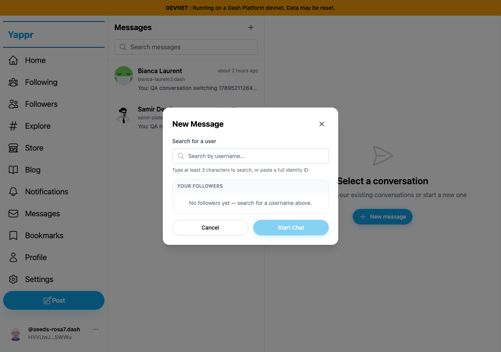
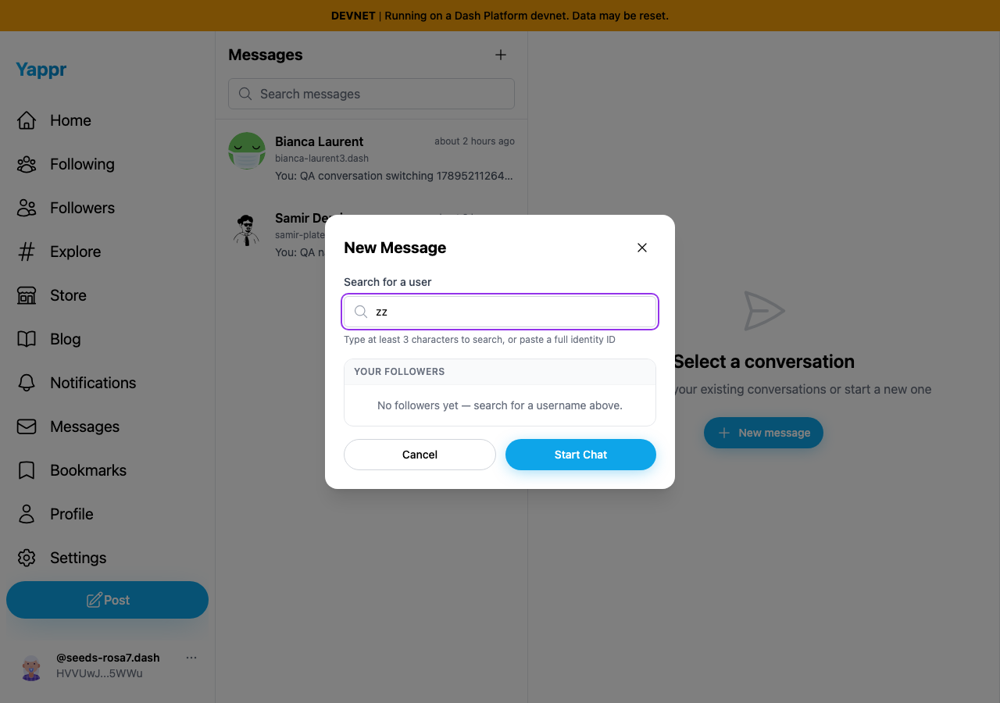
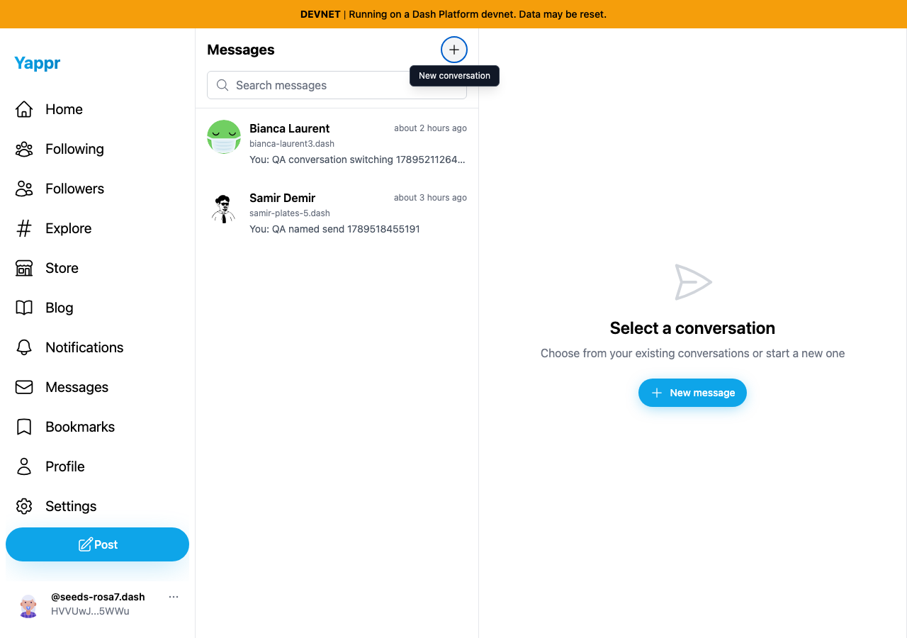

# PR 469 — New Message dialog, current rebased head

Before: `cf0efbc10b8757137063113ebbd2061e8b87d8f7` (staging).
After: `7f259cfef8df477a7763c9c9d4680defb55a76f1` (full signed PR head).

Independent committed devnet production builds at ports3288/3290; Chromium1280×900/light theme. Both captures use fresh private sessions for controlled QA persona55, `HVVUwJLhEngLH5LkZx8FgUkcso28xK7tn5gaaHke5WWu`, with the same existing conversations. Both wait for actual participant names and follower state to load. Session setup is seeded and is not login evidence. No service responses, application data, DOM styling or screenshots were mocked/altered.

| Before — exact base | After — full PR head |
|---|---|
|  |  |
|  |  |

The Tab pair shows the existing background navigation focus outline versus contained recipient-input focus. The Escape pair shows the dialog remaining open versus dismissal and opener focus. All four final PNGs were inspected at original resolution. The second participant's relative timestamp naturally crossed an hourly boundary during this capture session; that timestamp is unrelated to the modal behavior and is not a claimed change.

`before.json`/`after.json` record12forward and12reverse Tab trials:11outside stops per direction before,0after. After also verifies named dialog/recipient input, Escape/Cancel/Close/backdrop dismissal, draft clearing, header-opener restoration, actual full-identity selection and390px mobile selection with composer focus. `compatibility.json` records both desktop New message opener variants and an actual `samir-plates-5` username search selecting persona56, `6yDkcAPd29Y24aLt1Ec1ZaRfwd4BCMJB6Swg9tgeYFmx`. No messages were written. Semantic, data-selection and mobile claims are procedural assertions; the screenshots illustrate focus and dismissal.

Rebase validation: the one signed patch is preserved; range-diff changes only the header hunk context to retain staging's new tooltip/ARIA while wiring its button to the opener-capture handler. Independent code review: APPROVED. Production devnet build, lint/types and265unit tests passed. Both builds emitted the pre-existing static-export header warning and server-render cart-localStorage log.

This supersedes the earlier authoritative `722a8fdfc0987d1bd14bcf134c18780a2a61f1b3/yappr/pr-new-message-dialog` comparison for the old head. The initial PR body had briefly contained unrelated header screenshots and an incorrect head string; those remain invalid and are not used here.
