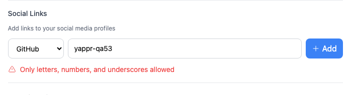
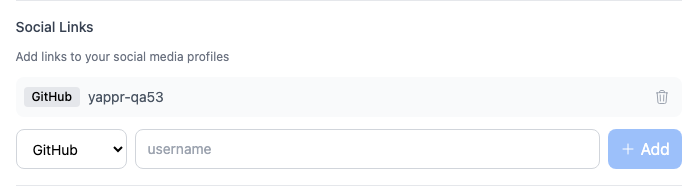
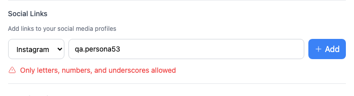
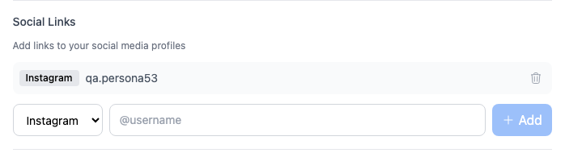

# Yappr PR #470 — provider-specific social handles

PR: https://github.com/PastaPastaPasta/yappr/pull/470

Exact before: `eb895be71a7207c73fb9329ac9d9bb7b398f53da`, the frozen staging comparison base, independently built at port 3240. Exact after: `850d0f7bc1c8705f029dc507f26331b05ff8dbcb`, independently built at port 4198. Both production `npm run build:devnet` builds use the real devnet. Separate browser contexts, Chromium, 1440×1440, en-US, UTC, light, device scale 1. Staging continued advancing during this audit; the before remains the exact common ancestor of this isolated fix.

Shared assigned QA identity: persona 53, `hamzak78`, `VQpFJTzQqdTzMQQcJmKhARpXBE5f9GjwRZ8UMCY2stW`. Synthetic handles were entered using the normal profile editor. No injected DOM, browser storage, SDK behavior, or network responses. No external provider page was opened, and these examples do not assert ownership of provider accounts.

| Surface | Before — exact base | After — full PR head |
|---|---|---|
| Add GitHub `yappr-qa53` |  |  |
| Add Instagram `qa.persona53` |  |  |

Focused views are unannotated crops of the originals at x=334, y=1065, width=698, height=190. Full-resolution originals: [GitHub before](comparison/before/github.png), [GitHub after](comparison/after/github.png), [Instagram before](comparison/before/instagram.png), [Instagram after](comparison/after/instagram.png). The original images retain application and identity context. All eight final images were opened and visually inspected. The unrelated Evolution badge asset loaded only on the after build; relative post ages naturally advanced. Neither incidental difference is part of this fix.

The before state rejects both valid provider-specific characters with “Only letters, numbers, and underscores allowed.” The after state adds each handle as a removable row and clears the input. GitHub accepts alphanumerics and single internal hyphens; Instagram adds periods to its allowed characters. Other provider rules are preserved. This PR does not introduce provider length limits or claim complete enforcement of every provider naming policy.

Both handles were also saved together, then verified after a full reload with the expected `https://github.com/yappr-qa53` and `https://instagram.com/qa.persona53` links, `_blank`, and `noopener noreferrer`. Both were subsequently removed through the editor, saved, and reloaded; the profile again had zero social links. [Roundtrip record](roundtrip.json).

Validation: lint, all 203 unit tests including 17 new validation/URL/provider-isolation cases, production devnet build, and independent code review approved. Capture-only files are outside the product repository. The implementation extracts the existing validation switch without otherwise changing the form's save, remove, or disabled behavior.
