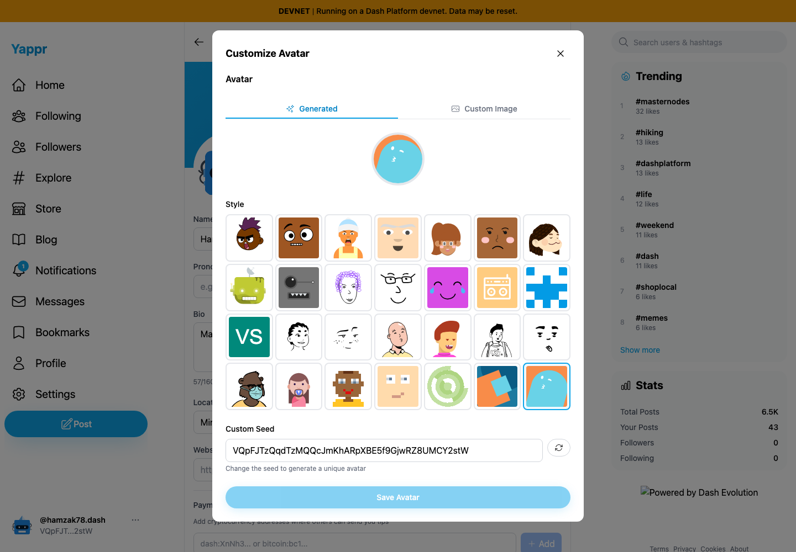
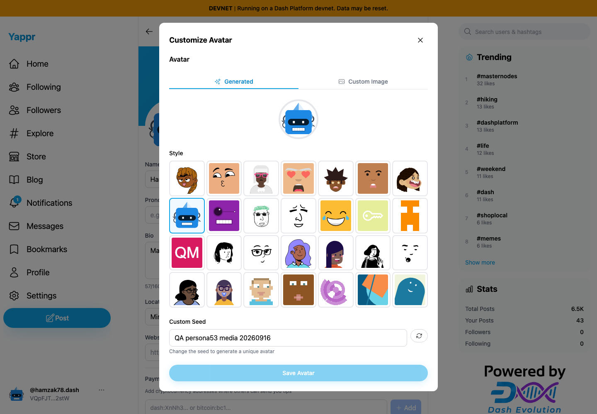
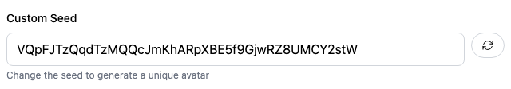
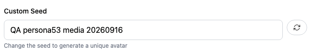

# Yappr PR #471 — retain saved avatar generator settings

PR: https://github.com/PastaPastaPasta/yappr/pull/471

Exact before: `c98a6ecd7e26ae5bc9fc8e400e6011eb8465b3a0` (independent production devnet build on port 3260). Exact after: `fbbfb208c24a8588341728d41365624da1e81e0f` (independent production devnet build on port 4200). Chromium, separate contexts, 1440×1000, en-US, UTC, light, device scale 1.

Same assigned persona53 / hamzak78 identity `VQpFJTzQqdTzMQQcJmKhARpXBE5f9GjwRZ8UMCY2stW`. The Bottts avatar with seed `QA persona53 media 20260916` was saved through the ordinary UI on the before build. Owner reload and a fresh guest rendered exactly the captured generated image. The same persisted recipe was then opened on each build. No data was changed between these before/after captures. No DOM, browser-storage, SDK, or network-response injection.

| Surface | Before — exact base | After — full PR head |
|---|---|---|
| Reopened editor |  |  |
| Seed detail |  |  |

The before editor incorrectly selects Thumbs, substitutes the identity ID, and previews a different image despite the saved public avatar being Bottts. The after editor restores Bottts and the exact saved seed; the profile avatar remains unchanged. The detail images are unannotated crops at x=400, y=754, width=640, height=112 of the corresponding full screenshots. All four final images were opened and inspected at original resolution. The unrelated Evolution badge loaded only on the after build and is outside the fix.

The editor now reads the stored avatar field through the existing batched profile cache instead of re-parsing `getProfile().avatar`, which is already a rendered data URI. Public rendering and custom image URLs retain their existing behavior. The new service tests distinguish stored JSON from rendered output, preserve HTTPS/IPFS URLs, and cover profiles using defaults.

Validation: lint, full `tsc --noEmit --incremental false`, all 209 tests, production build, independent review approved. Runtime checks covered saved Bottts/custom seed, owner and guest image equality, Reset restoring the saved recipe, and a second save/reload restoring the original Pixel Art / `hamzak78-lecture` recipe. The original recipe was resolved from public persona seeding metadata, then its preview and fresh guest image were compared byte-for-byte with the retained pre-test avatar URI. [Verification record](verification.json). The profile was later reused for the separately disclosed #472 fixture and restored again.
