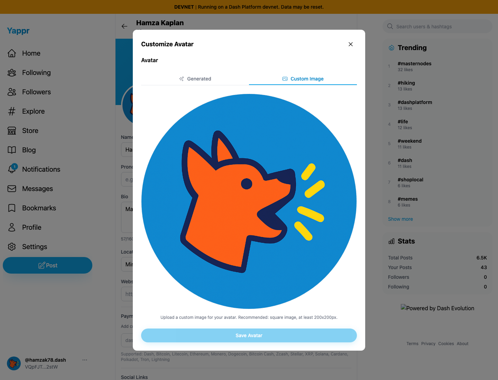
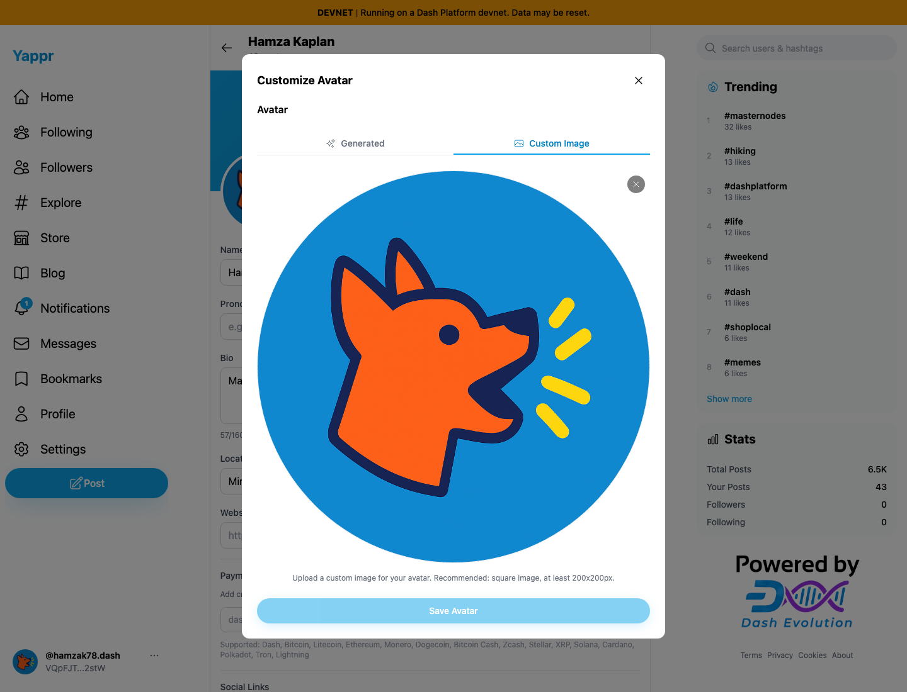

# Yappr PR #472 — visible, usable avatar removal

PR: https://github.com/PastaPastaPasta/yappr/pull/472

Exact before: `c98a6ecd7e26ae5bc9fc8e400e6011eb8465b3a0` (independent production devnet build, port 3260). Exact after: `1f3074b1ea3167f9ca55e57f47afd84205998756` (independent production devnet build, port 4201). Separate Chromium contexts, 1440×1100, en-US, UTC, light, device scale 1.

Same assigned persona53 / hamzak78 identity `VQpFJTzQqdTzMQQcJmKhARpXBE5f9GjwRZ8UMCY2stW`. The public Yappr icon at `https://raw.githubusercontent.com/PastaPastaPasta/yappr/c98a6ecd7e26ae5bc9fc8e400e6011eb8465b3a0/public/yappr.png` was saved through the ordinary avatar URL UI. This does not exercise storage-provider upload. No DOM, browser-storage, SDK, or network-response injection.

| Surface | Before — exact base | After — full PR head |
|---|---|---|
| Custom image removal control |  |  |
| Full editor |  |  |

The focused pair is cropped without annotations at x=400, y=210, width=640, height=180 from the full screenshots. The before image has no visible Remove button: the button's top-right location is outside the circular clipping path. An ordinary pointer click could not reach it. The after X below/right of the Custom Image tab is visible and pointer hit-testing reaches the button. [After clicking Remove](comparison/after/remove.png), the draft shows “Paste a URL below” and Reset. All five final images were opened and inspected. The unrelated Evolution badge loaded only on the after build and is outside this fix.

The control is now a sibling of the clipped upload target, so Enter/Space on it also cannot bubble into upload/settings activation. Removal clears the local draft; existing rules still require a replacement custom URL or a generated avatar before saving. Reset restores the saved image. No persistence semantics are changed by this PR.

Validation: lint, full `tsc --noEmit --incremental false`, production build, and independent review approved. Normal UI verified pointer, Enter, Space, Reset, and a 390×844 mobile pointer pass. An existing six-pixel profile-editor page overflow was observed separately and is not claimed fixed here. The original Pixel Art / `hamzak78-lecture` avatar was restored through Generated → Save and a fresh guest's rendered data URI matched the retained pre-test original exactly. [Verification record](verification.json).
