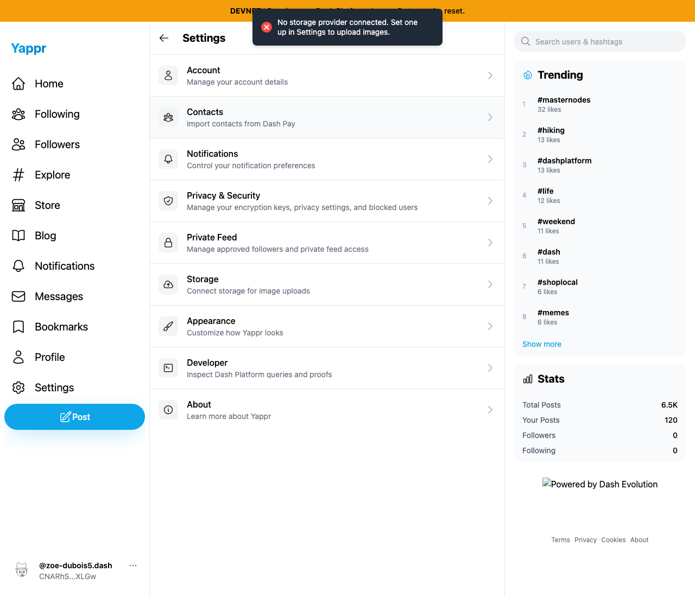
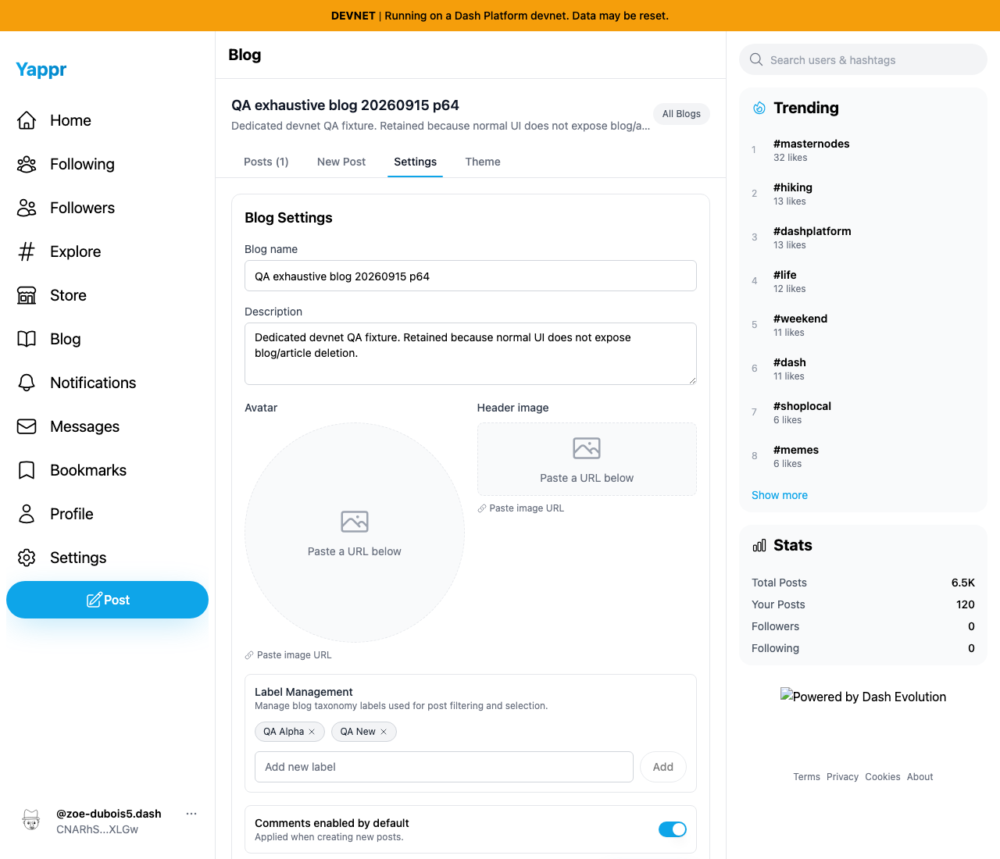
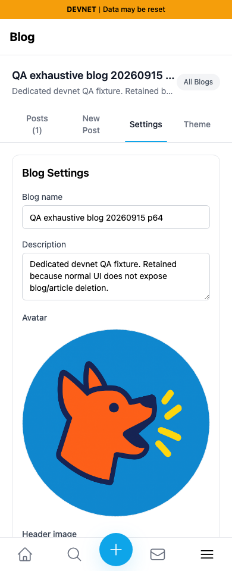
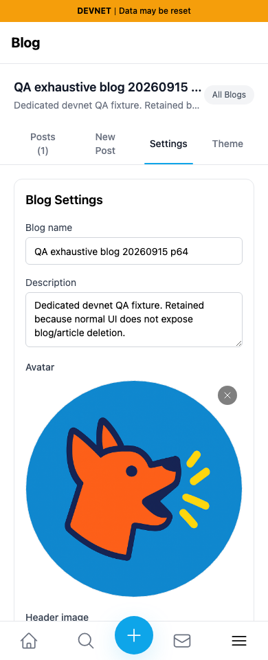

# Yappr #472 — avatar removal in the shared uploader

The Remove image control is clipped by the circular preview. Its keyboard events also reach the containing upload target, sending a user without a connected storage provider to Settings. The change places Remove outside both the image clipping and upload target, preserving its normal button behavior.

**Evidence correction:** this verified comparison supersedes the original PR 472 image set at artifact 535c24c68ba624365ecd549f6cc569fe9e8cf152. The previous local output carried the c98a6ecd build stamp and was not verified as the committed PR head. The signed head was rebuilt from its clean checkout and its compiled Settings About hash verified before every capture. This replacement demonstrates the same shared component through Blog Settings; it does not repeat the earlier profile-persona mutation. Source approval is unchanged. QA90 is a duplicate affected surface of QA68, covered by this one PR.

Exact frozen staging base `c98a6ecd7e26ae5bc9fc8e400e6011eb8465b3a0`; full signed PR head `1f3074b1ea3167f9ca55e57f47afd84205998756`. Independent production devnet exports: shared base 3260, rebuilt head 3300. The target staging branch has advanced; these screenshots compare the exact original pre-change base with the complete PR head. Fresh Chromium contexts for each revision/viewport, normal registered authentication key 2 UI sign-in, light theme, en-US, America/Chicago. Desktop 1280×1100; mobile 390×960.

Shared synthetic QA fixture:

- Identity `CNARhSLcQRfdxLZXTrvDVtVGKg1RHXjwJTpGSd2DXLGw` (persona 64).
- Blog `BdMQRKM6xT8jx4bKbkhP3wYo7V835pDjcEWTbN5PMNRU` — `QA exhaustive blog 20260915 p64`.
- Same saved avatar `https://yap.pr/yappr.png`.

No injected browser/application state, intercepted responses, altered clocks, storage-provider connections, file uploads, saved avatar/metadata writes or publication. Both local static adapters serve only the devnet mount, so the root-level sidebar logo is absent in both full desktop captures; it is unrelated to this control. Real network sidebar statistics may advance during sequential captures and are not compared.

## Visible control

| Before — exact base | After — full head |
|---|---|
|  |  |

These are direct screenshots of the same Avatar component, without scaling or annotations. Full desktop context: [before](comparison/before/desktop-control.png) · [after](comparison/after/desktop-control.png).

## Keyboard Enter result

Before — Enter on Remove leaves the blog and opens Settings:

After — Enter clears the unsaved avatar and keeps Blog Settings open:

## Mobile

| Before — clipped control | After — visible control |
|---|---|
|  |  |

[Before mobile Enter destination](comparison/before/mobile-keyboard-destination.png) · [After mobile Enter destination](comparison/after/mobile-keyboard-destination.png).

Actual assertions: pointer clicks cannot reach the base control, while head clicks clear only the draft. Enter on the base navigates to `/devnet/settings/`; head Enter and Space clear only the avatar draft and remain on `/devnet/blog/`. Each head activation is followed by a fresh page readback showing the same original avatar, name, description and labels. No Save settings action was taken. Persisting cleared optional blog fields is independent QA89 and is outside this comparison. [Safe assertions](assertions.json) · [Evidence matrix](EVIDENCE_MATRIX.md).

Validation: existing source lint, full TypeScript, production build and independent review passed; the exact signed head production build was rerun for this evidence. All 10 final screenshots inspected at original resolution. Public content type/byte verification and rendered PR/README inspection completed before handoff.

## SHA-256

- `f000c7ef582bb6025030cfa1b9a3853c36ff6d50b0e72040b2089f5d08a61759` — `EVIDENCE_MATRIX.md`
- `d15ce5feb833ebbeac21f403f054bb080d9399a5065d4b2c3b92098e9e548cf9` — `assertions.json`
- `cea7793ead2a72cdd210df6e00d419d82bc07a1b7d0535165b9af5f67d8a842b` — `comparison/after/desktop-control-focus.png`
- `dfa0e39d0e397b8c82e0fcbaff505d136e89fa452f9e76c0448f072bf012f17f` — `comparison/after/desktop-control.png`
- `136b7ba5052e038ab589b5b4653894624d6af1e511d5cf3ced37e0062adccfb4` — `comparison/after/desktop-keyboard-destination.png`
- `e0f85095753d383cc919e3215a2dbb4c3a04cb495e381600de5a3b915034740e` — `comparison/after/mobile-control.png`
- `5a0bda9897fd118e537c8f2b84cc162a53e767f9359d2bfb4b41769a0007c265` — `comparison/after/mobile-keyboard-destination.png`
- `d3213d7f39df858ae53152f04210e4463f7b5ea73687d99b00a19b4780464eb4` — `comparison/before/desktop-control-focus.png`
- `9292c8d0c62e988e6f2c6e15f8eec1e061678299d6b5048ccf44ae2dbf7646ac` — `comparison/before/desktop-control.png`
- `5784f8f8af9c1dd7c67f5c2b64cc93e4afedcc8104f28cecc005de5ef9cad921` — `comparison/before/desktop-keyboard-destination.png`
- `40a177f5a24d25be88f7dc7a96851c9c5ce631066481a9c993911f211c3ecaa4` — `comparison/before/mobile-control.png`
- `c97a981d8da3678a23725f038e7c6b0f0c39b7fd7c3beddb99038fe275359e75` — `comparison/before/mobile-keyboard-destination.png`
